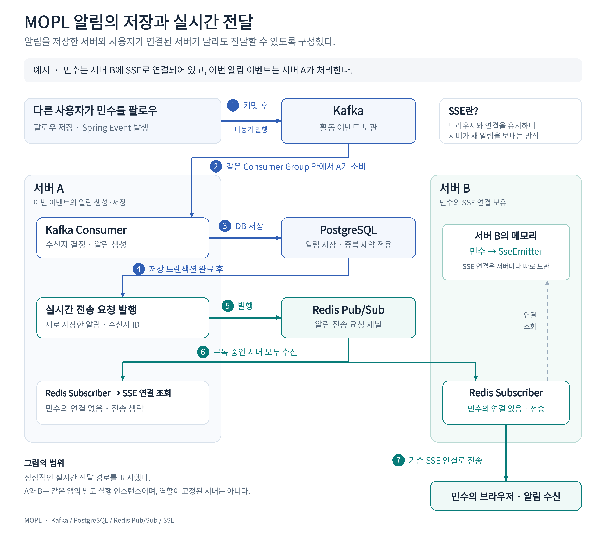

# Kafka·Redis Pub/Sub·SSE를 활용한 다중 서버 인스턴스 알림 전달 흐름

MOPL 프로젝트는 콘텐츠를 함께 감상하고 소통하는 소셜 플랫폼이다. 다른 사용자가 나를 팔로우하거나 구독한 플레이리스트에 새로운 콘텐츠가 추가되면 관련된 알림을 받는다.

알림을 보내려면 먼저 알림 데이터를 DB에 저장하고, 알림을 받을 사용자의 브라우저로 전달해야 한다. 그런데 서버 인스턴스를 여러 개 실행하면 **알림을 저장하는 인스턴스와 사용자의 브라우저가 연결된 인스턴스가 달라질 수 있다.**

이 문제를 해결하기 위해, 알림을 저장한 뒤 같은 채널을 구독 중인 서버 인스턴스에 알림 전송 요청을 브로드캐스트하고, 사용자와 연결된 인스턴스에서 알림을 보내도록 구현했다.

아래 그림은 이 문제를 해결하도록 구현한 현재 알림 흐름이다.

## 기존 단일 인스턴스에서는 보이지 않던 문제

사용자가 화면을 새로고침하지 않아도 실시간으로 알림을 받을 수 있도록 SSE(Server-Sent Events)를 사용해 구현했다. 브라우저가 서버에 연결되면 서버가 그 연결을 통해 새로운 알림을 보내는 방식이다.

이때 사용자마다 어느 서버 인스턴스에 연결되어 있는지가 중요하다. 예를 들어 사용자의 브라우저가 인스턴스B에 연결되어 있다면, 그 연결을 통해 알림을 보낼 수 있는 곳도 서버 인스턴스B이다. 서버 인스턴스A가 같은 DB를 사용한다고 해서 서버 인스턴스B의 연결까지 함께 사용할 수 없다.

아래의 상황에서 실시간으로 알림을 전달하지 못할 수 있다.

1. 사용자의 브라우저가 서버 인스턴스B에 연결되어 있음
2. 해당 사용자에게 보낼 알림을 서버 인스턴스A가 생성해서 DB에 저장함
3. 서버 인스턴스A가 직접 알림을 보내려고 하지만, 해당 브라우저와 연결되어 있지 않음

알림 데이터는 DB에 남아있기 때문에 사용자가 알림 목록을 다시 조회하면 볼 수 있다. 하지만 서버 인스턴스B에서 전송 요청이 전달되지 않으면, 사용자의 현재 화면에서는 새로운 알림이 실시간으로 표시되지 않는다.

## 알림을 처리하는 인스턴스가 다른 이유

MOPL에서는 팔로우나 구독 같은 사용자의 활동이 발생하면 Spring Event를 발행한다. 이 이벤트를 받은 리스너는 해당 작업의 트랜잭션이 커밋된 후에 Kafka에게 이벤트를 비동기로 발행한다.

여러 서버 인스턴스는 Kafka에서 같은 Consumer Group으로 묶는다. Consumer Group은 이벤트 처리 작업을 나눠 맡는 그룹이다. 정상적인 소비 과정에서 하나의 이벤트를 해당 그룹 내 한 서버 인스턴스가 처리한다. **모든 서버 인스턴스가 같은 이벤트를 받아 각각 알림을 만드는 방식이 아니다.**

그래서 사용자의 브라우저가 서버 인스턴스B에 연결되어 있어도, 알림 생성은 서버 인스턴스A에서 발생할 수 있다.

## Kafka와 Redis Pub/Sub을 함께 사용한 이유

애플리케이션 내부에서만 알림 이벤트를 처리하면 인스턴스 종료 시 처리 중인 이벤트를 복구하기 어렵다. 그래서 브로커가 수신한 이벤트를 보관하고 다시 소비할 수 있도록 **Kafka**를 사용했다.

Kafka Consumer가 알림을 저장한 뒤에 자신의 서버 인스턴스에서 바로 실시간 전송을 하게 되면, 다른 서버 인스턴스에 사용자가 연결된 경우 알림을 보내지 못할 수도 있다. 그래서 저장이 끝난 알림의 전송 요청을 **Redis Pub/Sub**을 사용해서 같은 채널을 구독 중인 서버 인스턴스들에게 브로드캐스트하도록 구현했다.

이렇게 각 서버 인스턴스는 브로드캐스트된 알림 전송 요청을 받고, 각각의 서버 인스턴스에서 해당 사용자의 SSE 연결이 있을 경우 알림을 실시간으로 전송한다.

---

# 팀 Notion 주소

[[SB10-4팀] Sprint Spring 백엔드 고급 팀 프로젝트](https://app.notion.com/p/Codeit-Sprint-10-4-daa65902e5ef834d9f3001309ddcf53d)

---

# GitHub Repository 주소

[https://github.com/Codeit-SB10-final-team04/sb10-mopl-team04](https://github.com/Codeit-SB10-final-team04/sb10-mopl-team04)
