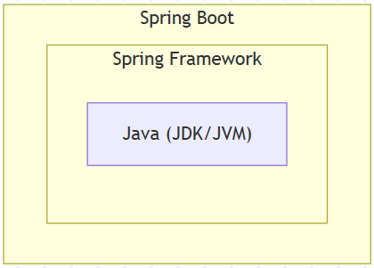
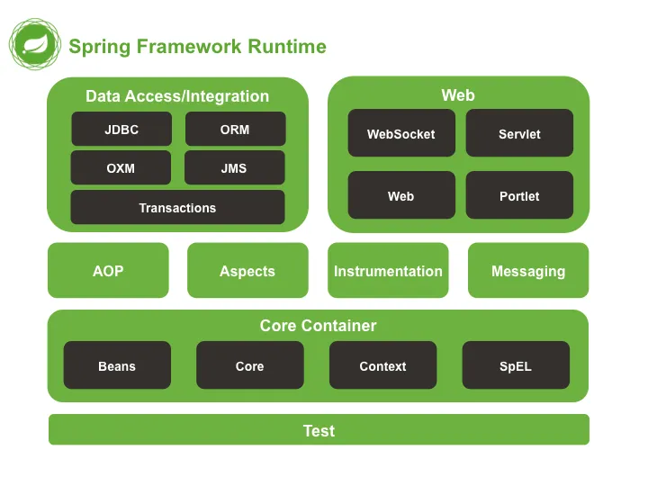

# 오늘의 학습

## <span style="background-color: #FFF9C4">1. Spring 핵심 개념</span>

### 1-01. AOP(Aspect Oriented Programming; 관점 지향 프로그래밍)

#### 1) 객체 지향 프로그래밍(OOP)의 한계

**역할에 따라 책임을 분리**하는 데 탁월하지만, 실제 시스템을 설계하다 보면 로깅, 트랜잭션 처리, 보안 검사, 실시간 측정 같은 **모든 모듈에서 반복적으로 등장하는 로직**들이 존재한다. 이러한 중복을 OOP만으로 제거하기 어렵다.

해결 방법으로는 **중복된 코드를 공통화해서 재사용 가능하도록 만들어야 한다**. 그리고 이 공통화 작업은 **AOP**를 통해서 할 수 있습니다.

<br>

#### 2) AOP(Aspect-Oriented Programming)

**핵심 비즈니스 로직과는 별개인 공통 기능(횡단 관심사)을 하나의 모듈(Aspect)**로 분리하여 관리할 수 있게 해주는 프로그래밍 패러다임

핵심 개념은 **관심사의 분리(Separation of Concerns)**

즉, 비지니스 로직과 다른 로그, 트랜잭션, 보안, 예외처리 등 공통 관심사를 하나로 묶어서 관리할 수 있는 것

- **횡단 관심사(Cross-Cutting Concern)** : 비즈니스 로직과는 직접 관련 없지만, **여러 계층 또는 컴포넌트에 걸쳐 반복적으로 나타나는 관심사**로, **중복을 유발하고, 코드 유지보수성을 크게 떨어뜨림.**

<br>

#### 3) Spring AOP

Spring은 `@AspectJ` 스타일의 AOP를 지원하며, AspectJ 전체 기능 중 **프록시 기반 AOP(Proxy-based AOP)**를 기본 제공

- 스프링 프레임워크에서 제공하는 AOP의 특징
  - ⭐**프록시 기반의 AOP 구현체** : 대상 객체(Target Object)에 대한 프록시를 만들어 제공하며, 타겟을 감싸는 프록시는 서버 Runtime 시에 생성
  - ⭐**메서드 조인 포인트만 제공** : 핵심기능(대상 객체)의 메서드가 호출되는 런타임 시점에만 부가기능(어드바이스)을 적용할 수 있다.
- 구성요소
  - Aspect
  - Join Point
  - Advice
  - Pointcut
  - Weaving
- 한계
  - **프록시 기반 AOP**는 **메서드 수준**에서만 작동
  - **⭐⭐⭐클래스 내부의 메서드 호출(self-invocation)**에는 적용되지 않음
  - 복잡한 AOP 기능이 필요한 경우, AspectJ 컴파일 타임 위빙 등을 고려할 수 있음

---

## <span style="background-color: #FFF9C4">2. Spring 프로젝트의 생태계</span>

Spring Boot 이후부터는 다양한 Spring 프로젝트들이 **유기적으로 연결되어 하나의 통합된 플랫폼**을 구성하고 있으며, 각 프로젝트는 특정 영역에 특화되어 **독립적이면서도 조합 가능한 구조**로 설계되어 있다.

### 2-01. Spring Framework

**Java 플랫폼을 위한 오픈 소스 애플리케이션 프레임워크**로서 간단히 **스프링(Spring)**이라고도 함

애플리케이션을 개발하기 위한 **IoC, DI, AOP, MVC 등의 아키텍처 기반 서비스**를 제공하며, 애플리케이션의 구성과 실행에 필요한 복잡성을 줄이고 **유지보수가 쉬운 구조적 설계**를 가능하게 한다.

- 특징
  - 오픈 소스(Open Source)이다.
  - Java 엔터프라이즈 애플리케이션을 쉽게 만들 수 있다. (규모가 큰 애플리케이션)
  - 프레임워크의 기본 원칙에 충실하다.
- 역할
  - IoC 컨테이너
  - AOP 엔진
  - MVC 프레임워크
  - 트랜잭션 추상화

<br>

### 2-02. Spring Data

다양한 데이터 저장소(RDB, NoSQL, 검색 엔진 등)에 대해 **일관된 프로그래밍 모델과 추상화된 접근 방식**을 제공하는 프로젝트

- 특징
  - CRUD 코드 자동 생성
  - 공통 인터페이스 표준화
  - 데이터 저장소 독립성 확보
  - 페이징(pagenation), 정렬, 동적 쿼리, Auditing 등 다양한 부가기능 내장

<br>

### 2-03. Spring Security

Spring 기반 애플리케이션의 **인증(Authentication)**과 **인가(Authorization)**를 담당하는 보안 프레임워크

- 특징
  - 인증/인가 분리 구조 제공
  - 세션 기반, 토큰 기반(JWT), OAuth2 등 다양한 인증 방식 지원
  - 필터 체인 기반 보안 처리
  - 선언적 메서드 보안 기능
  - 보안 취약점 대응

<br>

### 2-04. Spring Cloud

클라우드 네이티브 애플리케이션, 특히 **마이크로서비스 아키텍처(MSA)**를 위한 인프라 구성 요소를 통합 지원하는 프로젝트

- 특징
  - 구성 서버(Config Server)
  - 서비스 디스커버리(Eureka)
  - API Gateway(Spring Cloud Gateway)
  - 로깅/모니터링
  - 회복력 패턴 지원

---

## <span style="background-color: #FFF9C4">3. Spring 공식 문서 활용법</span>

### 3-01. Reference Documentation (참조 문서)

[Spring Framework Documentation :: Spring Framework](https://docs.spring.io/spring-framework/reference/index.html)

<br>

### 3-02. API Documentation (Javadoc)

[Overview (Spring Framework 7.0.3 API)](https://docs.spring.io/spring-framework/docs/current/javadoc-api/)

<br>

### 3-03. Guides (공식 가이드)

[Guides](https://spring.io/guides)

---

## <span style="background-color: #FFF9C4">4. Spring Boot의 혁신</span>

### 4-01. Spring Boot의 탄생 배경

**기존 Spring Framework가 갖고 있던 진입 장벽을 혁신적으로 낮춘 ‘발전형 프로젝트’**

- 기존 Spring의 복잡한 설정
- 마이크로서비스 아키텍처(MSA)의 부상

<br>

### 4-02. Spring Framework와 Spring Boot와의 관계

Spring Boot는 Spring Framework 위에서 동작하는 **별도의 프레임워크가 아니라, “Spring을 빠르게 시작하고 구성하는 플랫폼”**



<br>

### 4-03. Spring Boot의 핵심 가치

단지 **"간편하고 손쉬운 Spring"**이 아니라, **복잡했던 Spring의 설정과 실행 구조를 통째로 재정의한 도구**

- 자동 설정 (Auto Configuration)
- 독립 실행 가능한 애플리케이션
- 내장 서버 (Embedded Server)

---

## <span style="background-color: #FFF9C4">5. Spring Boot 프로젝트 시작하기</span>

### 5-1. Spring Initializr

Spring Boot는 다양한 기능을 자동 구성해주지만, **프로젝트의 시작 지점에서 필요한 의존성과 구조를 개발자가 지정**해줘야 한다. 이때 초기 구성을 빠르게 도와주는 도구가 바로 **Spring Initializr**

[start.spring.io](https://start.spring.io/)

또는 IntelliJ는 Spring Initializr와 **직접 연동**되어 있어 웹사이트를 사용하지 않고도 IDE 내에서 프로젝트를 생성할 수 있다.

---

## <span style="background-color: #FFF9C4">6. Spring의 핵심 모듈 이해하기</span>

Spring Framework는 단일 라이브러리가 아니라, **기능별로 분리된 수십 개의 모듈**이 계층적으로 조립되어 구성된 플랫폼

### 6-01. 주요 모듈의 계층적 위치 확인



Spring 모듈은 단방향 의존성을 가지며, **상위 기능일수록 더 많은 하위 모듈을 포함**한다.

```
spring-core
   ↑
spring-beans
   ↑
spring-context
   ↑
spring-web
   ↑
spring-webmvc
```

---

## <span style="background-color: #FFF9C4">7. Spring Boot 프로젝트 구조</span>

### 7-01. `src/main/java` : 애플리케이션 소스 코드

**실행 가능한 애플리케이션 코드, 즉 비즈니스 로직의 중심**이 되는 디렉토리로, 프로젝트의 주 기능은 모두 이곳에서 정의됨.

- 규칙
  - **패키지 스캔 기준을 메인 클래스(`@SpringBootApplication` 애너테이션이 정의된 클래스)의 위치부터 하위로 적용**

<br>

### 7-02. `src/main/resources` : 설정 파일과 정적 리소스

Java 코드가 아닌 **리소스 파일**을 저장하는 디렉토리로, 애플리케이션의 **실행 환경 구성**과 클라이언트 응답에 필요한 **정적 파일**들이 이곳에 위치

빌드 시 `classpath`에 포함되어, Java 코드에서 설정 파일이나 리소스를 불러올 수 있는 위치로 작동

- 설정 파일 : `application.yml` 또는 `application.properties`
- 정적 리소스 : `static/`
- 템플릿 리소스 : `templates/`

<br>

### 7-03. `src/test` : 테스트 코드와 리소스

**테스트 전용 소스 코드**를 작성하는 영역으로, **프로덕션 코드(main 코드)**가 잘 작동하는지를 확인하기 위한 **검증 코드**가 여기에 작성된다.

---

## <span style="background-color: #FFF9C4">8. Spring Boot 프로젝트 빌드 설정(Gradle)</span>

### 8-01. Gradle

**소프트웨어 빌드를 자동화하는 도구(build automation tool)**다. 쉽게 말해, **"우리가 만든 코드를 실행 가능한 형태(JAR, WAR 등)로 만드는 모든 과정을 자동으로 처리해주는 프로그램"**

- 아래의 작업을 수행
  - 자바 파일을 컴파일하고(Javac 사용)
  - ⭐라이브러리를 자동으로 다운로드하고 연결하며
  - ⭐테스트를 실행하고
  - 패키징해서 실행 가능한 애플리케이션을 만들어낸다
    ➡️ 그래서 Gradle은 빌드 툴인데 라이브러리의 의존성을 관리한다.

<br>

### 8-02. 빌드(Build)

소프트웨어 개발에서 말하는 **"빌드(Build)"**는 **애플리케이션을 완성된 형태로 만드는 전체 과정**

1. Complie
2. Resolve Dependencies
3. Test
4. Package
5. (옵션) Deploy

<br>

### 8-03. Spring Boot에서 Gradle의 역할

| 파일                     | 설명                                          |
| ------------------------ | --------------------------------------------- |
| ⭐ `build.gradle`        | 빌드 설정과 의존성 정보를 담은 핵심 설정 파일 |
| `settings.gradle`        | 프로젝트 이름 등 최상위 설정                  |
| `gradlew`, `gradlew.bat` | Gradle 래퍼 (Wrapper) 실행 파일               |
| `gradle/` 디렉토리       | 래퍼 관련 구성 파일 포함                      |

<br>

### 8-04. Gradle 래퍼(**Wrapper)**

Gradle을 설치하지 않아도 프로젝트를 빌드할 수 있도록 도와주는 **자동 설치 스크립트**

```
gradlew                 <- Unix용 실행 파일 (./gradlew)
gradlew.bat             <- Windows용 실행 파일
gradle/wrapper/
├── gradle-wrapper.jar  <- Gradle 실행을 위한 로더
└── gradle-wrapper.properties ← 사용할 Gradle 버전 정의
```

`gradlew`와 `gradlew.bat`는 스크립트로, 실행하면 내부적으로 `gradle-wrapper.jar`를 호출

`gradle-wrapper.jar`는 `gradle-wrapper.properties`를 읽어서 필요한 Gradle 배포본(zip)을 다운로드하고, 실행시킨다.

이 중 가장 중요한 건 `gradle-wrapper.properties`다. 여기에는 프로젝트에 필요한 **Gradle 버전이 명시되어** 있어서, 다른 사람이 이 프로젝트를 실행할 때도 동일한 버전을 자동으로 다운로드하고 실행하게 된다.
