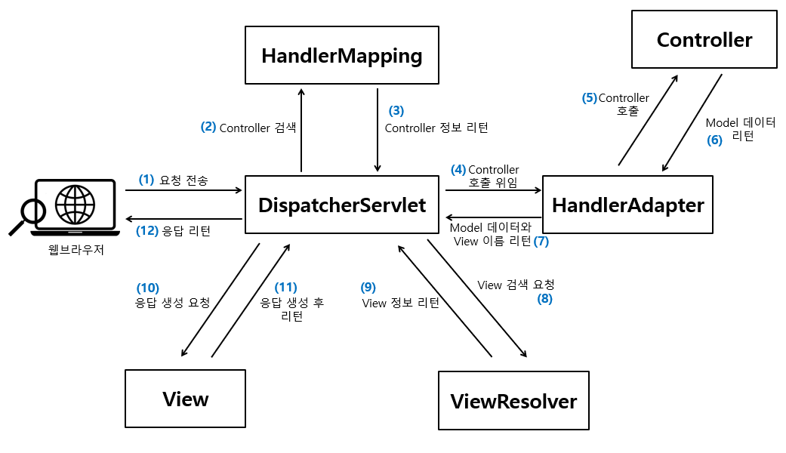

# 오늘의 학습

## <span style="background-color: #FFF9C4">1. 웹 애플리케이션의 기초</span>

### 1-02. 서블릿(Servlet)의 이해

자바로 작성되어 서블릿 컨테이너(ex: 톰캣)에서 실행되는 **서버 측 웹 컴포넌트**로, 클라이언트의 HTTP 요청(Request)을 처리하여 **HTTP 응답(Response)을 생성**

자바 진영에서 웹 애플리케이션을 구현하기 위한 가장 기초적인 표준이며, Java EE (현 Jakarta EE)의 일부로 정의되어 있음.

- **등장 배경**
  - 초기 웹 서버는 정적인 HTML 파일만 제공할 수 있었고, 동적인 웹 페이지를 만들기 위해 Perl이나 Shell 기반의 CGI(Common Gateway Interface)가 주로 사용되었지만, CGI는 한계가 있음
    - 요청마다 새로운 프로세스를 생성하여 **성능 저하** 발생
    - 복잡한 상태 관리와 요청 분기 처리의 어려움
    - 프로세스 간 자원 공유의 부재
  - 이러한 문제를 해결하기 위해 **Java 기반의 고성능 웹 서버 컴포넌트로서 Servlet**이 등장
    - 프로세스가 아닌 **스레드 기반 처리**로 고성능 제공
    - **객체지향 방식**으로 코드 구조화 가능
    - 세션, 쿠키, 리다이렉션 등 HTTP 기능을 손쉽게 사용 가능
    - 다양한 WAS(Web Application Server)에서 표준적으로 작동 (Tomcat, Jetty 등)
- **작동 흐름**
  ```
  [브라우저] → [HTTP 요청] → [서블릿 컨테이너] → [서블릿 클래스의 doGet/doPost()] 실행 → [응답 생성]
  ```
- Spring MVC는 결국 내부적으로 DispatcherServlet이라는 서블릿을 통해 모든 요청을 처리함
- **서블릿의 생명주기(Lifecycle)**
  - 서블릿은 클라이언트의 요청이 있을 때마다 새롭게 생성되는 것이 아니라, **서블릿 컨테이너가 그 생명주기를 제어**
  - 컨테이너는 서블릿 객체를 단 한 번 생성하고, 여러 요청을 반복해서 처리하도록 유지
  - **단계**
    1. 생성자 호출
    2. `init()` ➡️ 최초 요청 시 1회 호출로, 초기화
    3. `service()` ➡️ 클라이언트 요청이 들어올 때마다 분기 수행시킴
    4. `doGet()` / `doPost()` ➡️ `service()`내부에서 HTTP 메서드에 따라 분기 실행
    5. `destroy()` ➡️ WAS 종료 시 1회 실행되어, 메모리 효율을 위해 자원 정리
- **서블릿 컨테이너의 역할**
  - **서블릿이 실행될 수 있는 환경과 HTTP 통신을 위한 핵심 기능을 제공하는 서버 측 컴포넌트**
  - Java EE 스펙을 따르는 웹 애플리케이션 서버라면 반드시 서블릿 컨테이너를 포함하고 있으며, **Spring Boot**에서도 톰캣을 내장해 이를 자동으로 제공
  - **종류** : Tomcat, Hetty, UnderTow, Resin 등
  - **요청부터 응답까지의 흐름**
    ```
    [브라우저] → (HTTP 요청)
             ↓
    [Connector (Socket)]
             ↓
    [Request 객체 생성]
             ↓
    [Context 및 URL 매핑 탐색]
             ↓
    [Wrapper에서 해당 서블릿 호출 → service() → doGet()/doPost()]
             ↓
    [Response 객체 작성]
             ↓
    [Socket을 통해 응답 전송]
             ↓
    [브라우저 화면 출력]
    ```

## <span style="background-color: #FFF9C4">2. MVC 아키텍처의 이해</span>

### 2-01. Spring MVC

Spring Framework에서 **웹 계층을 담당하는 모듈**로, `spring-webmvc`에 포함된 웹 프레임워크이다.

**서블릿(Servlet) API**를 기반으로 동작하며, 클라이언트의 HTTP 요청을 받아 Model, View, Controller로 분리하여 처리하는 MVC 패턴을 구현한다.

➡️ 개발자는 서블릿을 직접 작성하지 않아도 애너테이션 기반으로 컨트롤러를 통해 요청 처리, 데이터 바인딩, 응답 생성을 편리하게 구현

- 데이터 바인딩 : HTTP 요청으로 들어온 값들을 자바 객체의 필드에 자동으로 매핑하는 과정

<br>

### 2-02. MVC 패턴

Model - View - Controller의 약자

- **Model** : 데이터와 비즈니스 로직 처리
  - 클라이언트의 요청을 처리한 **결과 데이터**를 담고 있는 영역
  - Service Layer에서 만들어진 객체가 곧 Model 데이터가 된다.
- **View** : 사용자에게 보여지는 화면 처리
  - Model 데이터를 기반으로 **사용자에게 시각적으로 보여지는 결과를 생성**
  - **종류**: HTML, JSON, 문서(PDF, Excel 등)
  - View를 분리하면 백엔드와 프론트엔드 작업을 동시에 할 수 있어 효율적
- **Controller** : 요청 처리 및 흐름 제어
  - 클라이언트의 요청을 **직접적으로 수신하는 엔드포인트**
  - 요청을 받고 비즈니스 로직을 실행한 후, Model을 View에 전달
  - Controller에서는 반드시 **DTO 또는 Entity** 객체만 반환

<br>

### 2-03. MVC 패턴의 장점

대규모 애플리케이션을 보다 명확하게 구조화할 수 있게 해주는 **대표적인 아키텍처 패턴**

하나의 애플리케이션을 세 가지 책임 영역으로 분리하여 관리함으로써 유지보수성과 확장성을 높이는 데 큰 장점

- **관심사의 분리 (Separation of Concerns)**
  - 서로 다른 목적과 책임을 가진 코드를 분리하여 관리하는 원칙
  - Model - View - Controller로 나눠서 각 계층은 자신의 책임만 집중
    - View는 화면 표시만 담당하고,
    - Controller는 흐름 제어만 수행하며,
    - Model은 데이터 처리 및 비즈니스 로직에만 집중합니다.
  - **장점**
    - 코드 변경 범위 최소화
    - 코드 재사용성 증가
    - 개발 역할 분담 용이
    - 유지보수성과 확장성 향상
    - 테스트 용이

---

## <span style="background-color: #FFF9C4">3. Spring MVC의 구조</span>

### 3-01. Spring MVC의 핵심 컴포넌트

Spring MVC는 여러 컴포넌트들이 요청과 응답을 유기적으로 처리하는 구조로 이루어져 다. 이 구조의 중심에 있는 건 `DispatcherServlet`이며, 그 외 여러 보조 컴포넌트들이 함께 동작한다.



[그림] Spring MVC의 동작 방식 및 구성요소

- `DispatcherServlet`
  - Spring MVC 아키텍처의 핵심이며, 모든 HTTP 요청의 진입점
  - Front Controller Patter 기반으로 동작하며, 클라이언트의 요청을 수신하고 이후 처리를 전담
- `HandlerMappgin`
  - 클라이언트 요청 URI와 이를 처리할 Controller 메서드를 **연결(매핑)**해주는 역할
  - 요청 URI를 분석하여 해당 요청을 처리할 수 있는 핸들러 객체(주로 Controller 클래스 내부의 메서드)를 찾아 `DispatcherServlet`에 반환
  - 실무에서는 대부분 `RequestMappingHandlerMapping`을 사용
- `HandlerAdapter`
  - 다양한 핸들러 타입을 **일관된 방식으로 실행**할 수 있도록 추상화
  - 핸들러 호출 결과를 ModelAndView 형태로 표준화하여 `DispatcherServlet`에 전달
    - “Model 데이터 + View 이름”의 형태
  - 커스텀 핸들러를 사용할 경우 `HandlerAdapter`를 직접 구현하여 Spring에 등록
- **응답 처리 컴포넌트**
  - `ViewResolver`
    - Controller가 반환한 View 이름을 실제 JSP, Thymeleaf 템플릿 파일 등으로 **찾아주는 역할**
    - 찾은 View 객체를 `DispatcherServlet`에게 전달
    - `ViewResolver` 경로가 잘못 설정되면 뷰를 찾지 못해 500 오류가 발생
  - `HttpMessageConverter`
    - API 응답은 View가 아닌 **직접 JSON, XML 등으로 데이터를 반환**하는데, 이때 Java 객체를 직렬화(혹은 역직렬화)해주는 역할
    - Controller에서 반환한 객체를 응답 헤더의 `Content-Type`에 따라 적절한 변환기(구현체)를 선택하고, **HTTP Response Body에 맞게 변환**
      - API 요청 처리시 상단의 이미지에서 `ViewResolver와 View` 자리에 위치함
    - 클라이언트의 요청 Body를 Java 객체로 **역변환 (RequestBody)**도 가능

---

## <span style="background-color: #FFF9C4">4. Spring Boot MVC 시작하기</span>

### 4-01. Spring-boot-starter-web

Spring Boot에서 `spring-boot-starter-web`은 **웹 애플리케이션 개발에 필요한 핵심 의존성들을 묶어 놓은 스타터(Starter)**로, 이 의존성 모듈 하나만 설치하면 아래 기능을 손쉽게 사용 가능

- **기능**
  - Spring MVC 웹 프레임워크
  - 내장 Tomcat 서버
  - Jackson을 이용한 JSON 처리
  - 정적 리소스 제공
  - 예외 처리 자동화

```groovy
// build.gradle
implementation 'org.springframework.boot:spring-boot-starter-web'

```

- **주요 의존성**
  - `spring-web` : Spring MVC 프레임워크 핵심 기능 제공
  - `spring-webmvc` : `DispatcherServlet`, Controller, View 등 구성 요소 제공
  - `jackson-databind` : JSON 직렬화/역직렬화 지원
  - `validation-api`, `hibernate-validator` : Bean Validation 지원 (예: `@Valid`)
  - `spring-boot-starter-tomcat` : 내장 Tomcat 서버로 애플리케이션 실행
- Spring Boot의 자동 설정(AutoConfiguration) 기능으로 인해 `DispatcherServlet` 이나 `@RestController`, `@RequestMapping`, 정적 리소스 핸들링 등의 설정들이 자동으로 구성됨

<br>

### 4-02. 정적 리소스 설정

Spring Boot는 기본적으로 **정적 리소스 (HTML, CSS, JS, 이미지 등)**를 다음 위치에 두면 자동으로 제공

```bash
/src/main/resources/
├── static/
├── public/
├── resources/
└── META-INF/resources/
```

위 폴더 중 하나에 `index.html`, `style.css`, `script.js` 등을 두면 자동으로 `/` 또는 `http://localhost:8080/index.html` 같은 경로로 접근 가능

---

## <span style="background-color: #FFF9C4">5. API 테스트 도구</span>

### 5-01. Postman

**API 개발과 테스트에 최적화된 HTTP 클라이언트 도구**

브라우저나 cURL로는 불편했던 API 테스트 과정을 쉽고 시각적으로 처리할 수 있게 해줌

RESTful API를 주로 사용하는 백엔드 개발자와 QA, 프론트엔드 개발자 간의 **API 통신 검증 도구**로 매우 널리 사용됨

- cURL(Client for URL)은 터미널이나 명령 프롬프트에서 URL을 기반으로 HTTP, HTTPS 등 다양한 프로토콜을 사용해 데이터를 전송하고 응답할 수 있는 명령줄 도구
- **컬렉션(Collection)**
  - 관련된 API 요청들을 하나의 그룹으로 묶어 관리할 수 있는 단위(컨테이너)
  - 각 요청은 컬렉션 내에 저장되며, 요청 간 공통 설정(예: 환경 변수, 헤더 등)을 공유 가능
  - **장점**
    - 테스트 시나리오 분류
    - 일괄 실행
    - 협업 용이
    - 문서화 지원
- **환경(Environment) 변수**
  - **서버 주소, 토큰 등 환경별로 달라지는 값**을 효율적으로 관리하는 값들을 변수(Variable)로 추출해 관리할 수 있는 기능
  - 변수(Variable) 종류
    - Global : 전체 요청(모든 환경)
    - Environment : 특정 환경
    - Collection : 컬렉션 내부
    - Local : 한 요청 내

---

## <span style="background-color: #FFF9C4">6. 기본적인 요청 처리하기</span>

### 6-01. 패키지 구조 생성

- **패키지 구조**
  - **기능 기반 패키지 구조(package-by-feature)**
    - 애플리케이션의 패키지를 애플리케이션에서 구현해야 하는 기능을 기준으로 패키지를 구성하는 것
    - 패키지 안에는 **하나의 기능을 완성하기 위한 계층별(API 계층, 서비스 계층, 데이터 액세스 계층) 클래스들이 모여있음.**
    - 예시 구조
      ```
      root/
      ├── coffee/
      │   ├── Coffee
      │   ├── CoffeeDTO
      │   ├── CoffeeController
      │   ├── CoffeeRepository
      │   └── CoffeeService
      ├── member/
      │   ├── Member
      │   ├── MemberDTO
      │   ├── MemberController
      │   ├── MemberRepository
      │   └── MemberService
      ...
      ```
  - **계층 기반 패키지 구조(package-by-layer)**
    - 패키지를 하나의 계층(Layer)으로 보고 클래스들을 계층별로 묶어서 관리하는 구조
    - 예시 구조
      ```
      root/
      ├── DTO
      │   ├── CoffeeDTO
      │   └── MemberDTO
      ├── Entity
      │   ├── Coffee
      │   └── Member
      ...
      ```

<br>

### 6-02. Controller 클래스 설계

- **API 계층**
  - 클라이언트의 요청을 직접적으로 전달받는 계층으로, Controller가 존재함
- **Controller 설계**
  - 현대의 웹 애플리케이션에서는 일반적으로 애플리케이션이 제공해야 될 기능을 **리소스(Resource, 자원)**로 분류
  - 이 리소스에 해당하는 Controller 클래스를 구현하면 됨
  - 하지만 **핸들러 메서드(Handler Method)가 없다면 “404 Not Found”가 발생함.**
  - Controller 계층에서는 오버로딩 불가
  - 예시 코드

    ```java
    package com.springboot.member;

    import org.springframework.stereotype.Controller;
    import org.springframework.ui.Model;
    import org.springframework.web.bind.annotation.*;

    @Controller
    @RequestMapping("/v1/members")
    public class MemberController {

        @PostMapping
        public String postMember(@RequestParam("email") String email,
                                  @RequestParam("name") String name,
                                  @RequestParam("phone") String phone,
                                  Model model) {
            model.addAttribute("email", email);
            model.addAttribute("name", name);
            model.addAttribute("phone", phone);

            return "memberResult"; // templates/memberResult.html
        }

        @GetMapping("/{member-id}")
        public String getMember(@PathVariable("member-id") long memberId, Model model) {
            model.addAttribute("memberId", memberId);
            return "memberDetail"; // templates/memberDetail.html
        }

        @GetMapping
        public String getMembers(Model model) {
            System.out.println("# get Members");
            return "memberList"; // templates/memberList.html
        }
    }
    ```

- **사용한 핸들러 메서드(Handler Method)**
  - `@RequestMapping("/v1/members")`
    - 클래스 레벨에서 공통 URI 경로를 지정하는 애너테이션
  - `@PostMapping`
    - 클라이언트의 요청 데이터(request body)를 서버에 생성할 때 사용하는 애너테이션
  - `@GetMapping`
    - 클라이언트가 서버에 리소스를 조회할 때 사용하는 애너테이션

<br>

### 6-03. 다양한 요청 데이터 처리하기

핸들러 메서드 파라미터를 이용해 클라이언트의 요청 데이터를 유연하게 받을 수 있다.

- `@RequestHeader`
  - 요청 헤더 정보 처리
- `@CookieValue`
  - 쿠키 정보 처리
  - 쿠키에 저장된 로그인 토큰 등을 받아올 때 사용
- `@RequestBody`
  - JSON 형테의 요청 데이터(Request Body)를 Java 객체로 자동 변환
  - 사용 시, 클라이언트에서 `Content-Type: application/json`을 명시해야 함.
  - DTO 클래스에는 기본 생성자와 getter/setter가 있어야 Jackson이 자동 바인딩할 수 있다.
- `@ModelAttribute`
  - 클라이언트가 전송한 **폼 데이터(form-data)** 를 자바 객체에 자동으로 매핑
  - 주로 HTML `<form>` 태그로 전송된 데이터를 처리할 때 사용
  - `@ModelAttribute`가 생략되더라도, POST 방식의 form 데이터는 자동으로 객체에 바인딩
  - DTO 클래스에는 getter와 setter가 필요
    - `name` 같은 필드가 아닌 `getName()` 같은 속성(property)을 기준으로 값을 매핑하기 때문
- `@PathVariable`
  - URL 경로의 변수 값 처리
  - 요청 URL의 경로(path)에 포함된 값을 추출해 핸들러 메서드의 매개변수로 바인딩
  - 괄호 안에 입력한 문자열 값은 `@GetMapping("/{member-id}")`처럼 중괄호({ }) 안의 문자열과 동일해야 한다.
    - `@PathVariable Long member-id`
- `@RequestParam`
  - 쿼리 스트링 또는 form 필드 값 처리
  - 주로 클라이언트 쪽에서 전송하는 요청 데이터를 **쿼리 파라미터(Query Parmeter 또는 Query String), 폼 데이터(form-data), x-www-form-urlencoded** 형식으로 전송하면 이를 서버 쪽에서 전달 받을 때 사용하는 애너테이션
  - 쿼리 파라미터(Query Parameter 또는 QueryString)는 요청 URL에서 ‘?’를 기준으로 붙는 key/value 쌍의 데이터
  - `http://localhost:8080/coffees/1?page=1&size=10`

---

## <span style="background-color: #FFF9C4">7. 파일 업로드 처리하기</span>

### 7-01. 파일 업로드

일반 텍스트 데이터 전송과는 달리, **multipart/form-data** 라는 특별한 HTTP 요청 형식으로 전송됨

한 번의 요청으로 텍스트 데이터와 바이너리 파일을 함께 서버에 전달할 수 있도록 설계됨

- **멀티파트 요청(Multipart Request)**
  - 파일 업로드는 일반적인 `x-www-form-urlencoded`가 아닌 **multipart/form-data** 형식으로 전송
  - 브라우저가 파일 바이너리 데이터를 포함한 요청을 보낼 수 있도록 하는 특별한 인코딩 방식
    - 파일 + 텍스트 동시 전송 가능
  - `Content-Type`을 `multipart/form-data`로 설정
  - **사용 방식** : `@RequestParam MultipartFile`
  - 예시 코드

    ```java
    @PostMapping("/v1/coffees/upload")
    public String uploadCoffeeImage(@RequestParam("coffeeName") String coffeeName,
                                     @RequestParam("image") MultipartFile file,
                                     Model model) throws IOException {
        String fileName = file.getOriginalFilename();
        Path savePath = Paths.get("./uploads/" + fileName);
        Files.createDirectories(savePath.getParent());
        file.transferTo(savePath);

        CoffeeImageDto dto = new CoffeeImageDto();
        dto.setCoffeeName(coffeeName);
        dto.setFileName(fileName);

        model.addAttribute("coffeeName", coffeeName);
        model.addAttribute("fileName", fileName);
        return "uploadResult";
    }
    ```

---

## <span style="background-color: #FFF9C4">8. 응답 처리 이해하기</span>

### 8-01. ViewResolver와 View의 동작 원리

Spring MVC에서 컨트롤러의 반환 타입이 `String`일 경우, 이 문자열은 **View 이름**으로 해석됨

View 이름은 `ViewResolver`에 의해 실제 템플릿 파일로 변환됨

즉, `return "memberResult";` → `templates/memberResult.html`로 변환

- ViewResolver 동작 순서
  1. 컨트롤러가 `String` 형태의 View 이름을 반환
  2. `ViewResolver`가 prefix/suffix 경로를 붙여 실제 HTML 경로를 생성
  3. 템플릿 엔진(Thymeleaf 등)이 HTML 렌더링 후 클라이언트에 응답

<br>

### 8-02. HttpMessageConverter

ViewResolver가 동작하는 방식은 SSR(서버사이드 렌더링) 방식

하지만 REST API처럼 데이터를 직접 응답해야 하는 경우, Spring은 `HttpMessageConverter` 를 사용해 객체를 JSON, XML 등으로 변환

- `@ResponseBody`가 붙으면 ViewResolver는 동작하지 않음
- 대신 `HttpMessageConverter`가 작동하여 객체를 JSON으로 변환
- Spring Boot는 기본적으로 Jackson 라이브러리를 사용해 JSON 변환을 처리

<br>

### 8-03. `@ResponseBody`의 동작 원리

반환된 데이터를 **HTTP 응답 본문(response body)** 에 직접 작성하게 만듦

- View를 거치지 않기 때문에 REST API 개발 시 주로 사용됨
- 내부적으로 `RequestMappingHandlerAdapter` → `HttpMessageConverter` 순서로 호출됨

```java
@GetMapping("/v1/coffees/info")
@ResponseBody
public Map<String, Object> getCoffeeInfo() {
    Map<String, Object> map = new HashMap<>();
    map.put("name", "콜드브루");
    map.put("price", 4000);
    return map; // JSON 응답으로 처리됨
}
```
