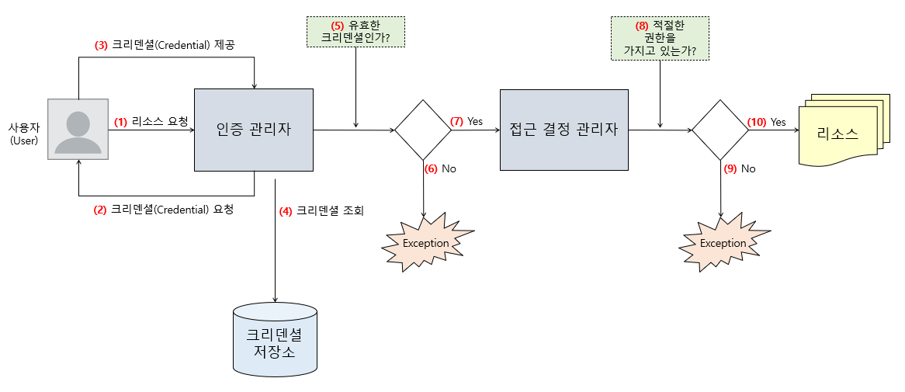
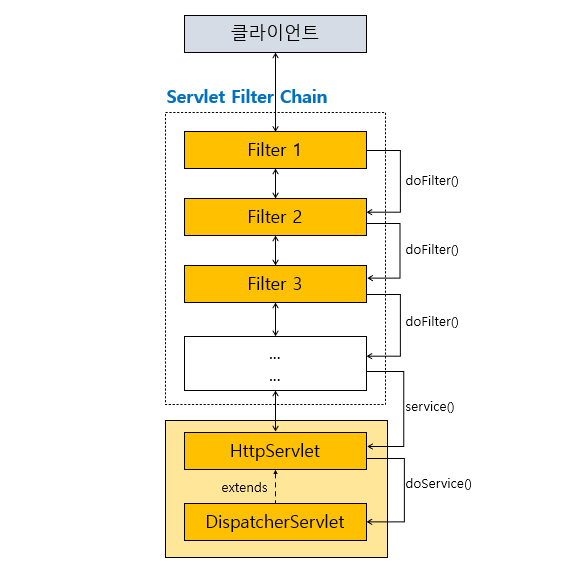
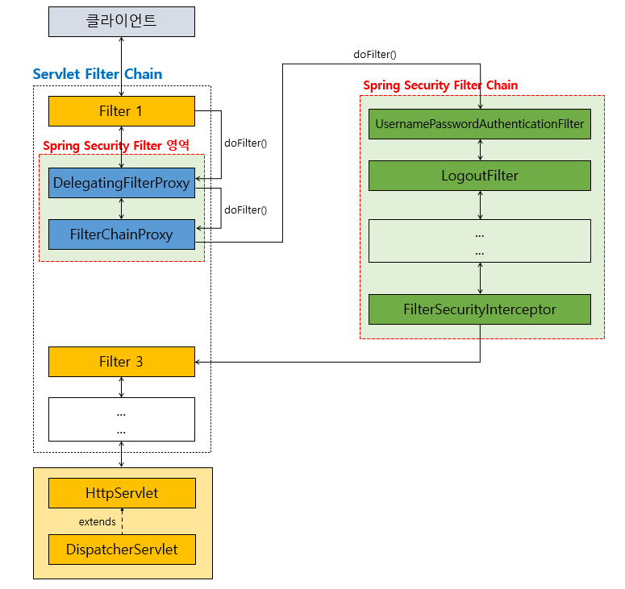
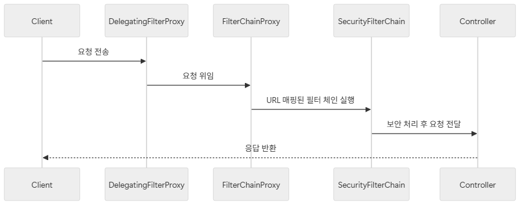
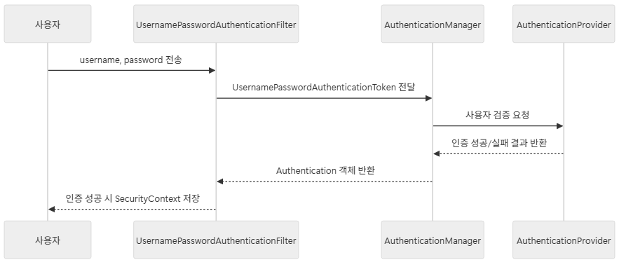
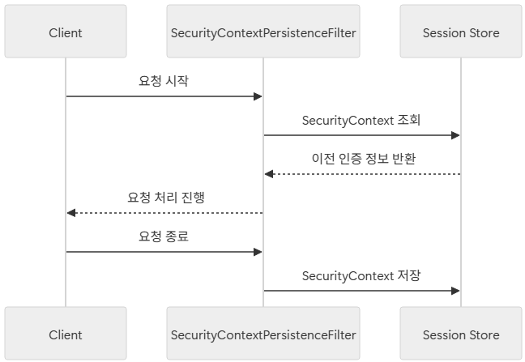

# <span style="background-color: #FFF9C4">2. Filter 아키텍처의 이해</span>

## 2-01. 서블릿 Filter와 Filter Chain

### 1) 서블릿(Servlet) Filter

**서블릿 기반 애플리케이션의 엔드포인트에 요청이 도달하기 전에 중간에 요청을 가로채서 측정 작업을 수행할 수 있는 Java 컴포넌트**

- `FilterRegisterationBean`을 **Spring Bean으로 등록하면 Filter가 등록됨**

```
Client (Request 보냄) ➡️

==========[Servlet Container]==========

(가장 먼저 Filter를 거침)
Filter (전/후처리 로직 실행 후) ➡️
FrontController(DispatcherServlet) ➡️
Interceptor ➡️
Controller, Service, Component, etc.
```

<br>

### 2) Filter Chain

여러 개의 Filter가 연결되어 Chain을 이루는 구조

- 모든 Filter 처리가 끝난 후 Servlet(예: DispatcherServlet)이 실행됨

<br>

### 3) 서블릿 Filter와 Filter Chain 특성

- **요청 URI path 기반 처리**: 서블릿 컨테이너는 요청 URI를 기반으로 어떤 Filter와 Servlet을 매핑할지 결정
- **순서 지정 가능**: Filter는 Chain 내에서 실행 순서 지정 가능
- **Spring Boot에서 순서 지정 방법**
  - Filter에 `@Order` 애너테이션 추가 또는 `Ordered` 인터페이스 구현
  - `FilterRegisterationBean`의 `setOrder()` 메서드 이용

<br>

### 4) Spring Security와 서블릿 Filter의 관계

**Spring Security**는 **서블릿 Filter 기반으로 동작하는 보안 프레임워크**

- HTTP Request가 들어오면
- Spring Security가 여러 개의 보안 관련 Filter를 Chain으로 연결하여 실행
- 인증(Authentication), 인가(Authorization), 보안 이벤트 처리 등의 대부분 기능이 Filter Chain 안에서 수행됨

<br>

## 2-02. Spring Security Filter 구조

### 1) 보안이 적용된 웹 요청의 일반적인 처리 흐름



- 보안이 적용된 요청은 항상 **“인증 ➡️ 권한 검증 ➡️ 접근 허용/차단”**의 과정을 거침

<br>

### 2) 웹 요청에서 서블릿 Filter와 Filter Chain의 역할

사용자의 요청은 Controller에 도달하기 전 인증 관리자나 접근 결정 관리자가 중간에 요청을 가로채서 검증을 수행한다.

이때 요청을 가로챌 수 있는 적절한 포인트를 제공하는 것이 **서블릿(Servlet) Filter**

#### Filter Chain

Filter는 여러 개가 연결되어 **Filter Chain**을 형성할 수 있음



- 각 Filter는 `doFilter()` 메서드를 구현하여 Chain을 형성함
- 전처리 후 요청은 `DispatcherServlet`으로 전달
- 후처리 시 응답을 수정하거나 추가 작업 수행 가능

<br>

### 3) Spring Security에서 Filter 역할

Spring Security는 Filter를 이용해 요청을 가로채고 **보안 관련 작업**을 추가한다.



#### `DelegatingFilterProxy`

**서블릿 컨테이너 영역의 Filter와 Spring의** `ApplicationContext`**에 Bean으로 등록된 Filter들을 연결해 주는(위임하는) bridge 역할**

#### `FilterChainProxy`

**Spring Security의 Filter를 사용하기 위한 진입점**

즉, `FilterChainProxy`**부터 Spring Security에서 제공하는 Security Filter들이 필요한 작업을 수행**

- 어떤 Filter Chain을 사용할지 결정하고, 가장 먼저 결정된 Filter Chain을 실행
- **Spring Security 보안 필터의 실행 관리자**

<br>

### 4) Security Filter Chain workflow

**Spring Security Filter Chain**은 Spring Security에서 **보안을 위한 작업을 처리하는 Filter의 모음**

- “내가 어떤 URL”에 어떤 보안 규칙을 적용할지”를 담고 있음
- 개발자가 커스터마이징할 수 있는 핵심 부분



<br>

## 2-03. 주요 Security Filter

### 1) `UsernamePasswordAuthenticationFilter`

Spring Security에서 가장 널리 사용되는 인증 Filter 중 하나로, 기본적으로 **Form 로그인(Login)** 요청을 처리하기 위해 사용

- 개발자가 원하는 방식으로 **REST API 기반 로그인** 등에도 활용 가능
  - form 요청이 아닌 JSON 기반 로그인 요청을 처리
- OTP, Captcha, 2FA 코드 등 **추가 인증 요소**와 함께 검증하도록 확장 가능
- 이 Filter는 **username/password 기반 인증**만 담당
- OAuth2, OIDC 기반 인증은 별도의 필터(예: `OAuth2LoginAuthenticationFilter` 등)가 동작하므로, `UsernamePasswordAuthenticationFilter`와 직접적으로 연관되지 않음



1. 사용자가 로그인 요청에 **username**과 **password**를 전달
2. `UsernamePasswordAuthenticationFilter`는 요청에서 **username**과 **password** 추출
3. `UsernamePasswordAuthenticationToken` 생성 후 `AuthenticationManager`에 전달
4. `AuthenticationManager`는 등록된 `AuthenticationProvider`(예: `DaoAuthenticationProvider`)를 통해 사용자 정보를 검증
5. 인증 성공 시 `SecurityContextHolder`에 인증 정보가 저장

<br>

### 2) `BasicAuthenticationFilter`

- **역할**: HTTP Basic 인증 처리
- **주요 동작**
  1. 요청 헤더에 `Authorization: Basic ...` 값을 확인
  2. Base64 디코딩을 통해 `username:password`를 추출
  3. `AuthenticationManager`를 통해 인증 진
- REST API 서버에서 테스트나 간단한 인증 방식으로 자주 사용됨

<br>

### 3) `DefaultLoginPageGeneratingFilter`

- **역할**: 별도의 로그인 페이지를 구현하지 않은 경우, **Spring Security가 기본 제공하는 로그인 페이지를 생성**

<br>

### 4) `LogoutFilter`

- **역할**: 사용자의 로그아웃 처리
- **주요 동작**
  1. 기본적으로 `/logout` 요청 감지
  2. 세션 무효화(Session Invalidation)를 수행
  3. SecurityContext에서 인증 정보를 제거

```java
@Override
protected void configure(HttpSecurity http) throws Exception {
    http.logout()
        .logoutUrl("/logout")
        .logoutSuccessUrl("/login?logout")
        .invalidateHttpSession(true)
        .deleteCookies("JSESSIONID");
}
```

- 실무에서 로그아웃 후 특정 페이지로 리다이렉트하거나 토큰 기반 로그아웃 처리를 추가하는 경우가 많음

<br>

### 5) `SecurityContextPersistenceFilter`

- **역할**: 요청이 시작될 때 `SecurityContext`를 로드하고, 요청이 끝나면 `SecurityContext`에 저장
- **동작 원리**
  - 일반적으로 **세션(HttpSession)**에 `SecurityContext`를 저장
  - ➡️ 사용자가 로그인하면 다음 요청에도 동일한 인증 정보를 유지할 수 있음
- 로그인 유지(Session 기반 인증)의 핵심 Filter



<br>

### 6) `ExceptionTranslationFilter`

- **역할**: 보안 처리 중 발생하는 **예외**(`AuthenticationException`, `AccessDeniedException`)를 처리
- **주요 동작**
  - 인증이 필요한데 인증되지 않은 경우 ➡️ 로그인 페이지로 리다이렉트
  - 인가 실패(권한 없음)인 경우 ➡️ `403 Forbidden` 응답 반환
- Spring Security의 에러 처리를 담당하는 핵심 Filter

<br>

### 7) `FilterSecurityInterceptor`

- **역할**: **최종 인가(Authorization) 결정**을 수행하는 Filter
- **주요 동작**
  1. 현재 요청에 필요한 권한 확인
  2. `AccessDecisionManager`를 통해 접근 허용/거부 여부를 결정
  3. 인가가 허용되면 Controller로 요청이 전달됨
- `@PreAuthorize`, `@Secured` 같은 애너테이션이 동작하는 기반이 되는 Fitler

<br>

## 2-04. Filter 순서와 우선 순위

서블릿 Filter는 여러 개가 동시에 등록될 수 있다. 이때 **실행 순서**에 따라 애플리케이션의 동작이 크게 달라짐

<br>

### 1) Filter 실행 순서의 중요성

- **보안 Filter**의 경우, 인증 Filter ➡️ 권한 부여 Filter ➡️ 로깅 Filter 순으로 실행되는 것이 일반적
- **순서가 잘못되면**
  - 인증되지 않은 사용자가 권한 검증 Filter에 도달 가능
  - 로깅이나 모니터링이 제대로 동작하지 않을 수 있음

<br>

### 2) Filter 순서 지정 방법

#### Spring Boot에서 Filter 실행 순서 지정

1. `@Order` 애너테이션
   - `@Order(1)` : 숫자가 작을수록 우선순위가 높다
2. `Ordered` 인터페이스
   - `Ordered` 인터페이스 구현 후, `getOrder()` 값으로 순서를 제어
   - 숫자가 작을수록 우선 순위가 높음
3. `FilterRegistrationBean`
   - `setOrder(1)` 메서드를 이용해 명시적으로 순서를 지정
   - 숫자가 작을수록 우선 순위가 높음

---

# <span style="background-color: #FFF9C4">3. **인증 아키텍처 - 인증 프로세스**</span>

사용자의 인증(Authentication) 요청이 Spring Security Filter Chain의 특정 Filter에 도달했을 때, Spring Security의 컴포넌트들이 어떤 과정을 거쳐 사용자의 인증 요청을 처리하는지 확인해보자.

<br>

## 3-01. Spring Security의 컴포넌트로 보는 인증 처리 흐름


<br>

## 3-02. 핵심 인증 컴포넌트 역할 정리

### 1) `AuthenticationManager`

#### 인증 관리자 역할

- Spring Security에서 **인증(Authentication)** 처리를 총괄하는 핵심 인터페이스
- 사용자의 로그인 요청에서 생성된 `Authentication` 객체를 전달 받아 인증 시도
- 직접 인증 로직을 **하위 Provider**에 위임

<br>

### 2) `ProviderManager`

`AuthenticationManager`의 대표적 구현체

#### 다중 `AuthenticationProvider` 관리

- 하나의 애플리케이션은 여러 인증 방식을 동시에 지원할 수 있음
  - 예: ID/Password 인증, OAuth2 인증, JWT 인증 등
- 여러 개의 `AuthenticationProvider`를 보관/관리하여 다양한 인증 방식을 처리할 수 있음

#### 인증 처리 위임 프로세스

- 각 `AuthenticationProvider`를 순차적으로 호출하여 인증 시도
- 첫 번째로 인증을 성공하는 Provider가 최종 결과로 반환됨

<br>

### 3) `AuthenticationProvider`

#### 실제 인증 로직 수행

- 실제 인증 로직을 수행하는 컴포넌트
- 사용자 정보 검증, 비밀번호 비교, 권한 확인 등 로직 포함

#### 주요 구현체

- `DaoAuthenticationProvider` (가장 대표적인 구현체)
  - `UserDetailsService`와 `PasswordEncoder`를 사용하여 DB 기반 인증 처리

#### 커스텀 `AuthenticationProvider` 구현

- 새로운 인증 방식을 도입하려면 `AuthenticationProvider`를 직접 구현할 수 있음
  - 예: 사내 전용 토큰 인증, 외부 API 기반 인증 등

<br>

### 4) 인증 이벤트

Spring Event 기반으로 동작함

#### `AuthenticationSuccessEvent`

- 인증이 성공적으로 완료되었을 때 발생
- 예: 로그인 성공 로그 기록, 보안 알림 전송 등

`AuthenticationFailureEvent`

- 인증이 실패했을 때 발생
- 예: 로그인 실패 횟수 기록, 계정 잠금 처리 등
- 로그인 실패 시 알림 이메일 발송, IP 차단 등의 보안 기능으로 확장 가능

---
