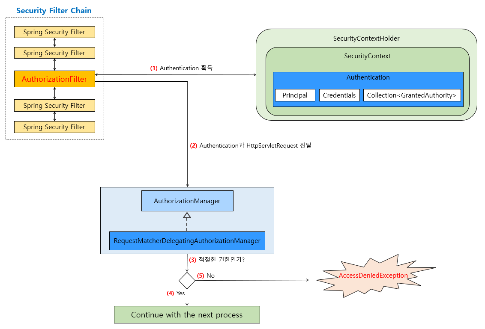
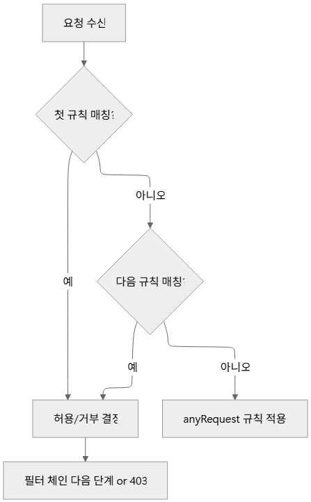

# <span style="background-color: #FFF9C4">5. **인가 아키텍처 - 인가 프로세스**</span>

단순히 인증에만 성공했다고 모든 Resource에 접근할 수 있다면 권한 부여(인가, Authorization)이라는 보안 요소를 무시하는 것

Spring Security에서 인증된 사용자에게 어떤 과정을 거쳐 애플리케이션 Resource에 대한 접근 권한을 부여하는지 살펴보자.

<br>

## 5-01. Spring Security의 컴포넌트로 보는 권한 부여(인가, Authorization) 처리 흐름

- Spring Security의 인가 과정은 보통 **Filter Chain**에서 수행됨



<br>

## 5-02. 인가 처리에서 사용되는 컴포넌트 세부 흐름

### 1) `FilterSecurityInterceptor`와 `AuthorizationFilter`

두 Filter 모두 요청이 들어올 때 인증 정보를 기반으로 권한 검사를 수행

- `FilterSecurityInterceptor`
  - 가장 전통적인 인가(Authorization) 처리 Filter
  - URL 요청에 대한 접근 권한을 검사함
- `AuthorizationFilter`
  - Spring Security 5.5+에서 추가된 새로운 Filter
  - `AuthorizationManager`와 함께 동작
  ```
  클라이언트 요청이 들어오면
                                                       ➡️ (허용) ➡️ 보호된 자원 접근
                                                     /
  ➡️ AuthorizationFilter ➡️ (인가 검사) ➡️ 인가 결정
                                                     \
                                                       ➡️ (거부) ➡️ Access Denied
  ```

#### 인가 결정 위임 메커니즘

- 인가는 보통 `AuthorizationManager` 또는 `AccessDecisionManager`에 위임
- Filter는 단순 “인가 검사 필요” 신호를 보냄
- Manager는 실제 권한 판단 수행

#### 인가 성공/실패 시 처리 방식

- 인가 **성공** 시 다음 Filter나 Controller로 전달
- 인가 **실패** 시 `AccessDeniedException`이 발생하며, `AccessDeniedHandler`가 이것을 처리

<br>

### 2) `AuthorizationManager`

- 함수적 인터페이스로 정의 ➡️ **람다** 표현식으로 쉽게 작성 가능
- `check()` 메서드로 인증 정보와 요청 정보를 입력 받아 접근 허용 여부를 결정

<br>

### 3) `AuthorizationManager` 구현체

#### `RequestMatcherDelegatingAuthorizationManager`

- `RequestMatcher`를 통해 매치되는 권한 부여 처리

#### `AuthorityAuthorizationManager`

- 특정 권한(Authority)이 있는지 검사

#### `AuthenticatedAuthorizationManager`

- 인증(Authentication) 자체 여부만 검사

<br>

## 5-03. URL 기반 인가 설정

### 1) `requestMatchers().access()` 메서드 활용

- URL 요청 경로별로 권한을 제어 가능
- Spring Security 6(=Spring Boot 3.x)에서 `antMatchers`, `mvcMatchers`, `regexMatchers`가 제거되고, `requestMatchers(...)` 한 가지로 통일
- 내부적으로 어떤 Matcher를 사용하느냐에 따라 Ant/MVC/Regex 전략이 적용

```java
http.authorizeHttpRequests(auth -> auth
    .requestMatchers("/admin/**").access(AuthorityAuthorizationManager.hasRole("ADMIN"))
    .anyRequest().authenticated()
);

// 아래처럼 builder 메서드로 표현 가능
http.authorizeHttpRequests(auth -> auth
    .requestMatchers("/user/**").hasRole("USER")
    .anyRequest().authenticated()
);
```

<br>

### 2) 경로 매칭 전략 (Ant/MVC/Regex)

#### Ant 패턴

REST API나 단순 경로 매칭에 적합

- 가장 흔함
- `*` : 경로 요소 1개
- `**` : 하위 모든 디렉터리 포함

```java
.requestMatchers("/admin/*").hasRole("ADMIN")
.requestMatchers("/api/**").hasRole("USER")
```

#### MVC 패턴

```java
.requestMatchers(mvc.pattern("/articles/{id}")).hasRole("USER") // 경로 변수 인식
.requestMatchers(mvc.pattern(HttpMethod.POST, "/articles")).hasRole("WRITER")
```

#### Regex 패턴

```java
.requestMatchers(new RegexRequestMatcher("^/file/[a-f0-9\\\\-]{36}$", null)).hasAuthority("FILE_READ")
```

<br>

### 3) 규칙 평가 순서와 우선 순위

- **규칙**
  - “요청 매칭 조건 + 인가 조건” 형태로 구성되며, 아래 한 줄 전체를 말함
  - 예시: `.requestMatchers("/admin/*").hasRole("ADMIN")`



### 4) 주요 인가 조건 메서드

| 메서드            | 의미                             | 전형적 사용            |
| ----------------- | -------------------------------- | ---------------------- |
| `permitAll()`     | 로그인 여부와 무관하게 모두 허용 | 정적 리소스, 공개 API  |
| `anonymous()`     | 로그인하지 않은 사용자만 허용    | 로그인/회원가입 페이지 |
| `authenticated()` | 로그인 사용자만 허용             | 일반 보호 API          |
| `denyAll()`       | 누구도 접근 불가                 | 임시 차단, 테스트      |

```java
.requestMatchers("/login", "/signup").anonymous()
.requestMatchers("/assets/**").permitAll()
.anyRequest().authenticated()
```

<br>

## 5-04. 메서드 보안

URL 기반 인가 외에도 메서드 단위 보안 적용 가능

### 1) `@EnableMethodSecurity`

```java
@Configuration
@EnableMethodSecurity(prePostEnabled = true)
public class SecurityConfig {
}
```

위 설정을 통해 `@PreAuthorize`, `@PostAuthorize` 애너테이션 사용 가능

<br>

### 2) `@PreAuthorize`, `@PostAuthorize` 활용

```java
// 메서드 실행 `전` 인가 검사
@PreAuthorize("hasRole('ADMIN')")
public void deleteUser(Long id) {
    // ADMIN 권한을 가진 사용자만 실행 가능
}

// 메서드 실행 `후` 반환값 인가 검사
@PostAuthorize("returnObject.owner == authentication.name")
public User getUser(Long id) {
    // 반환된 User 객체의 소유자가 현재 사용자일 때만 접근 허용
}
```

<br>

### 3) 메서드 파라미터 기반 동적 인가

**SpEL(Spring Expression Language)**을 사용하여 메서드 파라미터를 조건으로 활용할 수 있다.

- 현재 인증된 사용자 정보는 `authentication` 또는 `principal`를 통해 접근

```java
// 파라미터 id와 인증 객체의 principal.id가 동일한 경우만 접근 허용
@PreAuthorize("#id == authentication.principal.id")
public void updateUser(Long id) {
    // 현재 로그인한 사용자와 id가 같을 때만 실행됩니다.
}
```

<br>

## 5-05. 인가 이벤트와 예외 처리

### 1) `AuthorizationEvent` 발행과 구독

인가 과정에서 이벤트가 발행되며, 이를 구독해 로깅이나 모니터링을 수행할 수 있다.

```java
@Component
public class CustomAuthorizationEventListener {
    @EventListener
    public void handleAuthEvent(AuthorizationEvent event) {
        // ...
    }
}
```

<br>

### 2) 인가 실패 시 예외 처리 전략

- 인가 실패 시 `AccessDeniedException`이 발생
- `AccessDeniedHandler`가 인가 실패 시 발생한 `AccessDeniedException`을 처리
- 기본적으로 `403 Forbidden` 응답 반응

---
