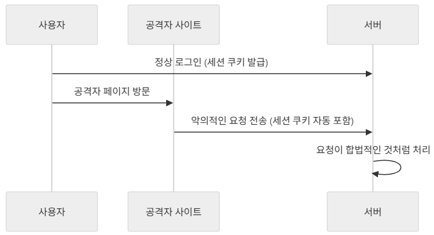
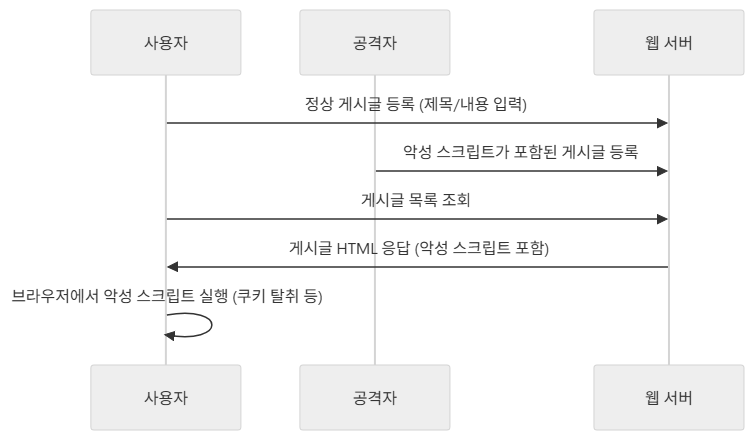
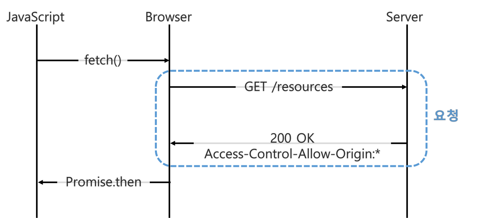
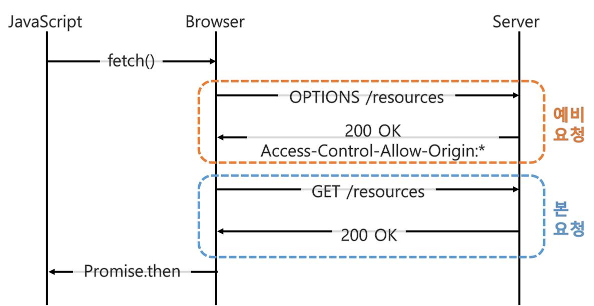

# <span style="background-color: #FFF9C4">7. 커스텀 Filter 구현</span>

## 7-01. 커스텀 Filter의 필요성

### 1) 기본 Filter의 한계

Spring Security는 다양한 보안 기능을 제공하기 위해 여러가지의 Filter를 기본적으로 제공한다.

다만, **특정 비즈니스 로직**이나 **추가적인 보안 정책**을 적용하려고 할 때, 내장 Filter만으로는 한계가 있다.

아래의 경우에 커스텀 Filter가 필요

- 모든 요청에 대해 **추가적인 로깅** 수행
- 특정 헤더 값이 반드시 포함되어야 하는 규칙 적용
- 사용자 IP 주소 검증 or 화이트리스트 정책 적용

<br>

### 2) 커스텀 Filter

기본 Filter Chain **앞/뒤의 원하는 위치에 삽입** 가능

- 꼭 필요한 경우에만 사용할 것
- 보안과 관련된 중요한 정책은 **표준 Filter로 먼저 처리**하고, 커스텀 Filter는 부가적인 기능에 사용

#### 커스텀 Filter 필요성

- 추가 인증 단계
  - 기본 인증 후, 별도의 토큰 검증이나 OTP 인증 추가
- 로깅 및 감사(Audit)
  - 요청과 응답에 로그를 남겨 추적 가능성 ⬆️
- 보안 정책 적용
  - 특정 국가 IP 차단, User-Agent 기반 접근 제한, 특정 시간대 요청 차단 등
- 성능 확인 및 모니터링
  - 요청 처리 시간 기록하여 성능 문제 추적

<br>

## 7-02. 커스텀 Filter 구현 방법

### 1) `GenericFilterBean` 확장

Spring Security에서 Filter를 구현할 때 가장 기본적으로 사용할 수 있는 클래스

- `jakarta.servlet.Filter`를 구현한 추상(`abstract`) 클래스
- Spring Bean으로 등록 가능하게 지원
- **Filter 구조를 직접 제어**해야 할 때 유용

```java
// GenericFilterBean을 상속하여 Filter 구현
public class CustomGenericFilter extends GenericFilterBean {

    @Override
    public void doFilter(ServletRequest request, ServletResponse response, FilterChain chain)
            throws IOException, ServletException {
        // 1. 요청 전 처리 로직
        System.out.println("[CustomGenericFilter] 요청 처리 전 실행");

        // 2. Filter Chain 계속 진행
        chain.doFilter(request, response);

        // 3. 응답 후 처리 로직
        System.out.println("[CustomGenericFilter] 응답 처리 후 실행");
    }
}
```

#### 실무 활용

- 사용자 세션 만료 처리
- IP 화이트리스트
- ➡️ **요청과 응답을 모두 다루며, 전후 처리 제어가 필요한 경우** 주로 사용

<br>

### 2) `OncePerRequestFilter` 활용

Spring Security에서 커스텀 Filter를 구현할 때 **가장 많이 사용하는 클래스**

- **중복 실행 방지** : 한 요청당 한 번만 실행되도록 보장
- 인증/인가 검증, 로깅, 헤더 검증 등의 작업에 활용

```java
public class CustomOncePerRequestFilter extends OncePerRequestFilter {
    @Override
    protected void doFilterInternal(HttpServletRequest request,
                                    HttpServletResponse response,
                                    FilterChain filterChain) throws ServletException, IOException {
        // 1. 요청 전 처리
        String clientIp = request.getRemoteAddr();
        System.out.println("[CustomOncePerRequestFilter] 클라이언트 IP: " + clientIp);

        // 2. 필터 체인 진행
        filterChain.doFilter(request, response);

        // 3. 응답 후 처리
        System.out.println("[CustomOncePerRequestFilter] 응답 완료");
    }
}
```

#### 실무 활용

- JWT 토큰 검증
- 요청 추적 ID 로깅
- ➡️ 요청마다 반드시 한 번 실행되어야 하는 보안/로그 추적 로직에 적합

<br>

## 7-03. Filter Chain에 커스텀 Filter 추가

### 1) 특정 위치에 Filter 추가

Spring Security에서는 Filter Chain에 커스텀 Filter를 원하는 위치에 추가 가능

보통 `SecurityFilterChain` 구현할 때 `addFilterBefore`, `addFilterAfter`, `addFilterAt` 메서드 사용

- 아래의 코드는 `UsernamePasswordAuthenticationFilter` 실행 전 커스텀 Filter를 추가

```java
@Configuration
public class SecurityConfig {

    @Bean
    public SecurityFilterChain filterChain(HttpSecurity http) throws Exception {
        http
            .addFilterBefore(new CustomOncePerRequestFilter(), UsernamePasswordAuthenticationFilter.class)
            //...
    }
}
```

- `addFilterBefore` : 지정된 Filter **앞**에 커스텀 Filter 추가
- `addFilterAfter` : 지정된 Filter **뒤**에 커스텀 Filter 추가
- `addFilterAt` : 지정된 Filter와 **같은 위치**에 추가

<br>

### 2) URL 패턴 기반 Filter 적용

특정 URL 패턴에 커스텀 Filter 적용 가능

#### 방법1: 단일 Chain + 내부 분기

- **하나의** `SecurityFilterChain`만 존재
- 모든 요청에 같은 Filter Chain을 거침
- Filter 내부에서 `request.getRequestURI()`를 검사해 조건 분기
- **장점**: 구현 단순
- **단점**: 모든 요청이 Filter를 거침 ➡️ 불필요한 요청에도 실행 가능

#### 방법2: 다중 `SecurityFilterChain` 구성

- URL 패턴별로 **별도의** `SecurityFilterChain`을 정의
- **장점**: 불필요한 요청은 제외되므로 성능과 안정성이 올라감
- **단점**: Chain이 여러 개 생기므로 관리가 복잡해

---

# <span style="background-color: #FFF9C4">8. 주요 웹 보안 이슈와 Spring Security 방어 전략</span>

## 8-01. CSRF(Cross-Site Request Forgery) 이해와 방어

**CSRF**는 사용자가 의도하지 않은 요청을 공격자가 위조하여 서버에 보내도록 하는 공격 기법

- 피해자는 이미 로그인된 세션을 가진 상태이므로, 서버는 공격자가 보낸 요청을 정상 요청으로 오인
- ➡️ 사용자가 모르는 사이 계정 정보 변경, 송금, 글 작성 등의 행위 발생 가능



<br>

### 1) Spring Security의 CSRF 보호 메커니즘

#### 기본 동작

Spring Security는 기본적으로 **상태 유지 세션 기반 애플리케이션**에서 CSRF 보호를 활성화

서버는 요청 시 **CSRF 토큰**을 검증하여, 클라이언트가 의도적으로 요청을 보냈는지 확인

- Spring Security 6.x에서는 CSRF가 기본적으로 활성화되어 있음
- JWT를 `Authorization` 헤더에 담아 사용하는 Stateless Rest API 서버라면 인증 정보가 브라우저에 의해 자동 전송되지 않으므로 일반적으로 CSRF 비활성화
- 세션 기반 웹 앱은 CSRF 보호 필수
- `SameSite`, `Secure`, `HttpOnly` 쿠키 옵션 적극 활용

#### CsrfFilter와 CsrfToken

- **CsrfFilter**
  - 모든 요청에 대해 CSRF 토큰을 검증하는 Filter
  - 사용자가 보낸 요청에 `_csrf` 파라미터나 헤더 값이 없는 경우 `AccessDeniedException`을 발생
- **CsrfToken**
  - 서버가 세션별로 생성하여 클라이언트에게 전달하는 토큰
  - 매 요청마다 클라이언트가 전달하며, 서버는 저장된 토큰과 일치 여부 검사
- **토큰 생성 과정**
  - 사용자가 최초로 세션을 생성하거나 페이지를 요청할 때 **고유한 난수 기반 토큰**을 생성
    - 난수는 `SecureRandom` 기반으로 생성되어 예측이 불가능하고, 위조가 어려움
  - `HttpSessionCsrfTokenRepository`(기본 구현체) 또는 `CookieCsrfTokenRepository`에 저장됨
- **토큰 전달 방식**
  - **Form hidden 필드**: 서버에서 렌더링 시 `_csrf` 값을 자동 삽입
  - **AJAX/SPA**: 응답 헤더 또는 meta 태크로 전달 후, 요청 시 `X-CSRF-TOKEN` 헤더에 포함
  - **Double-submit 쿠키**: 토큰을 쿠키와 헤더 모두에 담아 서버에서 일치 여부 검증
- **검증 방식**
  1. 요청이 들어오면 `CsrfFilter` 동작
  2. 요청에 포함된 토큰(`_csrf` 필드 또는 헤더 값)을 추출
  3. 저장소(`HttpSession` 또는 `Cookie`)에 보관된 토큰과 비교
  4. 일치하면 정상 요청, 불일치 또는 누락 시 `AccessDeniedException` 발생
  - 공격자는 올바른 토큰을 알 수 없으므로 위조 요청은 차단됨
- **CsrfFilter 동작 순서**
  ```
  - loadToken() ➡️ 저장소에서 토큰 조회
  - 없으면 generateToken() ➡️ saveToken()
  - 요청 메서드가 POST/PUT/DELETE/PATCH면 토큰 검증
  - 토큰 불일치 ➡️ AccessDeniedException
  ```
- **보강 전략**
  - **Origin/Referer 검증**: 요청 헤더로 동일 출처인지 확인
  - **SameSite 쿠키**: `Lax` 또는 `Strict` 설정으로 크로스 도메인 요청 차단
  - **XSS 방어**: 토큰 탈취 방지를 위해 필수

<br>

## 8-02. XSS(Corss-Site Scripting) 이해와 방어

**XSS**는 공격자가 악의적인 스크립트를 웹 페이지에 삽입하여 사용자의 브라우저에서 실행되도록 하는 공격 기법

- **쿠키 탈취, 세션 하이재킹, 악성 사이트 리다이렉션, 피싱** 등에 활용됨



### 1) XSS 주요 유형

- **Stored XSS**
- **Reflected XSS**
- **DOM 기반 XSS**

<br>

### 2) Spring Security의 XSS 방어 접근법

#### 기본 응답 헤더 설정: CSP와 nosniff

브라우저가 **응답 헤더**를 근거로 위험한 Resource/스크립트를 차단하도록 하는 접근법

- **CSP(Content-Security-Policy)**와 **X-Content-Type-Options: nosniff**는 현제 XSS 방어에서 가장 많이 사용하는 방식
  - **CSP(Content-Security-Policy)**: Resource/스크립트 로딩 및 실행 원천 제한
  - **X-Content-Type-Options**: MIME 스니핑 방지하여 잘못된 타입의 Resource 실행 및 랜더링 금지

<br>

### 3) CSP (Content-Security-Policy)

**브라우저가 강제하는 보안 정책**으로, **어떤 출처(origin)의 Resource만 로드/실행 가능한지**를 선언적 헤더로 규정

- origin = protocol + host(domain) + port
  - URL의 **프로토콜, 호스트, 포트**를 합친 값
  - 예시 : https://example.com:443
- XSS 방어의 최전선: 스크립트 실행 원천을 제한하고, **인라인 스크립트 금지** 또는 **허용된 nonce/hash만 실행**하게 함

#### 전략

- `nonce` : 요청마다 서버가 난수를 생성하여 `<script nonce="<값>">`에서만 실행 허용
  - Thymeleaf 등의 서버사이드 렌더링에 사용
- `hash` : 스크립트 내용을 SHA-256 등의 해시값으로 계산한 뒤, CSP 정책에 등록된 해시값과 일치하는 스크립트만 실행 허용

<br>

## 8-03. CORS(Cross-Origin Resource Sharing) 이해와 설정

**CORS**는 교차 출처 Resource 공유를 의미

서로 다른 Origin을 가진 애플리케이션이 서로의 Resource에 접근할 수 있도록 해줌

<br>

### 1) 동일 출처 정책(SOP)

브라우저는 **SOP**를 적용하여 **다른 출처의 Resource 접근을 차단**

- **장점**: 외부 Resource를 무분별하게 가져오는 것을 막아, **XSS·XSRF 공격** 방어 가능
- **한계**: SOP로 인해 기본적으로 제한되는 다른 출처 요청을 서버가 허용한 경우에만 브라우저가 접근할 수 있도록 하는 예외 메커니즘 **CORS**가 있음

<br>

### 2) CORS 동작 원리

**Simple Request(단순 요청)와 Preflight Request(예비 요청)** 두 가지 존재

#### **Simple Request(단순 요청)**

서버에 바로 요청을 보내고, 서버는 `Access-Controle-Allow-Origin` 헤더를 포함한 응답을 반환

브라우저는 이 헤더를 확인해 요청 허용 여부 결정



- **Simple Request 조건**
  - 요청 메서드는 `GET`, `HEAD`, `POST` 중 하나
  - `Accept`, `Accept-Language`, `Content-Language`, `Content-Type` 등 **제한된 헤더**만 사용 가능
  - `Content-Type`은 `application/x-www-form-urlencoded`, `multipart/form-data`, `text/plain`만 허용

#### **Preflight Request(예비 요청)**

본 요청 전에 `OPTIONS` 메서드로 예비 요청을 보

서버가 허용 여부(`Access-Control-Allow-*` 헤더)를 응답하면, 브라우저가 본 요청을 진행합니다.

- 대부분의 REST API는 `application/json`을 사용하기 때문에 **Preflight 요청**으로 처리됨



---
