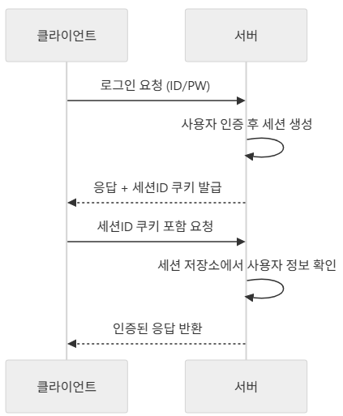
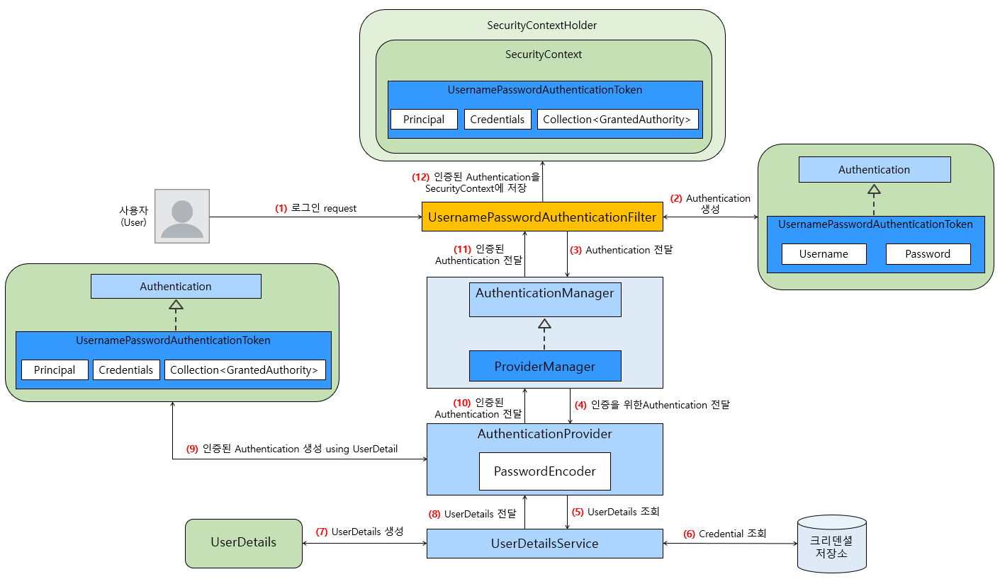
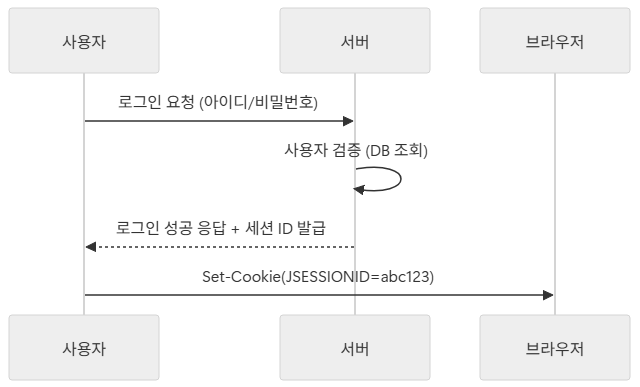
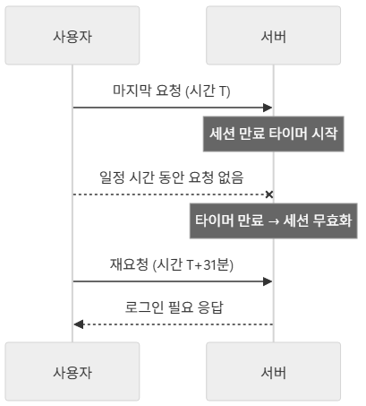
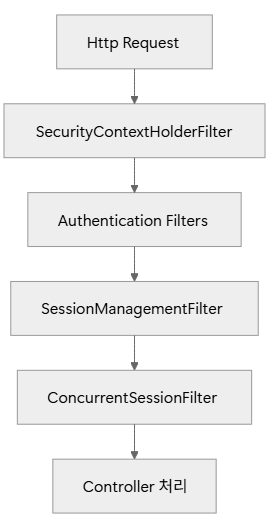

# 1. 세션 기반 인증

## 1-01. 세션 기반 인증

### 1) 세션(Session)

**서버에서 관리하는 사용자 상태 정보 저장 공간**으로, 사용자가 로그인하면 서버는 세션을 생성하고 **고유한 세션 ID** 발급.

- 세션 ID는 쿠키에 저장되어 클라이언트와 서버 간 인증 상태를 이어줌

#### 세션 workflow



- 로그아웃하거나 세션이 만료되면 세션은 제거됨

#### 세션 ID와 쿠키의 관계

- 세션 자체는 서버 메모리나 DB 등에 저장됨
- 클라이언트는 **세션 ID만 쿠키에 저장**하고, 이것을 통해 서버가 세션을 찾음
- **쿠키는 세션을 식별하는 열쇠 역할**

<br>

## 1-02. Spring Security의 세션 기반 인증 아키텍처

Spring Security로 세션 기반 인증을 적용할 때, 내부적으로 **인증 정보는 SecurityContext에 저장**되고, SecurityContext는 다시 **HttpSession과 연결**되어 상태가 유지됨



<br>

### 1) 인증 정보의 세션 저장 메커니즘

인증이 완료되면 `SecurityContextHolderFilter`를 통해 `SecurityContext`를 세션에 저장(Spring Security 5에서는 `SecurityContextPersistenceFilter`)

- **요청 전 처리**: 세션에 저장된 `SecurityContext`를 꺼내 현재 스레드에 바인딩
- **요청 후 처리**: 현재 스레드에서 사용한 `SecurityContext`를 다시 세션에 저장
- ➡️ 로그인 후 모든 요청에서 인증 정보를 자동으로 유지 가능

<br>

### 2) `SecurityContext`와 `HttpSession`의 관계

- `SecurityContext`는 인증 정보를 담고 있는 객체
- `SecurityContextHolder`는 `SecurityContext`를 **ThreadLocal**에 저장하여 현재 실행 중인 스레드에서 인증 정보를 쉽게 접근할 수 있게
- `HttpSession`은 `SecurityContext`를 보존하는 저장소 역할

<br>

### 1-03. Spring Security의 기본 세션 관리 동작

### 1) 로그인 후 세션 생성 과정



- 브라우저는 서버에서 발급한 세션 ID를 쿠키(`JSESSION`)에 저장하고, 이후 요청마다 자동으로 함께 전송

<br>

### 2) 쿠키의 역할

세션 ID를 클라이언트에 저장하기 위한 수단으로 사용

보안 속성(`HttpOnly`, `Secure`, `SameSite`)을 활용하여 보안성 강화

```
Set-Cookie: JSESSIONID=abc123; Path=/; HttpOnly; Secure; SameSite=Strict
```

<br>

### 3) 로그아웃 시 세션 무효화

로그아웃 요청이 들어오면 서버는 해당 세션을 제거

브라우저에 저장된 쿠키는 더 이상 유효하지 않게 됨

```java
@PostMapping("/logout")
public String logout(HttpServletRequest request) {
    HttpSession session = request.getSession(false);
    if (session != null) {
        session.invalidate(); // 세션 무효화
    }
    //...
}
```

- `invalidate()` : 세션에 저장된 모든 데이터 제거
- 로그아웃 후에 브라우저는 기존 `JSESSIONID`를 보관하고 있다. 하지만 서버에서는 해당 세션을 더 이상 찾을 수 없기 때문에 새로운 로그인이 필요
- 세션 삭제 시 쿠키 만료 처리도 함께 처리하는 것이 안전함

<br>

### 4) 세션 타임아웃

- 세션은 일정 시간 동안 사용되지 않으면 자동으로 만료됨
- 기본값은 보통 **30분**

```yaml
server:
  servlet:
    session:
      timeout: 30m # 30분
```



---

# 2. 세션 관리 핵심 컴포넌트

## 2-01. `SecurityContextHolder`와 `SecurityContext`


### 1) `SecurityContextHolder`

- Spring Security에서 현재 인증(Authentication) 정보를 저장하고 조회하는 **중앙 저장소** 역할을 함
- 기본적으로 **스레드 로컬(ThreadLocal)** 방식을 사용해 각 요청마다 인증 정보를 독립적으로 보관
- 즉, 로그인 성공 시 생성된 `Authentication` 객체는 `SecurityContextHolder`에 저장되고, 이후 요청 처리 과정에서 언제든지 참조할 수 있음

#### `SecurityContextHolder` 동작 방식

**ThreadLocal**을 사용해 각 요청 스레드마다 별도의 `SecurityContext`를 저장

- **멀티스레드 환경**에서 인증 정보가 뒤섞이지 않고, 요청 단위로 분리됨
- **전략 모드**
  - `MODE_THREADLOCAL` : (기본값) 요청 스레드마다 독립된 `SecurityContext` 저장
  - `MODE_INHERITABLETHREADLOCAL` : 자식 스레드가 부모 스레드의 `SecurityContext` 상속
  - `MODE_GLOBAL` : 모든 스레드가 하나의 `SecurityContext` 공유 (거의 사용하지 않음)

<br>

### 2) `SecurityContext`

실제 인증 정보인 `Authentication` 객체를 담고 있는 컨테이너

#### `Authentication` 객체 구성요소

- `Principal` : 사용자 정보(보통 `UserDetails` 구현체)
- `Credentials` : 비밀 번호 또는 인증 토큰
- `Authorities` : 사용자가 가진 권한(**Role**) 목록
- `Details` : 부가 정보(IP, 세션 ID)

<br>

## 2-02. 세션 관리 Filter

인증, 인가뿐만 아니라 세션 관리 역시 여러 개의 Filter를 통해 처리된다.

대표적인 Filter는 아래와 같다.

- `SecurityContextHolderFilter`
- `SessionManagementFilter`
- `ConcurrentSessionFilter`



<br>

### 1) `SecurityContextHolderFilter`

요청이 들어올 때마다 `SecurityContext`**를 생성**하거나 `HttpSession`**에서 기존 Context를 복원**

- 요청 처리 후에는 `SecurityContextHolder.clearContext()`를 통해 **ThreadLocal에 저장된 Context를 제거**
- `SecurityContextPersistenceFilter` 대신 `SecurityContextHolderFilter`가 최신 버전(Spring Security 6+)에서 사용

#### `HttpSessionSecurityContextRepository`

기본 구현체로, `HttpSession`**에** `SecurityContext`**를 저장/조회**함

- 로그인 성공 시 인증 객체 `Authentication`을 담은 `SecurityContext`가 세션에 저장됨

<br>

### 2) `SessionManagementFilter`

로그인 시점에 동작하여 세션 인증 전략(SessionAuthenticationStrategy)을 실행

- **세션 고정 보호, 동시 세션 제어** 처리
- 금융 서비스나 보안 민감 서비스에서는 동시 로그인 제한 반드시 적용

#### 세션 고정(Session Fixation) 보호

공격자가 미리 발급받은 세션 ID를 피해자에게 심어주고, 로그인 후에도 동일한 세션을 공유하는 공격

- Spring Security는 기본적으로 로그인 시 세션 ID를 변경하여 보호함

#### 동시 세션 제어

한 사용자가 여러 개의 세션을 가질 수 없도록 제한

<br>

### 3) `ConcurrentSessionFilter`

요청이 들어올 때마다 **세션의 유효성을 검사**

- 세션이 만료되었거나 허용 개수를 초과한 경우, 사용자를 강제 로그아웃 처리
- 관리자 페이지에서 **강제 로그아웃 기능**을 구현할 때 유용

<br>

## 2-03. 세션 이벤트와 Listener

- 세션 이벤트(Session Event)는 세션의 생성, 소멸, 만료 시점에 발생하는 이벤트
- Listener는 이런 이벤트를 감지하고 특정 동작(로그, Resource 정리 등)을 수행할 수 있도록 돕는 컴포넌트

<br>

### 1) `HttpSessionListener`

- Java EE 표준 인터페이스
- `sessionCreated`, `sessionDestroyed` 메서드를 통해 세션의 생성/소멸을 감지

<br>

### 2) Spring ApplicationListener 활용

#### Spring 이벤트 시스템 연게

- `ApplicationListener`를 구현하거나 `@EventListener`를 통해 간단히 감지
- `HttpSessionCreatedEvent`, `HttpSessionDestroyedEvent` 클래스를 통해 감지 가능
- `SecurityContext`까지 함께 확인할 수 있어서 **사용자 단위 세션 추적**에 적합

<br>

### 3) 세션 만료 감지

#### `ConcurrentSessionFilter` 기반 만료

**동시 세션 제어**와 함께 사용되며, 만료된 세션을 감지하고 처리

- 세션이 만료되면 `HttpSessionDestroyedEvent`가 발생하며, Listener가 이것을 받아 처리할 수 있다.

---

# 3. 세션 관리 설정과 커스터마이징

## 3-01. 세션 생성 정책

Spring Security는 인증/인가를 처리할 때 **세션을 어떻게 생성하고 활용할지**를 결정할 수 있는 `SessionCreationPolicy`를 제공

- HTTP는 **Stateless(무상태성)** 프로토콜
- 하지만 로그인 유지, 사용자 상태 저장 등의 이유로 서버는 세션을 활용
- Spring Security는 기본적으로 **필요할 때만 세션을 생성**하여 사용

### 1) `SessionCreationPolicy` 종류

#### `ALWAYS`

요청이 들어올 때마다 세션을 항상 생성

- **테스트 환경, 강제 세션 추적 필요**할 때 사용

#### `IF_REQUITRD`

필요한 경우에만 세션 생성

- Spring Security 기본값
- **세션 기반 웹 애플리케이션**일 때 사용

`NEVER`

Spring Security는 세션을 생성하지 않지만, 기존 세션이 있다면 사용

- **외부 세션 관리 시스템 존재**할 때 사용

`STATELESS`

세션을 전혀 생성하지 않으며, 기존 세션도 사용하지 않음

- **API 서버(JWT, OAuth2 등 토큰 기반 인증)**를 사용할 때 사용 (모든 요청을 독립적으로 처리)

<br>

## 3-02. 세션 타임아웃 (Session Timeout)

사용자가 일정 시간 동안 활동하지 않았을 때 보안 강화를 위해 자동으로 세션을 종료하는 기능

- **불필요한 서버 자원 사용을 줄이고, 보안 사고를 예방**

```yaml
server:
  servlet:
    session:
      timeout: 30m # 30분 동안 활동이 없으면 세션 종료
```

- 세션 만료 이벤트 처리
  - 세션 만료 시 `HttpSessionEvent`를 발생 시킴. 이 이벤트를 통해 로그아웃 로그 저장, 알림 전송 등의 후처리 가능
- 세션 타임아웃 커스터마이징
  - 비즈니스 요구에 따라 세션 타임아웃을 사용자별로 다르게 적용하거나 특정 요청을 연장할 수 있음
- 금융 서비스나 보안이 중요한 서비스의 경우 **짧은 타임아웃(예: 10분)**을 설정하는 것이 일반적
- 반대로 사용자 경험이 중요한 경우에는 **긴 타임아웃(예: 1~2시간)**을 설정할 수 있음

<br>

## 3-03. 세션 만료 후 처리 전략

세션은 일정 시간 동안 사용자가 활동하지 않거나, 로그아웃하면 만료됨

만료된 세션에 접근하면, 사용자는 인증된 상태가 아니기 때문에 보안적인 조치가 필요함

<br>

### 1) 만료된 세션 접근 처리

#### 기본 동작

Spring Security는 기본적으로 `InvalidSessionStrategy`를 통해 만료된 세션 접근 처리

- 아무 설정이 없다면 `/login` 페이지로 리다이렉션

#### 커스터마이징 필요성

- REST API의 경우, JSON 응답으로 세션 만료를 알리는 것이 더 적절함
- 대규모 서비스의 경우, 만료 원인을 명시적으로 보여주는 것이 필요

<br>

### 2) `InvalidSessionStrategy` 구현

세션이 만료되었을 때 동작을 직접 정의할 수 있는 인터페이스

- 다양한 경우(웹, API, SPA 등)에 맞게 커스터마이징 가능
- `onInvalidSessionDetected(HttpServletRequest request, HttpServletResponse response)`
  - 유효하지 않은 세션 ID가 감지되었을 때 `SessionManagementFilter`에 의해 호출되는 `InvalidSessionStrategy`의 콜백 메서드

---
