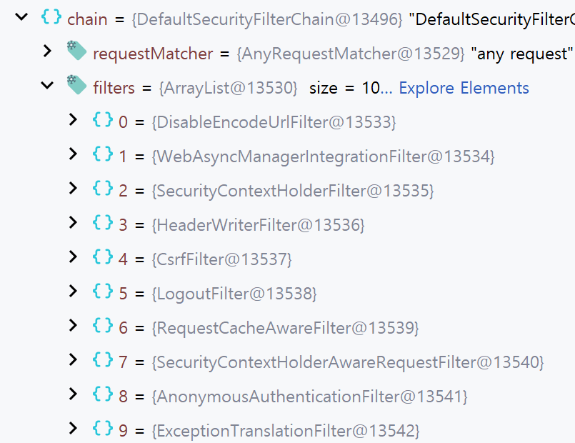
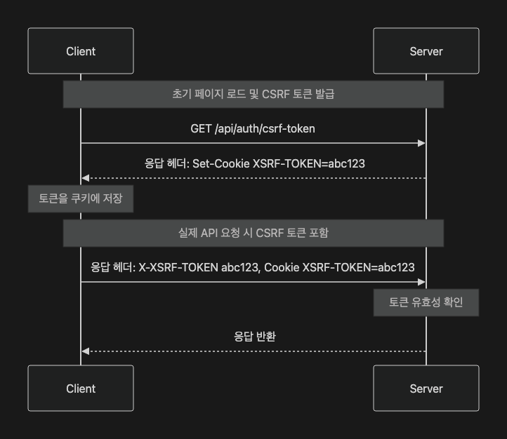

# 오늘의 성취

## 1. 개발 진행 상황

- Spring Security 환경설정
  - Spring Security 의존성 설치 및 설정 클래스 구현
  - `SecurityFilterChain`을 Bean으로 선언하고, 등록되는 Filter 디버깅

    

- CSRF 보호 설정하기
  - 서버는 CSRF 토큰을 응답 헤더 `Set-Cookie`를 통해 `XSRF-TOKEN` 쿠키에 저장
  - 클라이언트가 매 요청마다 쿠키에 저장된 CSRF 토큰을 `X-XSRF-TOKEN` 헤더에 담아 서버에 전달하고, 서버는 `X-XSRF-TOKEN`와 `Cookie` 헤더의 토큰을 비교
  - `CsrfTokenRepository`의 구현체는 `CookieCsrfTokenRepository`로 설정
  - `CsrfTokenRequestHandler` 컴포넌트 대체
    - [SpaCsrfTokenRequestHandler](#spacsrftokenrequesthandler)
  - CSRF 토큰을 발급하는 API 구현
    - `GET /api/auth/csrf-token`

<br>

## 2. 질문

### `csrfTokenRepository`와 `csrfTokenRequestHandler`

- [구현 중인 `SecurityConfig`](#securityconfig-구현-중)

#### `csrfTokenRepository`

CSRF 토큰을 **생성**·**저장**하고, 요청 시 다시 **조회**하는 역할

- `HttpSessionCsrfTokenRepository`
  - Spring Security의 기본 CSRF 토큰 저장소
    - `csrfTokenRepository`의 기본값
  - CSRF 토큰을 **서버의 HTTP Session**에 저장
- `CookieCsrfTokenRepository`
  - CSRF 토큰을 **쿠키** 기반으로 저장
  - 기본 쿠키 이름은 `XSRF-TOKEN`
  - 토큰이 생성·로드되면 서버는 `Set-Cookie` 응답 헤더를 통해 `XSRF-TOKEN` 쿠키에 CSRF 토큰 저장
  - 이후 요청에서 서버는 쿠키에 담긴 CSRF 토큰을 기준 토큰으로 사용
  - CSR/SPA 환경에서 클라이언트 JavaScript가 쿠키 CSRF 토큰을 읽어 `X-XSRF-TOKEN` 요청 헤더에 넣어야 하므로 `withHttpOnlyFalse()` 사용

#### `csrfTokenRequestHandler`

요청/응답에서 **CSRF 토큰을 어떻게 다룰지** 결정하는 역할

구체적으로

1. CSRF 토큰을 request attribute로 노출
   - 예시: SSR 환경에서 `_csrf` 값을 form hidden input 등에 사용할 수 있게 함
2. 클라이언트가 보낸 요청 안에서 CSRF 토큰 값을 읽는 역할
   - 예시
     - 요청 헤더의 `X-XSRF-TOKEN` 값을 읽거나
     - 요청 파라미터의 `csrf` 값을 읽음

---

# 프로젝트 요구 사항

## 4. 기본 요구사항

### 4-01. Spring Security 환경설정

- [x] 프로젝트에 Spring Security 의존성을 추가하세요.

- [x] Security 설정 클래스를 생성하세요.
  - 패키지명: `com.sprint.mission.discodeit.config`
  - 클래스명: `SecurityConfig`
- [x] `SecurityFilterChain` Bean을 선언하세요.
  - [x] 가장 기본적인 `SecurityFilterChain`을 등록하고, 이때 등록되는 필터 목록을 디버깅해보세요. 필터 목록은 PR에 첨부하세요.

- [x] 개발 환경에서 Spring Security 모듈의 로깅 레벨을 `trace`로 설정하세요.
  - 각 요청마다 통과하는 필터 목록을 확인할 수 있습니다.

### 4-02. CSRF 보호 설정하기



> 디스코드잇은 CSR 방식이기 때문에 CSRF 토큰은 다음과 같이 처리합니다.
>
> 1. 클라이언트에서 페이지가 로드될 때 CSRF 토큰 발급 API를 명시적으로 호출
> 2. 서버는 CSRF 토큰을 응답 헤더(`Set-Cookie`)를 통해 쿠키에 저장
> 3. 클라이언트에서 매 요청마다 쿠키에 저장된 CSRF 토큰을 헤더(`X-XSRF-TOKEN`)에 포함
> 4. 서버는 요청 헤더에 포함된 두 토큰 값(`X-XSRF-TOKEN`, `Cookie`)을 비교해 유효성 검증

- [x] `CsrfTokenRepository` 구현체를 `CookieCsrfTokenRepository`로 설정하세요.
  - 디폴트 구현체는 `HttpSessionCsrfTokenRepository`입니다.
  - 이때 클라이언트에서 쿠키에 저장된 CSRF 토큰에 접근해야 하므로 **HttpOnly**는 `false`로 설정합니다.

- [x] `CsrfTokenRequestHandler` 컴포넌트를 대체하세요.
  - 디폴트 구현체는 `XorCsrfTokenRequestAttributeHandler`입니다.
  - [Spring 공식문서](https://docs.spring.io/spring-security/reference/servlet/exploits/csrf.html#csrf-integration-javascript-spa)에서 권장하는 CSR+SPA(Single Page Application) 환경에 적합한 구현체를 정의하세요.

- [x] CSRF 토큰을 발급하는 API를 구현하세요.
  - API 스펙
    - 엔드포인트: `GET /api/auth/csrf-token`
    - 요청: 없음
    - 응답: `203 Void`
  - `CsrfToken` 파라미터를 메서드 인자로 선언하면, `HandlerMethodArgumentResolver`를 통해 자동으로 주입됩니다. ([공식문서](https://docs.spring.io/spring-security/reference/servlet/integrations/mvc.html#mvc-csrf-resolver))
  - GET 요청에는 CSRF 인증이 이루어지지 않기 때문에 토큰이 초기화되지 않습니다. 따라서 명시적으로 메소드에서 토큰을 호출합니다.

//...

---

# GitHub Repository 주소

[https://github.com/JungH200000/10-sprint-mission/tree/sprint9](https://github.com/JungH200000/10-sprint-mission/tree/sprint9)

---

# 정리 및 보관용 코드

## `SecurityConfig` (구현 중)

```java
import lombok.extern.slf4j.Slf4j;
import org.springframework.context.annotation.Bean;
import org.springframework.context.annotation.Configuration;
import org.springframework.security.config.annotation.web.builders.HttpSecurity;
import org.springframework.security.web.SecurityFilterChain;
import org.springframework.security.web.csrf.CookieCsrfTokenRepository;

@Configuration
@Slf4j
public class SecurityConfig {

    @Bean
    // HttpSecurity를 통해 HTTP 요청에 대한 보안 설정 구성
    public SecurityFilterChain securityFilterChain(HttpSecurity http) throws Exception {
        http
                .csrf(csrf -> csrf
                        .csrfTokenRepository(CookieCsrfTokenRepository.withHttpOnlyFalse())
                        .csrfTokenRequestHandler(new SpaCsrfTokenRequestHandler()));

        log.debug("========== [Spring Security Filter List] ==========");

        return http.build();
    }
}

```

## `SpaCsrfTokenRequestHandler`

```java
import jakarta.servlet.http.HttpServletRequest;
import jakarta.servlet.http.HttpServletResponse;
import org.springframework.security.web.csrf.CsrfToken;
import org.springframework.security.web.csrf.CsrfTokenRequestAttributeHandler;
import org.springframework.security.web.csrf.CsrfTokenRequestHandler;
import org.springframework.security.web.csrf.XorCsrfTokenRequestAttributeHandler;
import org.springframework.util.StringUtils;

import java.util.function.Supplier;

public class SpaCsrfTokenRequestHandler implements CsrfTokenRequestHandler {

    /* plain handler
     * 클라이언트가 쿠키에서 읽은 CSRF 토큰 값을 X-XSRF-TOKEN` 헤더에 그대로 담아 보내는 경우 사용
     * 이 헤더 값은 plain token이므로 CsrfTokenRequestAttributeHandler로 처리
     */
    private final CsrfTokenRequestHandler csrf = new CsrfTokenRequestAttributeHandler();

    /* xor handler
     * Spring Security의 기본 CSRF 요청 처리 방식
     * CSRF 토큰이 응답 본문 등에 노출될 때 BREACH 공격을 완화하기 위해 XRO 방식으로 토큰을 다룸
     */ - 서버 사이드 렌더링 환경에서 form hidden input으로 CSRF 토큰을 내려줄 때 이 방식이 사용될 수 있음
    private final CsrfTokenRequestHandler xorCsrf = new XorCsrfTokenRequestAttributeHandler();

    @Override
    // 클라이언트가 요청을 담아 보낸 CSRF 토큰 값을 꺼내는 메서드
    public String resolveCsrfTokenValue(
            HttpServletRequest request,
            CsrfToken csrfToken
    ) {
        /*
         * csrfToken.getHeaderName()은 현재 CSRF 토큰이 기대하는 요청 헤더 이름을 반환
         * CookieCsrfTokenRepository의 기본 헤더 이름은 X-XSRF-TOKEN
         * 즉, 아래 코드는 요청 헤더에서 X-XSRF-TOKEN 값을 읽음
         */
        String header = request.getHeader(csrfToken.getHeaderName());

        /*
         * CSR/SPA 요청인지 판단
         *
         * 클라이언트가 X-XSRF-TOKEN 헤더를 보냈으면,
         * 이 값은 보통 XSRF-TOKEN 쿠키에서 읽은 plain token
         *
         * 따라서 plain handler를 사용해서 토큰 값을 해석
         *
         * 반대로 X-XSRF-TOKEN 헤더가 없다면,
         * 서버 사이드 렌더링 form 요청처럼 _csrf 파라미터를 통해
         * XOR 처리된 토큰이 전달되는 상황일 수 있음
         * 이 경우 xor handler를 사용
         */
        CsrfTokenRequestHandler csrfTokenRequestHandler = StringUtils.hasText(header)
                ? this.csrf
                : this.xorCsrf;

        /*
         * 선택된 handler를 통해 요청에서 실제 CSRF 토큰 값을 꺼냄
         *
         * 이후 Spring Security의 CsrfFilter가
         * 저장소에 있는 토큰과 여기서 추출한 요청 토큰을 비교함
         */
        return csrfTokenRequestHandler.resolveCsrfTokenValue(request, csrfToken);
    }

    @Override
    // 서버 내부에서 현재 요청의 CSRF 토큰을 사용할 수 있도록 준비하는 메서드
    public void handle(
            HttpServletRequest request,
            HttpServletResponse response,
            Supplier<CsrfToken> csrfToken
    ) {
        /*
         * request attribute에 CSRF 토큰을 노출할 때 기본적으로 xor handler를 사용
         *
         * 이유:
         * - CSRF 토큰이 HTML 응답 본문 등에 포함될 가능성이 있는 경우
         * - XOR 방식으로 처리하면 BREACH 공격 완화에 도움이 됨
         *
         * 즉, 토큰을 request attribute로 제공하는 역할을
         * Spring Security 기본 방식인 XorCsrfTokenRequestAttributeHandler에 맡김
         */
        this.xorCsrf.handle(request, response, csrfToken);

        /*
         * Spring Security는 성능 최적화를 위해 CSRF 토큰을 지연 로딩할 수 있음
         *
         * 즉, 실제로 csrfToken.get()을 호출하기 전까지 토큰이 생성되거나 저장되지 않을 수 있음
         *
         * 그런데, CSR/SPA 환경에서는 페이지 로드 시점에
         * `GET /api/auth/csrf-token` API를 호출하기 때문에
         *  XSRF-TOKEN 쿠키를 명시적으로 발급받아야 함
         *
         * 따라서 csrfToken.get()을 호출해 지연 로딩된 토큰을 강제로 로드함
         * 이 과정에서 CookieCsrfTokenRepository가
         * Set-Cookie 응답 헤더를 통해 XSRF-TOKEN 쿠키를 내려줄 수 있다.
         */
        csrfToken.get();
    }
}

```
