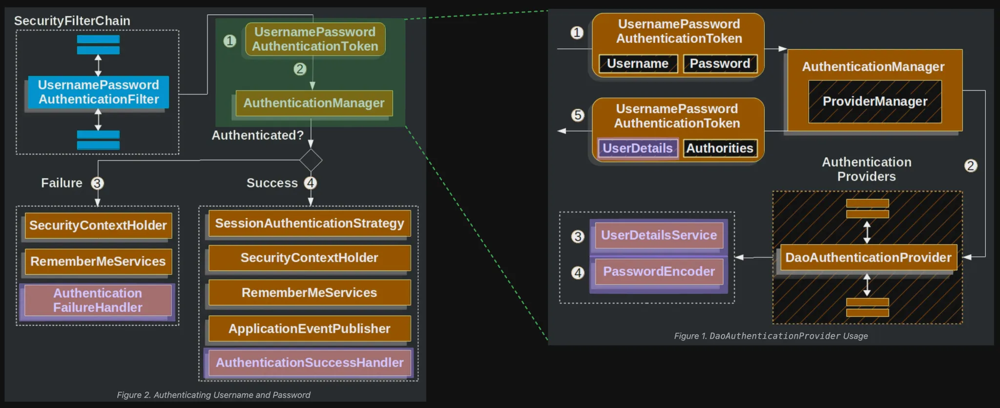

# 오늘의 성취

## 1. 개발 진행 상황

- 회원가입
  - 기존 회원가입 API 스펙 유지
  - 회원가입 시 비밀번호 해시 처리
    - `PasswordEncoder`의 `BCryptPasswordEncoder` 구현체 활용
- 인증 - 로그인
  - 로그인에 대한 `SecurityFilterChain` 설정 추가
    - [SecurityConfig](https://github.com/JungH200000/10-sprint-mission/blob/sprint9/src/main/java/com/sprint/mission/discodeit/config/security/SecurityConfig.java)
  - `UserDetailsService`의 구현체로 `DiscodeitUserDetailsService` 구현
    - [DiscodeitUserDetailsService](https://github.com/JungH200000/10-sprint-mission/blob/sprint9/src/main/java/com/sprint/mission/discodeit/security/userdetails/DiscodeitUserDetailsService.java)
  - `UserDetails`의 구현체로 `DiscodeitUserDetails` 구현
    - [DiscodeitUserDetails](https://github.com/JungH200000/10-sprint-mission/blob/sprint9/src/main/java/com/sprint/mission/discodeit/security/userdetails/DiscodeitUserDetails.java)

---

# 프로젝트 요구 사항

## 2. 기본 요구사항

`//...`

### 4-03. 회원가입

- [x] 회원가입 API 스펙은 유지합니다.
  - API 스펙
    - 엔드포인트: `POST /api/users`
    - 요청: `Body UserCreateRequest, MultipartFile`
    - 응답: `200 UserDto`
- [x] 회원가입 시 비밀번호는 `PasswordEncoder`를 통해 해시로 저장하세요.
  - `PasswordEncoder`의 구현체는 `BCryptPasswordEncoder`를 활용하세요.

### 4-04. 인증 - 로그인

- [x] `formLogin` 을 기본값으로 활성화하고, 추가된 필터를 확인해보세요.
  ```java
  http
      .formLogin(Customizer.withDefaults())
  ```
- Spring Security의 formLogin 인증 흐름은 그대로 유지하면서 필요한 부분만 대체합니다.

    
  - 이번 미션에서는 보라색 음영 처리된 5가지 컴포넌트를 대체합니다.
    1. `UserDetails`
    2. `UserDetailsService`
    3. `PasswordEncoder`: 이전에 정의한 `BCryptPasswordEncoder`로 대체됩니다.
    4. `AuthenticationSuccessHandler`
    5. `AuthenticationFailureHandler`
  - 각 컴포넌트의 기본 구현체가 무엇인지 디버깅해보세요.

- [x] 로그인을 처리할 url을 `/api/auth/login`로 설정하세요.
  ```java
  http
      .formLogin(login -> login
          .loginProcessingUrl(...)
      )
  ```
- [x] `UserDetailsService` 컴포넌트를 대체하세요.
  - 디폴트 구현체는 `InMemoryUserDetailsManager`입니다.
  - `DiscodeitUserDetailsService`를 정의하세요.

    ```java
    @Service
    @RequiredArgsConstructor
    public class DiscodeitUserDetailsService implements UserDetailsService {
        @Override
      public UserDetails loadUserByUsername(String username) throws UsernameNotFoundException {
          ...
      }
    }
    ```

    - 디스코드잇 DB에서 자체 관리하는 사용자 정보로 `UserDetails` 객체를 생성합니다.
    - 구현체를 Bean으로 등록하면 자동으로 대체됩니다.

- [x] `UserDetails` 컴포넌트를 대체하세요.
  - 디폴트 구현체는 `org.springframework.security.core.userdetails.User`입니다.
  - `DiscodeitUserDetails`를 정의하세요.

    ```java
    @Getter
    @RequiredArgsConstructor
    public class DiscodeitUserDetails implements UserDetails {
      private final UserDto userDto;
      private final String password;
        ...
    }
    ```

    - 인증 정보(`Principal`)에 담을 수 있는 정보를 자유롭게 확장할 수 있습니다.
    - `UserDto`와 비밀번호 정보를 저장하세요.

  - 앞서 정의한 `DiscodeitUserDetailsService`에서 `DiscodeitUserDetails`를 생성 후 반환하세요.

`//...`

---

# GitHub Repository 주소

[https://github.com/JungH200000/10-sprint-mission/tree/sprint9](https://github.com/JungH200000/10-sprint-mission/tree/sprint9)
