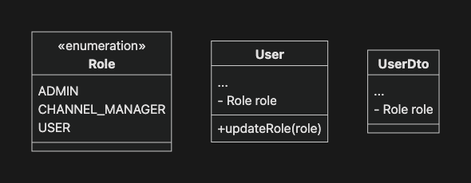
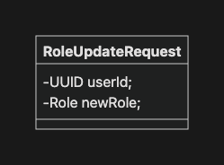

# 오늘의 성취

## 1. 개발 진행 상황

- 인증 - 로그인
  - `AuthenticationSuccessHandler` 구현체로 `LoginSuccessHandler` 구현
  - `AuthenticiationFailureHandler` 구현체로 `LoginFailureHandler` 구현
- 인증 - 세션을 활용한 현재 사용자 정보 조회
  - 세션 ID를 통해 사용자의 기본 정보(`UserDto`)를 가져올 수 있는 API 구현
- 인증 - 로그아웃
  - - `SecurityFilterChain` 설정에 로그아웃 관련 설정 추가
    - `LogoutSuccessHandler` 구현체인 `HttpStatusReturningLogoutSuccessHandler` 적용
- 인가 - 권한 정의
  - 회원 가입 시 모든 사용자 `USER` 권한을 기본 권한으로 가짐
  - 사용자 권한을 수정하는 API 구현
  - 애플리케이션 실행 시 `ADMIN` 권한을 가진 Admin 계정 초기화

## 2. 질문

### `HttpStatusReturningLogoutSuccessHandler`

"로그아웃 성공 후 리다이렉트가 아닌, 지정한 HTTP 상태 코드만 응답하라"는 핸들러 클래스

---

# 프로젝트 요구 사항

## 2. 기본 요구사항

`//...`

### 4-04. 인증 - 로그인

`//...`

- [x] `AuthenticationSuccessHandler` 컴포넌트를 대체하세요.
  - 디폴트 구현체는 `SavedRequestAwareAuthenticationSuccessHandler`입니다.
  - `LoginSuccessHandler`를 정의하고 대체하세요.

    ```java
    @Component
    public class LoginSuccessHandler implements AuthenticationSuccessHandler {
        ...
        @Override
      public void onAuthenticationSuccess(HttpServletRequest request, HttpServletResponse response,
          Authentication authentication) throws IOException, ServletException {
          ...
      }
    }
    ```

    - 인증 성공 시 `200 UserDto`로 응답합니다.

  - 설정에 추가하세요.
    ```java
    http
        .formLogin(login -> login
            ...
            .successHandler(loginSuccessHandler)
        )
    ```

- [x] `AuthenticiationFailureHandler` 컴포넌트를 대체하세요.
  - 디폴트 구현체는 `SimpleUrlAuthenticationFailureHandler`입니다.
  - `LoginFailureHandler`를 정의하고 대체하세요.

    ```java
    @Component
    public class LoginFailureHandler implements AuthenticationFailureHandler {
        ...
      @Override
      public void onAuthenticationFailure(HttpServletRequest request, HttpServletResponse response,
          AuthenticationException exception) throws IOException, ServletException {
            ...
      }
    }
    ```

    - 인증 실패 시 `401 ErrorResponse`로 응답합니다.

  - 설정에 추가하세요.
    ```java
    http
        .formLogin(login -> login
            ...
            .failureHandler(loginFailureHandler)
        )
    ```

- [x] 이제 로그인 처리는 `SecurityFilterChain`에서 모두 처리되기 때문에 기존에 구현했던 로그인 관련 코드는 제거하세요.
  - `AuthApi.login`, `AuthController.login`
  - `AuthService.login`
  - `LoginRequest`

### 4-05. 인증 - 세션을 활용한 현재 사용자 정보 조회

> 이전 버전까지의 디스코드잇 프론트엔드에서는 현재 사용자 정보를 브라우저의 세션 스토리지(user-storage)에서 관리해왔습니다.
> 브라우저의 세션 스토리지는 Javascript로 접근이 가능하기 때문에, XSS(Cross-Site Scripting) 공격에 취약합니다.
> 따라서 프론트엔드 `2.0.x` 부터는 사용자 정보를 브라우저의 메모리에서 관리하도록 변경되었습니다.
> 하지만, 메모리에 저장된 정보는 브라우저 새로고침 시 모두 삭제됩니다.
> 따라서 새로고침 시 쿠키에 저장된 세션 ID를 통해 현재 사용자 정보를 조회합니다.

- [x] 세션ID를 통해 사용자의 기본 정보(`UserDto`)를 가져올 수 있도록 API를 정의하세요.
  - API 스펙
    - 엔드포인트: `GET /api/auth/me`
    - 요청: `Header(자동 포함) Cookie: JSESSIONID=…`
    - 응답: `200 UserDto`
  - `SecurityFilterChain`의 필터를 통해 인증에 성공하면 `Controller`에서 `@AuthenticationPrincipal`를 통해 인증 정보에 접근할 수 있습니다.

### 4-06. 인증 - 로그아웃

- Spring Security의 logout 흐름은 그대로 유지하면서 필요한 부분만 대체합니다.
- 이번 미션에서는 2가지 요소를 대체합니다.
  - Logout 처리 URL
  - `LogoutSuccessHandler`
- [x] 로그아웃을 처리할 url을 `/api/auth/logout`로 설정하세요.

  ```java
  http
      .logout(logout -> logout
          .logoutUrl(...)
      )
  ```

- [x] `LogoutSuccessHandler` 컴포넌트를 대체하세요.
  - 디폴트 구현체는 `SimpleUrlLogoutSuccessHandler`입니다.
  - `HttpStatusReturningLogoutSuccessHandler`로 대체하세요.

    ```java
    http
        .logout(logout -> logout
            ...
            .logoutSuccessHandler(...)
        )
    ```

    - `204 Void` 응답을 반환하세요.

### 4-07. 인가 - 권한 정의

- [x] 다음과 같이 권한을 정의하세요.
  - 관리자: `ADMIN`
  - 채널 매니저: `CHANNEL_MANAGER`
  - 일반 사용자: `USER`

  

- [ ] 데이터베이스 Schema를 변경하세요.

  ```sql
  CREATE TABLE users
  (
      ...
      role varchar(20) NOT NULL
  );

  ALTER TABLE users
      ADD role varchar(20) NOT NULL;
  ```

- [x] 회원 가입 시 모든 사용자는 `USER` 권한을 기본 권한으로 설정하세요.
- [x] 사용자 권한을 수정하는 API를 구현하세요.
  - API 스펙
    - 엔드포인트: `PUT /api/auth/role`
    - 요청: `Body UserRoleUpdateRequest`
    - 응답: `200 UserDto`

    

- [x] 애플리케이션 실행 시 `ADMIN` 권한을 가진 어드민 계정이 초기화되도록 구현하세요.
  - admin 계정이 없는 경우에만 초기화하세요.
- [x] `DiscodietUserDetails.getAuthorities`를 수정하세요.

`//...`

---

# GitHub Repository 주소

[https://github.com/JungH200000/10-sprint-mission/tree/sprint9](https://github.com/JungH200000/10-sprint-mission/tree/sprint9)
