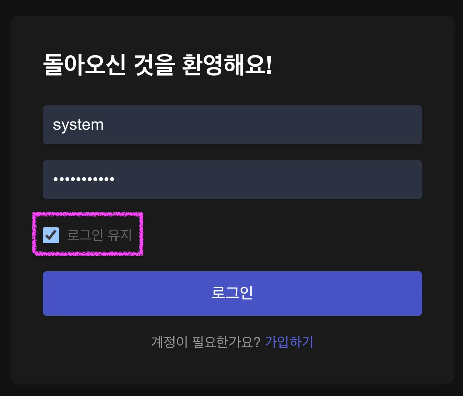
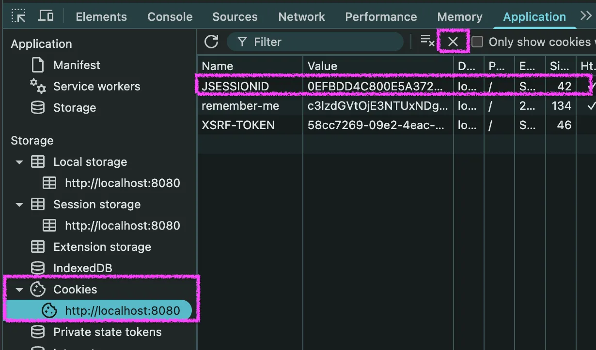

# 오늘의 성취

## 1. 개발 진행 상황

- 세션 관리 고도화
  - `UserStatus` entity 대신 `SessionRegistry`를 활용해 사용자 로그인 여부를 판단하도록 리팩터링
    - 관련 `UserStatus` entity와 코드 삭제
- 로그인 고도화 - RememberMe
- 권한 적용 고도화
  - `SpEL` 사용하여 Method Security 기반 Resource 보호 정책 강화
    - `SpEL`만 사용하여 Resource 소유자 조건 구분이 어려운 경우 `Evaluator`를 구현하여 비교
      - 예시 : `MessageService`에서 `update`와 `delete`의 경우 `meesageId`만으로는 작성자(`author`)가 누구인지 확인이 어려움
      - `Evaluator` : 조건이 참인지 거짓인지 평가하는 클래스

---

# 프로젝트 요구 사항

## 5. 심화 요구사항

### 5-01. 세션 관리 고도화

`//...`

- [x] `UserStatus` Entity 대신 `SessionRegistry`를 활용해 사용자의 로그인 여부를 판단하도록 리팩토링하세요.
  - `UserStatus` Entity와 관련된 코드는 모두 삭제하세요.
  - (로그아웃처럼) `HttpSession` 만료 시 `SessionRegistry`의 `SessionInformation`도 자동으로 만료 처리할 수 있도록 `HttpSessionEventPublisher`를 Bean으로 등록합니다.
    - `httpSessionEventPublisher`: `HttpSession`이 만료된 경우 이벤트를 통해 `SessionRegistry`의 `SessionInformation`도 자동으로 만료하기 위해 필요한 Bean입니다.
  ```java
  @Bean
  public HttpSessionEventPublisher httpSessionEventPublisher() {
    return new HttpSessionEventPublisher();
  }
  ```

### 5-02. 로그인 고도화 - RememberMe

- [x] 로그인 요청 파라미터(`remember-me`)가 `true`인 경우 세션이 무효화되어도 자동으로 다시 로그인되도록 하세요.
  - 로그인 화면에서 로그인 유지 체크 후 로그인하면 `remember-me` 파라미터가 `true`로 설정되어 요청합니다.

      

  - `remeberMe` 설정을 활용하세요.

    ```java

    http
        .rememberMe(...)
    ```

  - 로그인 상태에서 `JESSIONID` 쿠키를 삭제 후 새로고침했을 때 인증 상태가 유지 되는지 확인해보세요.
    

### 5-03. 권한 적용 고도화

- [x] `SpEL`을 활용해 Method Security 기반 리소스 보호 정책을 강화해보세요.
  - 사용자 정보 수정, 삭제는 본인만 할 수 있습니다.
  - 메시지 수정, 삭제는 해당 메시지를 작성한 사람만 할 수 있습니다.

---

# GitHub Repository 주소

[https://github.com/JungH200000/10-sprint-mission/tree/sprint9](https://github.com/JungH200000/10-sprint-mission/tree/sprint9)
