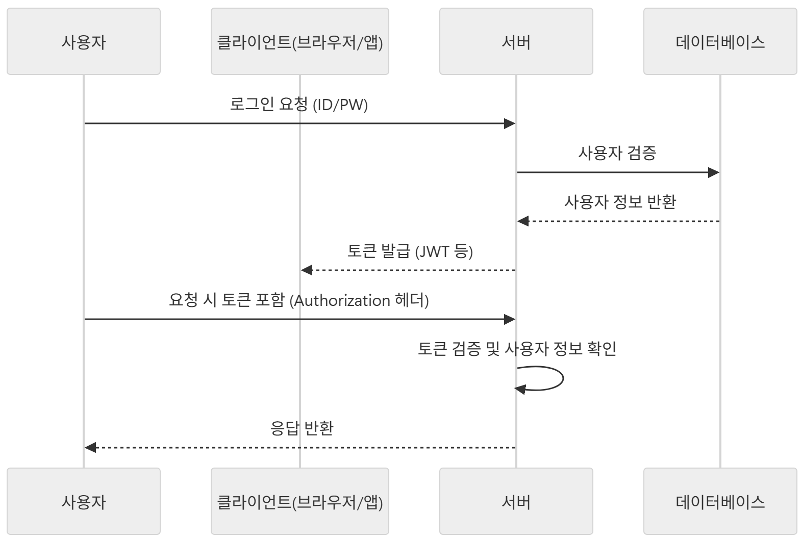
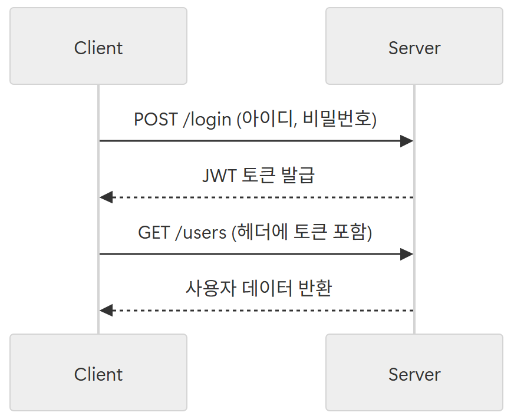
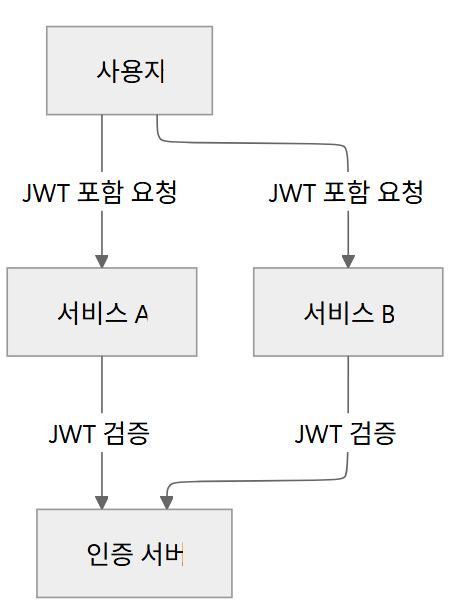
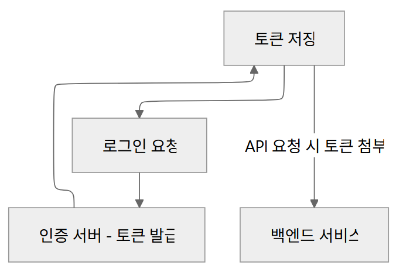
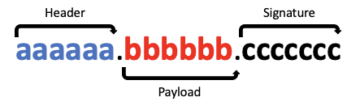
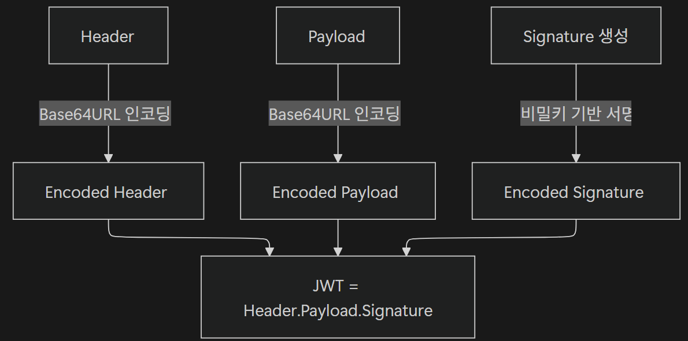
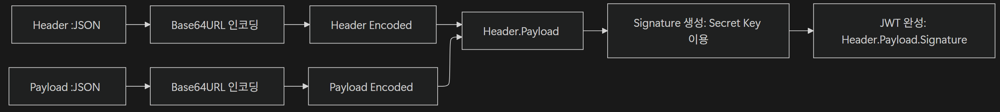
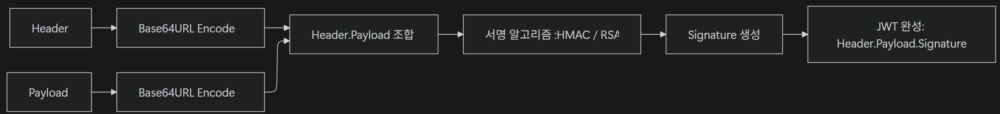
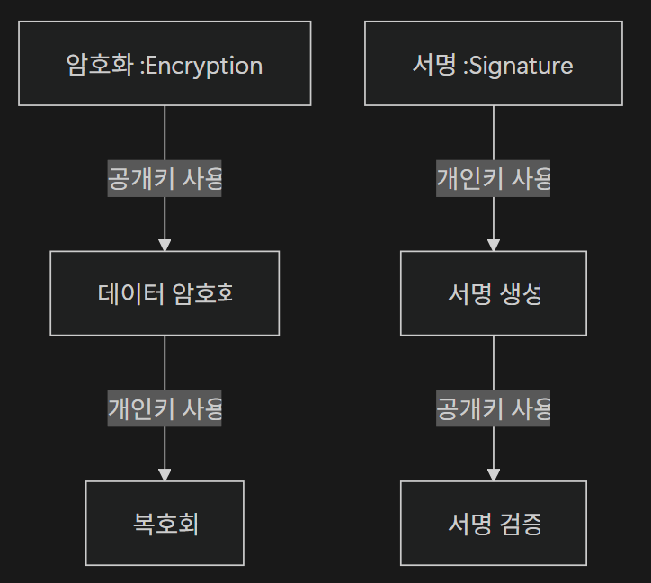
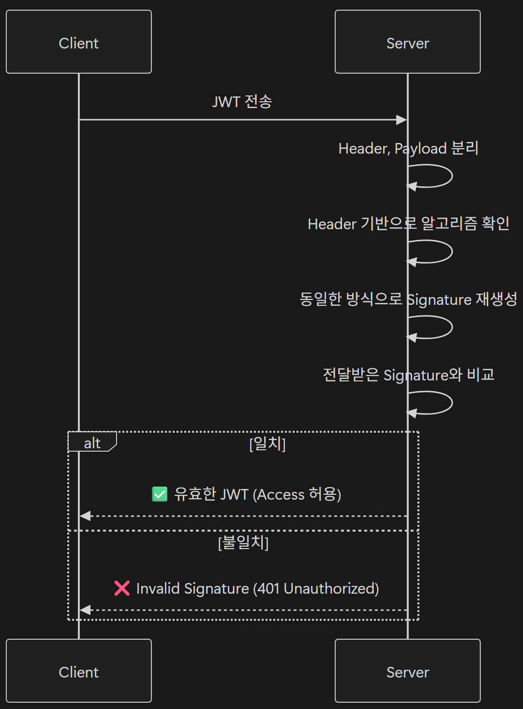

# <span style="background-color: #FFF9C4">1. 토큰 기반 인증의 개념과 필요성</span>

## 1-01. 세션 기반 인증 한계점

세션 기반 인증은 간단하지만, **확장성**과 **분산 환경**에서 여러 문제가 드러남

<br>

### 1) 서버 측 세션 저장소의 확장성 문제

- **메모리 사용량 증가**: 모든 사용자의 로그인 상태를 서버가 관리하기 때문에 사용자가 늘어날수록 서버 메모리에 저장된 세션 정보 증가

<br>

### 2) 분산 환경에서 세션 관리 문제

- **부하 분산 어려움**: 서버가 여러 대일 경우, 사용자의 세션 정보를 모든 서버가 공유해야 함
- **인증 상태 불일치**: 서버 A에는 세션이 있지만, 서버 B에는 세션이 없는 경우 인증 실패 발생 가능
- **인프라 복잡도 증가 및 유지보수 비용 증가**: Sticky Session, Redis 같은 **분산 세션 저장소** 필요

<br>

## 1-02. 토큰 기반 인증

사용자가 로그인에 성공하면 **서버가 세션을 저장하지 않고**, **토큰(Token)**을 발급해 클라이언트가 이 토큰을 보관하고 요청마다 서버에 전달하는 방식

- 서버가 사용자 상태(Session)를 저장하지 않으므로 **Stateless 아키텍처를 따름**



<br>

### 1) Stateless 아키텍처

토큰 기반 인증은 **Stateless(무상태)** 아키텍처의 핵심

서버는 클라이언트의 인증 상태를 저장하지 않고, 오로지 요청에 담긴 **토큰만으로 사용자를 식별**

#### Stateless 특징

- **서버 상태 저장**: 없음(Stateless)
- **인증 정보 위치**: 클라이언트가 보관한 토큰
- **요청 처리**: 각 요청마다 토큰을 검증하여 처리

#### Stateless 장점

- 서버 확장 시 서버 간 세션 동기화가 불필요하기 때문에 세션 공유 문제 해결
- 부하 분산(Load Balancing) 용이
- 세션 저장 공간이 불필요하기 때문에 서버 Resource 절약

<br>

### 2) 토큰 기반 인증 특징

#### 토큰 자체 포함성(Self-contained)

- 토큰만 있으면 서버는 추가 조회 없이 사용자 정보 확인 가능
- 세션 저장소를 따로 운영할 필요 없음

#### 서버 부하 분산과 확장성 향상

토큰 기반 인증은 **분산 환경**에서 강력한 장점이 있음

모든 서버가 독립적으로 토큰 검증 처리 ➡️ 시스템 확장성 크게 향

- **서버 확장성**
  - 서버가 토큰만 검증하면 되기 때문에, 사용자 수가 늘어나도 세션 저장소 부담이 없음
  - 새로운 서버를 추가하더라도 세션 동기화 과정 불필요
- **부하 분산**
  - 모든 서버가 동일한 방식으로 토큰 검증 수행
  - 특정 서버에 사용자를 고정시키는 Sticky Session 불필요

<br>

## 1-03. 토큰 기반 인증이 적합한 상황

### 1) RESTful API 설계와 토큰 인증

- RESTful API는 무상태(Stateless) 원칙을 따르는 게 핵심



<br>

### 2) 마이크로서비스 아키텍처와 토큰 인증

- 마이크로서비스 아키텍처는 수많은 독립 서비스 존재
- 세션 기반 인증 ➡️ 중앙 세션 저장소가 필요 ➡️ 관리 복잡 + 서비스 간 확장이 어려움
- 토큰 기반 인증의 Self-contained 특성 ➡️ 각 서비스가 동일한 토큰을 검증 ➡️ 인증을 독립적으로 처리



<br>

### 3) SPA(Single Page Application)와 토큰 인증

- SPA는 브라우저에서 실행되며, 백엔드와 REST API 또는 GraphQ로 통신
- 세션 기반 인증 ➡️ CSRF 방어와 `SameSite` 설정 등 복잡한 관리 필요
- 토킨 기반 인증 ➡️ 로컬 스토리지나 세션 스토리지에 저장 후, 요청 시마다 헤더에 직접 추가 ➡️ 직관적으로 동작

<br>

### 4) 모바일 애플리케이션과 토큰 인증

- 세션 기반 인증 ➡️ 연결이 끊어지면 인증 상태가 유지되지 않는 문제가 많음
- 토큰 기반 인증 ➡️ 토큰을 클라이언트단에서 보관 후 요청마다 재사용 ➡️ 모바일 환경에 더 적



---

# <span style="background-color: #FFF9C4">2. JWT의 구조와 원리</span>

## 2-01. JWT 정의와 표준

### 1) JWT (Json Web Token)

JSON 객체를 이용해 안전하게 정보를 주고받기 위한 토큰 형식

RFC 7519 표준으로 정의되고, 주로 인증(Authentication)과 권한 부여(인가, Authorization)를 위해 사용됨

#### **특징**

- **JSON 기반 구조**
  - Header와 Payload를 JSON 객체 형태로 구성
  - Payload에는 사용자 식별 정보, 권한, 만료 시간 등의 정보를 Claim이라는 key-value 형태로 담을 수 있음
- **URL-safe**
  - URL에 포함될 수 있도록 Base64URL 방식으로 인코딩하여 웹 환경에서 안전하게 전달 가능
- **자가 포함(Self-contained)**
  - 토큰 자체에 필요한 정보(사용자 정보, 권한 등)를 담고 있어서 별도의 조회가 필요 없음

#### JWT 표준

JWT는 **IETF(Internet Engineering Task Force)**에서 발행한 **[RFC 7519](https://datatracker.ietf.org/doc/html/rfc7519)** 문서로 표준화됨

- IETF는 인터넷 기술의 표준을 개발하고 관리하는 국제 조직으로, HTTP, TCP/IP, SMTP 등 대부분의 인터넷 핵심 프로토콜 표준을 정의

<br>

### 2) 토큰 기반 인증에서 JWT


토큰 기반 인증 방식에서 JWT는 가장 널리 사용되는 토큰 형식

- 특히 마이크로서비스 아키텍처(MAS) 환경에서 많이 사용

<br>

### 3) JWT 활용 사례

#### 웹 애플리케이션 인증

로그인 시 JWT 토큰 발급 ➡️ 이후 모든 요청에 토큰 포함시켜 사용자 인증 처리

#### 모바일 앱 인증

모바일 앱은 세션 유지가 어려움 ➡️ JWT를 활용해 Stateless 인증을 구현

#### 서버 간 통신

MSA 구조에서 서로 다른 서버 간 API 호출 시 JWT를 사용해 보안 강화 가능

<br>

## 2-02. JWT 구조

JWT는 문자열 형태로 전달되며 아래 사진처럼 세 부분으로 구성됨

- 각 부분은 `.`으로 구분
- 각각 **Base64URL**로 인코딩되어 있음





<br>

### 1) Header

토큰 타입 및 서명 알고리즘 정보 정의

즉, 이것이 어떤 종류의 토큰인지(JWT 등), 어떤 알고리즘으로 Sign할지 정의

#### **메타데이터(필드) 종류**

- `alg`
  - 서명(Signature)에 사용할 알고리즘 종류
  - 예시: HS256, RS256 등
- `typ`
  - 토큰 타입 명시
  - 예시: JWT 등

#### 예시

```json
{
  "alg": "HS256",
  "typ": "JWT"
}
```

<br>

### 2) Payload

서버에서 활용할 수 있는 사용자의 **인증 정보(Claims)**를 담고 있음

어떤 정보에 접근 가능한지에 대한 권한이나 사용자 이름 등 필요한 데이터를 담을 수 있음

- Signature를 통해 유효성이 검증될 정보
- 민감한 정보를 담지 않는 것이 좋음

#### Claims 종류

- **Registered Claims**
  - IETF에서 권장하는 표준 Claim
  - 예시: `iss`, `sub`, `exp`, `iat`
- **Public Claims**
  - 자유롭게 정의 가능하며, 공개적인 정보
  - 예시: `role`, `department`, `nickname` 등
- **Private Claims**
  - 서비스 내부에서만 사용하는 Claim
  - 예시: `userId`, `sessionId` 등

#### 예시

```json
{
  "iss": "discodeit.app", // 발급자 (Issuer)
  "sub": "user123", // 사용자 식별자 (Subject)
  "name": "홍길동", // 사용자 이름
  "role": "ADMIN", // 사용자 역할
  "iat": 1671894359, // 발급 시간 (Issued At)
  "exp": 1671897959 // 만료 시간 (Expiration Time)
}
```

<br>

### 3) Signature

JWT의 **무결성(Integrity)**을 보장하는 부분으로, 토큰이 위조되지 않았음을 검증하기 위한 서명

Base64URL로 인코딩된 Header와 Payload를 조합한 뒤, 지정한 알고리즘과 서버의 비밀키(Secret Key)를 사용하여 암호화

- 토큰이 **변조되지 않았는지**를 서버에서 검증할 수 있게 한다.

<br>

## 2-03. JWT 인코딩과 디코딩

JSON에는 `{`, `}`, `"` 같은 특수문자가 포함되는데, 이것들은 URL이나 HTTP 헤더에서 안전하지 않아 네트워크 전송 시 문제가 발생할 수 있다.

이에 따라 **Base64URL 인코딩**을 통해 안전한 문자열로 변환해야 한다.

<br>

### 1) Base64URL 인코딩(Encoding)

Base64 인코딩과 매우 유사하지만, **URL 환경에서도 안전하게 사용**될 수 있도록 일부 문자 대체

| 구분        | Base64 | Base64URL |
| ----------- | ------ | --------- |
| 62번째 문자 | `+`    | `-`       |
| 63번째 문자 | `/`    | `_`       |
| 패딩(`=`)   | 사용함 | 제거함    |

- 이 방식으로 인코딩된 문자열은 **URL 파라미터**나 **HTTP 헤더에서 깨지지 않고 안전하게 전송**됨

#### 인코딩 과정



<br>

### 2) 라이브러리로 JWT 인코딩/디코딩 자동화

직접 인코딩/디코딩 코드를 작성할 수 있지만, 실무에서는 검증된 라이브러리를 사용하는 것이 일반적

#### Spring Boot 환경에서의 주요 JWT 라이브러리

| 라이브러리                           | 주요 제공처           | 특징                                | 난이도      |
| ------------------------------------ | --------------------- | ----------------------------------- | ----------- |
| **JJWT (io.jsonwebtoken)**           | Okta (이전 Stormpath) | 직관적인 API, 빠른 개발 가능        | ⭐ 초급     |
| **Java-JWT (com.auth0)**             | Auth0                 | OAuth2, OpenID Connect와 연동 용이  | ⭐⭐ 중급   |
| **Nimbus JOSE + JWT (com.nimbusds)** | Connect2ID            | 세밀한 보안 설정, 엔터프라이즈 적합 | ⭐⭐⭐ 고급 |

<br>

## 2-04. JWT **Signature**

### 1) Signature(서명)

JWT는 인증(Authentication)과 **데이터 무결성(Integrity)**을 보장하기 위해 **Signature(서명)**을 포함함

Signature는 **Header와 Payload를 조합해 생성됨**

```bash
Signature = Sign( base64UrlEncode(Header) + "." + base64UrlEncode(Payload), secretKey )
```

#### Signature 목적

- **변조 방지(Integrity)**: 클라이언트가 Payload를 임의로 수정하지 못하게 설정
- **인증 보정(Authentication)**: 서버가 발급한 JWT임을 검증

#### Signature 생성 원리

**Header**와 **Payload**를 인코딩한 후, **비밀키(Secret Key)** 또는 **공개키/개인키(Key Pair)**를 이용해 생성



#### 무결성과 정합성??

- **무결성(Integrity)**
  - 데이터가 **변조되지 않고 원본 상태를 유지**하는 성질
  - “단일 데이터”가 손상되거나 변경되지 않음
  - 예시: JWT의 Payload는 Signature로 보호되어 임의로 수정 불가
- **정합성(Consistency)**
  - 여러 데이터 간 **논리적 일관성이 유지**되는 성질
  - “여러 데이터 간 관계”가 일치
  - 예시: DB의 사용자 정보와 주문 정보가 서로 일관성 있게 유지

<br>

### 2) 대칭키(HMAC) vs 비대칭키(RSA)

JWT는 서명 알고리즘에 따라 **대칭키 방식** 또는 **비대칭키 방식**으로 나뉨

#### 대칭키(HMAC) 방식

동일한 비밀 키로 서명 및 검증

- 서버가 하나라면 간단하고 효율적이지만,
- 여러 서버라면 같은 비밀키를 공유해야 하므로 관리 리스크 존재

#### 비대칭키(RSA) 방식

공개키와 개인키 두 개의 키를 사용

- **개인키(Private Key)**: JWT Signature을 생성하는데 사용
- **공개키(Public Key)**: Signature를 검증하는데 사용

즉, 서버가 여러 대라도 각 서버가 동일한 공개키를 공유하면 검증이 가능

#### 개인키와 공개키 역할 비교

- **Encryption(암호화)**
  - 공개키로 암호화, 개인키로 복호화
  - **목적**: 비밀 유지(Confidentiality)
- **Signature(서명)**
  - 개인키로 Signature 생성, 공개키로 Signature가 유효한지 검증
  - **목적**: 신뢰 검증(Integrity & Authentication)



<br>

### 3) Signature 검증 과정



<br>

### 3) Signature 알고리즘 선택 기준

JWT의 서명 알고리즘은 보안성과 성능 간의 트레이드오프(Trade-off)를 고려해야 함

| 알고리즘 | 종류  | 키 타입     | 보안성    | 속도 | 비고                   |
| -------- | ----- | ----------- | --------- | ---- | ---------------------- |
| HS256    | HMAC  | 단일 비밀키 | 중간      | 빠름 | 단일 서버에 적합       |
| HS512    | HMAC  | 단일 비밀키 | 강함      | 느림 | 더 높은 보안성         |
| RS256    | RSA   | 공개/개인키 | 매우 강함 | 중간 | 다중 서버 환경 적합    |
| ES256    | ECDSA | 공개/개인키 | 매우 강함 | 빠름 | 모바일/IoT 환경에 적합 |

---
