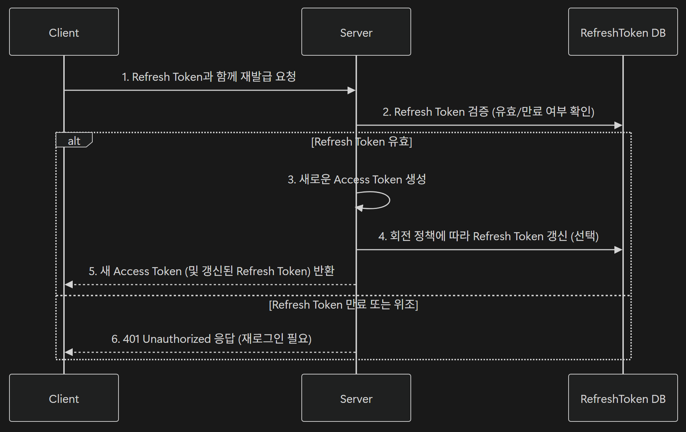

# 5. Refresh Token 패턴 구현

## 5-01. Refresh Token

Access Token이 만료되었을 때 **새로운 Access Token을 발급 받기 위한 수단**

### 1) Access Token의 한계

Access Token은 사용자의 인증 정보를 포함하는 **짧은 수명의 토큰**

만료 시간에 따라 아래 문제 발생 가능

- 토큰 만료 시간이 너무 짧을 경우 ➡️ 사용자 자주 로그인 필요 ➡️ 불편한 사용자 경험
- 토큰 만료 시간이 너무 길 경우 ➡️ 토큰 탈취 시 장기간 악용 가능 ➡️ 심각한 보안 위협

이 균형을 맞추기 위해 **Refresh Token**이 필요

 

### 2) Access Token과 Refresh Token

| 구분          | Access Token                  | Refresh Token                      |
| ------------- | ----------------------------- | ---------------------------------- |
| **주요 역할** | 인증된 사용자 확인            | 새로운 Access Token 발급           |
| **사용 위치** | 매 요청 시 Authorization 헤더 | Access Token 만료 시 전용 API 호출 |
| **유효 기간** | 짧음 (30분 내외)              | 김 (7일~30일)                      |
| **보관 위치** | 클라이언트 (메모리/스토리지)  | 서버 DB 또는 안전한 스토리지       |
| **보안 위험** | 탈취되면 즉시 피해 발생       | 유효기간이 길어 서버 검증 필요     |

- 두 토큰은 항상 **쌍(pair)**으로 발급됨

#### 동작 흐름

1. 로그인 시 Access Token과 Refresh Token이 함께 발급됨
2. 클라이언트는 API 요청 시 Access Token을 사용
3. Access Token이 만료되면 Refresh Token을 사용해 새로운 Access Token을 요청
4. 서버는 Refresh Token을 검증한 뒤 새로운 Access Token 발급

 

### 3) Refresh Token의 보안 이점

- **단기 노출 제한**
  - Access Token이 짧은 수명을 가지기 때문에 탈취 피해 감소
- **서버 검증 가능성**
  - Refresh Token은 서버가 직접 검증하기 때문에 위조 가능성이 낮음
- **토큰 재발급 제어**
  - 서버에서 Refresh Token을 무효화하면 사용자가 다시 로그인해야 함
- **로그아웃/비밀번호 변경 반영 용이**
  - 토큰 만료 또는 무효화를 통해 즉시 보안 상태 갱신 가능

단, **토큰 재발급 제어**와 **로그아웃/비밀번호 변경 반영 용이**는 Refresh Token을 어딘가(DB 등)에서 관리하고 있을 때 가능

 

### 4) 토큰 회전(Rotation)

Refresh Token이 재발급될 때마다 **이전 토큰을 무효화하고 새로운 토큰으로 교체하는 방식**

- **토큰 갱신 흐름**

  

 

## 5-02. 토큰 무효화 전략

### 1) 토큰 무효화 필요성

Refresh Token은 일반적으로 **7일~30일**의 긴 유효기간을 가지며, 사용자의 로그인 상태를 유지 시킴

하지만 아래의 경우에 반드시 토큰을 **강제로 폐기(무효화)** 해야 함

- **로그아웃**
  - 사용자가 명시적으로 세션 종료를 요청함
  - Refresh Token 삭제 필요
- **비밀번호 변경**
  - 사용자의 계정이 위험에 노출될 가능성
  - 기존 모든 토큰 무효화
- **강제 로그아웃**
  - 관리자가 보안 상의 이유로 세션 종료
  - 선택된 사용자의 토큰 삭제

 

### 2) 토큰 무효화 동작 흐름

1. 클라이언트가 로그아웃 요청
2. 서버는 해당 사용자의 Refresh Token 확인 후 DB에서 삭제
3. 서버가 로그아웃 응답 반환
4. 클라이언트는 로컬 스토리지에 저장된 토큰을 함께 제거

---
