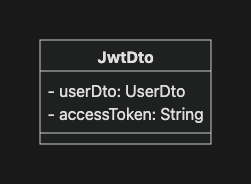
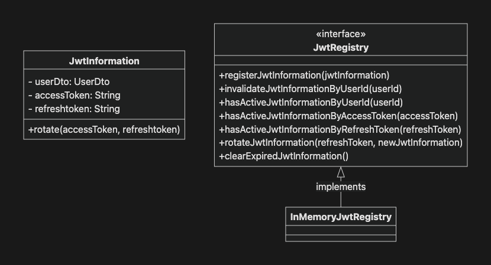

# 오늘의 성취

## 1. 개발 진행 상황

- JWT 컴포넌트 구현
  - 토큰 발급, 갱신, 검증을 담당하는 `JwtTokenProvider` 컴포넌트 구현
- 리팩터링 - 로그인
  - `AuthenticationSuccessHandler`를 `JwtLoginSuccessHandler`로 대체
    - 인증 성공 시, 토큰 발급
- JWT 인증 필터 구현
  - Access Token을 통해 인증하는 `JwtAuthenticationFilter` filter 구현
    - 요청당 한 번만 실행되도록 `OncePerRequestFilter` 상속
- Refresh Token으로 Access Token 재발급
  - Refresh Token Rotation 적용
- 리팩터링 - 로그아웃
  - 쿠키에 저장된 Refresh Token을 삭제하는 `JwtLogoutHandler` 구현
- 리팩터링 - 토큰 상태 관리
  - `JwtRegistry` 인테페이스 구현 후 `InMemoryJwtRegistry` 구현체 구현

## 2. 질문

### `ConcurrentLinkedDeque`란?

여러 스레드가 동시에 접근할 수 있는 thread-safe한 양방향 `Queue` 구현체

- `Concurrent` : 여러 스레드가 동시에 접근해도 안전함
- `Linked` : 내부적으로 노드가 연결된 linked 구조
- `Deque` : Double Ended Queue, 양쪽 끝에서 삽입과 삭제 가능한 `Queue`

일반적인 `Queue`가 FIFO(First In First Out, 선입선출) 방식이다. 즉, 한쪽 끝에서 데이터를 넣고 반대쪽 끝에서 데이터를 빼낸다.

반면, `Deque`는 양쪽 끝을 모두 사용할 수 있다. 즉, FIFO 방식의 `Queue`처럼 사용할 수 있고, LIFO 방식의 `Stack`처럼 사용할 수도 있다.

`ConcurrentLinkedDeque`는 이러한 `Deque` 기능에 더해, 여러 스레드가 동시에 데이터를 추가하거나 제거해도 안전하게 동작하도록 설계되어 있다. 따라서 여러 요청이 동시에 들어올 수 있는 환경에서 사용자별 JWT 정보나 세션 정보를 관리할 때 사용할 수 있다.

---

# 프로젝트 요구 사항

## 3. 기본 요구사항

### 3-01. JWT 컴포넌트 구현

- [x] JWT 의존성을 추가하세요.

  ```groovy

  implementation 'com.nimbusds:nimbus-jose-jwt:10.3'
  ```

- [x] 토큰을 발급, 갱신, 유효성 검사를 담당하는 컴포넌트(`JwtTokenProvider`)를 구현하세요.


### 3-02. 리팩토링 - 로그인

- 미션 9와 마찬가지로 Spring Security의 formLogin + 미션 9의 인증 흐름은 그대로 유지하면서 필요한 부분만 대체합니다.
- [x] 세션 생성 정책을 `STATELESS`로 변경하고, `sessionConcurrency` 설정을 삭제하세요.

  ```java

  http
      .sessionManagement(session -> session
          ...
          .sessionCreationPolicy(...)
      )
  ```

- [x] `AuthenticationSuccessHandler` 컴포넌트를 대체하세요.
  - 기존 구현체는 `LoginSuccessHandler`입니다.
  - `JwtLoginSuccessHandler`를 정의하고 대체하세요.

    ```java

    @Component
    public class LoginSuccessHandler implements AuthenticationSuccessHandler {
        ...
        @Override
      public void onAuthenticationSuccess(HttpServletRequest request, HttpServletResponse response,
          Authentication authentication) throws IOException, ServletException {
          ...
      }
    }
    ```

    - 인증 성공 시 `JwtProvider`를 활용해 토큰을 발급하세요.
      - 엑세스 토큰은 응답 Body에 포함하세요.
      - 리프레시 토큰은 쿠키(`REFRESH_TOKEN`)에 저장하세요.
    - `200 JwtDto`로 응답합니다.

      

  - 설정에 추가하세요.

    ```java

    http
        .formLogin(login -> login
            ...
            .successHandler(jwtLoginSuccessHandler)
        )
    ```

### 3-03. JWT 인증 필터 구현

- [x] 엑세스 토큰을 통해 인증하는 필터(`JwtAuthenticationFilter`)를 구현하세요.

  ```java

  public class JwtAuthenticationFilter extends OncePerRequestFilter {

    @Override
    protected void doFilterInternal(HttpServletRequest request, HttpServletResponse response,
        FilterChain filterChain) throws ServletException, IOException {...}
  ```

  - 요청 당 한번만 실행되도록 `OncePerRequestFilter`를 상속하세요.
  - 요청 헤더(`Authorization`)에 Bearer 토큰이 포함된 경우에만 인증을 시도하세요.
  - `JwtProvider`를 통해 엑세스 토큰의 유효성을 검사하세요.
  - 유효한 토큰인 경우 `UsernamePasswordAuthenticationToken` 객체를 활용해 인증 완료 처리하세요.

    ```java

    UsernamePasswordAuthenticationToken authentication =
                new UsernamePasswordAuthenticationToken(
                    userDetails,
                    null,
                    userDetails.getAuthorities()
                );
    SecurityContextHolder.getContext().setAuthentication(authentication);
    ```

### 3-04. 리프레시 토큰을 활용한 엑세스 토큰 재발급

- [x] 리프레시 토큰을 활용해 엑세스 토큰을 재발급하는 API를 구현하세요.
  - API 스펙
    - 엔드포인트: `POST /api/auth/refresh`
    - 요청: `Header Cookie: REFRESH_TOKEN=…`
    - 응답
      - 리프레시 토큰이 유효한 경우: `200 JwtDto`
      - 리프레시 토큰이 유효하지 않은 경우: `401 ErrorResponse`
  - `permitAll` 설정에 포함하세요.
    - 이 API는 엑세스 토큰이 없거나 만료된 상태에서 호출하게 됩니다.
- [x] 리프레시 토큰 Rotation을 통해 보안을 강화하세요.
- [x] 토큰 재발급 API로 대체할 수 있는 컴포넌트를 모두 삭제하세요.
  - Me API (`GET /auth/me`)
    > - 프론트엔드 `2.0.x`과 마찬가지로 `2.1.x`에서는 사용자 정보와 엑세스 토큰 정보를 브라우저의 메모리에서 관리합니다.
    > - 따라서 새로고침 시 쿠키에 저장된 리프레시 토큰을 통해 엑세스 토큰을 갱신합니다.
- RememberMe
  - 쿠키에 저장된 리프레시 토큰이 RememberMe의 기능을 대체할 수 있습니다.

### 3-05. 리팩토링 - 로그아웃

- [x] 쿠키에 저장된 리프레시 토큰을 삭제하는 `LogoutHandler`를 구현하세요.

  ```java

  public class JwtLogoutHandler implements LogoutHandler {

    @Override
    public void logout(HttpServletRequest request, HttpServletResponse response,
        Authentication authentication) {...}
  ```

- [x] 구현한 핸들러를 추가하세요.

  ```java

  http
    .logout(logout -> logout
        ...
        .addLogoutHandler(jwtLogoutHandler)
    )
  ```

## 4. 심화 요구사항

### 4-01. 리팩토링 - 토큰 상태 관리

- 토큰 기반 인증 방식은 세션 기반 인증 방식과 달리 무상태(stateless)이기 때문에 사용자의 로그인 상태를 제어하기 어렵습니다.
- 따라서 `SessionRegistry`를 통해 세션의 상태를 관리했던 것처럼, JWT의 상태를 관리할 수 있는 컴포넌트를 추가해야합니다.
- [진행 중] 토큰의 상태를 관리하는 `JwtRegistry`를 구현하세요.
  - `JwtRegistry`
    - `registerJwtInformation`
      - 로그인 성공 시 `JwtInformation`을 등록합니다.
      - 최대 동시 로그인 수(`1`)를 제어합니다.
    - `invalidateJwtInformationByUserId`: UserId로 해당 유저의 모든 `JwtInformation` 정보를 삭제합니다.
    - `hasActiveJwtInformationBy*`: `JwtInformation`이 Registry에 존재하는지 확인합니다.
      - `ByUserId`: 사용자의 로그인 상태를 판단할 때 활용합니다.
      - `ByAccessToken`: 필터에서 유효한 토큰인지 확인할 때 활용합니다.
      - `ByRefreshToken`: 토큰 재발급 시 유효한 토큰인지 확인할 때 활용합니다.
    - `rotateJwtInformation`: 토큰 재발급 시 토큰 로테이션을 수행합니다.
    - `clearExpiredJwtInformation`: 만료된 `JwtInformation`을 삭제합니다.
  - `InMemoryJwtRegistry`
    - 메모리에 `JwtInformation`을 저장하는 `JwtRegistry` 구현체입니다.
    - 동시성 처리를 위해 다음과 같이 구성하세요. 동시성에 대해서는 다음 미션에서 학습합니다.

      ```java

      public class InMemoryJwtRegistry implements JwtRegistry {

        // <userId, Queue<JwtInformation>>
        private final Map<UUID, Queue<JwtInformation>> origin = new ConcurrentHashMap<>();
        private final int maxActiveJwtCount;
          ...
      }
      ```



`//...`

---

# GitHub Repository 주소

[https://github.com/JungH200000/10-sprint-mission/tree/sprint10](https://github.com/JungH200000/10-sprint-mission/tree/sprint10)

---
