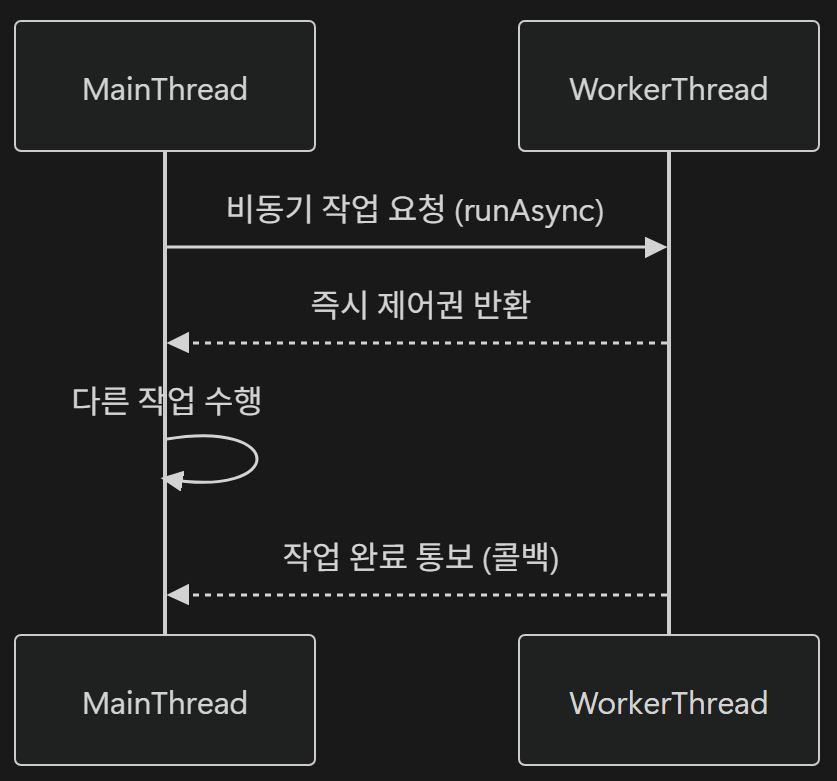
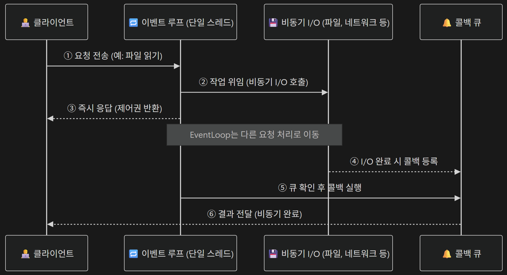

# <span style="background-color: #FFF9C4">1. 비동기 처리의 개념과 필요성</span>

## 1-01. 동기 vs 비동기 처리

### 1) 동기와 비동기

#### 동기 (Synchronous)

요청한 작업이 끝날 때까지 다음 작업이 대기

- 호출한 함수가 끝날 때까지 기다림 ➡️ 결과를 받고 다음 진행
- 적합한 환경 : 단순 요청, 처리량이 적은 시스템

#### 비동기 (Asynchoronous)

요청한 작업의 완료 여부와 관계없이 다음 작업을 수행 ➡️ 병렬적으로 여러 작업 수행

- 호출만 하고 바로 다음 코드 실행 ➡️ 결과는 나중에 받음
- 비동기 처리 예시 : `CompletableFuture.runAsync(() -> {...});`
- 적합한 환경 : 대규모 트래픽, 외부 API 호출, I/O 작업

<br>

### 2) 블로킹과 논블로킹

#### Blocking

호출한 함수가 작업을 끝낼 때까지 제어권을 반환하지 않음

- 작업 완료 후 제어권 반환
- 스레드가 멈춤
- 예시 : `InputStream.read()`

#### Non-Blocking

호출 즉시 제어권을반환하며, 완료 여부는 나중에 확인

- 즉시 제어권 반환
- 스레드가 계속 실행
- 예시 : `NIO Channel.read()`

<br>

### 3) 동기/비동기 + 블로킹/논블로킹 조합

- 동기 + 블로킹
  - 작업 완료까지 기다름
- 동기 + 논블로킹
  - 결과를 반복 확인 (Polling)
- 비동기 + 블로킹
  - 별도 스레드에서 실행하지만, 호출자는 결과를 기다림
- 비동기 + 논블로킹
  - 별도 스레드에서 실행되고 결과는 콜백으로 전달

<br>

### 4) 스레드 동작 구조



<br>

## 1-02. 비동기 처리 구현 메커니즘

### 1) 스레드 기반 비동기 처리

비동기 처리를 구현하는 가장 기본적인 방식은 **스레드(Thread)**를 활용하는 것

Java Application은 기본적으로 **메인 스레드 하나만 실행**되지만, 별도 스레드를 생성하면 동시에 여러 작업을 할 수 있다.

- 단일 스레드 프로그램의 한계
  - 모든 작업을 순차적으로 처리하기 때문에, 한 작업이 오래 걸리면 전체 프로그램이 멈춘 것처럼 느껴짐

#### 스레드(`Thread`)를 이용한 비동기 처리

- 메인 스레드와 작업 스레드가 **동시 실행** ➡️ 작업이 끝나길 기다리지 않음
- `Thread` 클래스 사용 ➡️ 간단한 병렬 처리 구현 가능

#### `ExecutorService`를 이용한 스레드 풀 관리

- 스레드 풀(Thread Pool)
  - **미리 생성해둔 일정 수의 스레드**를 재활용 하는 구조
  - 매번 스레드 새로 생성할 필요 없음
    - 자원 절약 + 안정적인 성능 유지
- `ExecutorService`
  - 스레드를 직접 생성하고 실행하는 대신, 작업(`Runnable`, `Callable`)을 제출(`submit()`)하면 스레드 풀에서 실행해 주는 인터페이스
  - 스레드 풀의 크기를 지정할 수 있음

#### `CompletableFuture`를 이용한 고수준 비동기 처리

- `CompletableFuture`
  - Java 8부터 제공되는 **비동기 작업 실행 및 결과 처리용 클래스**
  - **콜백 기반**(`thenApply`, `thenAccept`)으로 비동기 작업을 연결 가능
    - 콜백을 이용해 **논플로킹 체이닝** 가

<br>

### 2) 이벤트 루프 기반 비동기 처리

이벤트 루프(Event Loop)는 **단일 스레드(single-thread)** 환경에서 **수천 개의 요청을 효율적으로 처리할 수 있는 비동기 모델**

- 주로 **I/O 중심 애플리케이션(네트워크, 파일, DB 요청 등)**에 매우 효과적
- Node.js, Spring WebFlux, Project Reactor 등이 이 방식을 사용

#### 이벤트 루프의 구성 요소

- Event Loop : 요청의 등록, 실행, 완료를 관리하는 메인 루프 스레드
- Event Queue : 처리해야 할 요청(작업)을 저장하는 Queue
- Callback : 작업 완료 후 실행될 코드 블록
- Non-blocking I/O API : 운영체제(OS)가 관리하는 소켓의 I/O 상태를 감지하여, 읽기 가능·쓰기 가능·연결 가능 같은 이벤트를 애플리케이션에 알려주는 API
  - 예시 : epoll, kqueue

#### 동기 처리 구조와 비교

- 동기 처리
  - 모든 요청이 순서대로 실행, **이전 요청이 끝나야 다음 요청 시작** 가능
  - 요청 ➡️ 작업 시작 ➡️ 작업 완료 ➡️ 다음 요청 처리
- 이벤트 루프 기반 비동기 처리
  - **모든 요청을 Queue에 등록**, **I/O가 완료되면 Callback 실행**
  - 요청1, 요청2, 요청3, … 등록 ➡️ 이벤트 Queue ➡️ 이벤트 루프가 순서대로 작업 확인 ➡️ I/O 완료 이벤트 발생 ➡️ Callback 실행

#### 이벤트 루프 workflow



#### 이벤트 루프의 장점과 한계

- **장점**
  - 스레드 생성/관리 오버헤드가 없음
  - 메모리 효율 높음
  - 동시 요청 처리량 우수
- **한계**
  - CPU 연산이 많은 작업에는 부적합
  - Callback Hell(콜백 중첩) 발생 가능

<br>

### 3) 메시지 기반 비동기 처리

메시지 기반 비동기 처리(Message-driven Asynchronous Processing)는 **서로 다른 시스템이나 프로세스 간에 메시지를 교환하며 비동기적 작업을 처리하는 방식**

- **프로세스 간 결합도를 낮추는 비동기 통신 방식**

#### 메시지 Queue의 구조와 동작

메시지 Queue는 **요청(Request)**과 **응답(Response)**이 **동시에 처리되지 않아도 되는 비동기 구조를 제공**

- 발신자(Producer)는 메시지를 보낸 뒤 기다릴 필요 없이 다음 작업 수행 가능
- 수신자(Consumer)는 나중에 메시지를 꺼내 처리

```
1. Producer(발신자)
메시지 생성 ➡️ 메시지를 Queue에 전송

2. Message Queue(중간 저장소)
➡️ 메시지 저장 (버퍼 역할)
➡️ 전달 보장 및 순서 관리

3. Consumer(수신자)
➡️ Queue에 쌓인 메시지 순서대로 수신 및 처리(소비)
➡️ 처리 완료 후 ACK 전송
```

- ACK(Acknowledgement)
  - Consumer가 정상적으로 메시지를 처리했다는 신호로,
  - ACK를 받지 못하면 메시지는 “미처리”로 간주되어 Queue에 남음

#### 메시지 Queue의 특징

- **비동기성**(Asynchronous) : 요청과 응답 동시에 발생하지 않아도 됨
- **내결함성**(Fault Tolerance) : Consumer 장애 시 메시지 손실 X
- **확장성**(Scalability) : 여러 Consumer가 병렬적으로 메시지 처리 가능
- **순서 보장**(Ordering) : FIFO(선입선출)
- **버퍼링**(Buffering) : 과도한 요청 폭주 시 임시 저장소 역할 수행

#### 발행-구독(Pub-Sub) 패턴

Pub-Sub(Publish-Subscribe) 패턴은 메시지 Queue의 확장된 형태로, **하나의 메시지를 여러 구독자(Subscriber)**에게 동시에 전달할 수 있는 구조

- 메시지를 분류할 Topic을 생성
- 소비자(Consumer)가 관심있는 Topic을 구독(Subscribe)
- 생산자(Producer)가 해당 Topic에 한 번 메시지 발행(Publish)
- 해당 Topic을 구독(Subscribe)한 모든 소비자(Consumer)가 동일한 메시지를 받음

#### Kafka 예시 - Topic과 Partition 구조

Kafka에는 Topic만 있는게 아니라, **하나의 Topic을 여러 파티션(Partition)**으로 나누어 병렬 처리

- 각 파티션은 FIFO

<br>

## 1-03. I/O Bound

**Input/Output 작업의 지연이 시스템 처리 속도의 병목이 되는 상황**

- 예시: DB 조회, 파일 읽기/쓰기, 네트워크 통신 등
- 이 과정에서 CPU는 이미 요청을 보내도 **응답을 기다리는 동안 아무 일도 하지 않음** ➡️ 비효율적

<br>

### 1) CPU Bound vs I/O Bound

| 구분      | CPU Bound              | I/O Bound            |
| --------- | ---------------------- | -------------------- |
| 처리 중심 | 연산 중심              | 입출력 중심          |
| 병목 요인 | CPU 계산 속도          | 네트워크/디스크 속도 |
| 예시      | 암호화, 영상 렌더링    | DB, API, 파일 입출력 |
| 해결 방법 | 병렬 처리(Thread Pool) | 비동기, 논블로킹 I/O |

- CPU Bound와 I/O Bound 작업은 반드시 **스레드 풀(Thread Pool) 분리**
  - 즉, **성격이 다른 작업은 다른 자원에서 처리**

<br>

### 2) 동기(Synchronous) 방식의 한계

I/O 요청이 끝나기 전까지 서버 스레드는 **블로킹(Blocking)** 상태

- 대량 요청 ➡️ **스레드 수 증가** ➡️ **메모리/CPU 낭비** ➡️ **처리 지연**
- 예시: 1000개의 동시 요청 ➡️ 1000개의 스레드 동시 대기

#### 트래픽 환경에서 병목 현상

- 많은 요청이 동시에 들어오면 대기 중인 스레드 증가 ➡️ 스레드 풀의 여유 스레드 부족할 가능성 존재
- 스레드 생성/관리 비용이 커서, 일정 수준을 넘으면 **스레드 컨텍스트 스위칭** 비용 폭증

<br>

### 3) 비동기(Asynchronous) 방식의 이점

요청을 보내고 **응답을 기다리지 않은 채 다음 작업을 처리**

- I/O 요청 후 CPU를 다른 작업에 재활용

#### 트래픽 환경에서 처리 효율

- 스레드 수를 늘리지 않아도 **대기 중인 요청을 교차 처리**
- CPU는 항상 일하는 상태를 유지 ➡️ 처리량(Throughput) 증

---

# <span style="background-color: #FFF9C4">2. Java 스레드 이해</span>

## 2-01. 스레드

### 1) 스레드(Thread)란?

#### **스레드(Thread)**

- 프로그램 내부에서 독립적으로 실행되는 작업의 **가장 작은 단위**(흐름)으로, **하나의 코드 실행 흐름**이라고도 볼 수 있음
- 데이터와 애플리케이션이 확보한 자원을 활용하여 소스 코드를 실행함
- 하나의 프로그램(=프로세스) 안에 하나 이상의 스레드가 존재
  - 여러 스레드를 만들면 ➡️ **멀티 스레드 프로세스**
    - 동시에 여러 작업 처리할 수 있음
    - 각 스레드는 프로세스 내 **메모리를 공유** ➡️ 병렬적으로 작업 수행 가능

#### **프로세스(Process)**

- 실행 중인 애플리케이션
- 데이터, 컴퓨터 자원, 스레드로 구성

<br>

### 2) JVM과 스레드

Java 애플리케이션은 실행 시 JVM이 하나의 **프로세스**로 동작하며, 그 안에 여러 개의 **스레드**가 만들어짐

JVM은 아래와 같은 스레드들을 **스레드 스케줄러(Thread Scheduler)**를 통해 관리

- **메인 스레드**
  - `main()` 메서드를 실행시키는 스레드
- **GC 스레드**
  - 가비지 컬렉션 수행하는 백그라운드 스레드
- **Finalizer 스레드**
  - 객체 소멸 시점에서 정리 작업 수행
- **사용자 정의 스레드(작업 스레드, Worker Thread)**
  - 개발자가 직접 생성한 스레드
  - **백그라운드나 별도의 계산, 네트워크 통신, 파일 입출력** 등을 처리하기 위해 사용

<br>

### 3) 멀티 스레드

- **멀티 스레드 프로세스**
  - 하나의 프로세스 안에 여러 개의 스레드가 존재하는 프로세스
  - 각 스레드는 프로세스 내 **메모리를 공유** ➡️ 병렬적으로 작업 수행 가능
- **멀티 스레딩**
  - 하나의 프로세스 안에서 **여러 스레드를 생성**하여 **여러 작업을 동시에 또는 병렬적으로 처리**하는 방식

#### 멀티 스레드 장점

- CPU의 Multi Core를 효율적으로 활용 가능
- 동시에 여러 작업 수행 가능
- 사용자 경험(UX) 개선 가능
  - 예시 : UI 멈춤 방지 등

#### 멀티 스레드 위험성

- **동시성 문제**
  - 자원을 동시에 접근할 경우 **경쟁 상태(Race Condition)** 발생 가능
  - 잘못된 동기화로 인한 **데드락(Deadlock)** 발생 가능

<br>

## 2-02. 스레드 생성과 실행

메인 스레드 외에 별도의 작업 스레드를 활용한다는 것은 **작업 스레드가 수행할 코드를 작성하고, 작업 스레드를 생성하여 실행시키는 것을 의미**

- 작업 스레드를 생성하고 실행하는 방법
  - `Runnable` **인터페이스를 구현한 객체에서** `run()`**을 구현하여 스레드를 생성하고 실행하는 방법**

    ```java
    public class ThreadExample01 {

        public static void main(String[] args) {
            Thread thread1 = new Thread(new ThreadTask1());

            thread1.start();

            for (int i = 0; i < 100; i++) {
                System.out.print("@");
            }
        }
    }

    class ThreadTask1 implements Runnable {

        @Override
        public void run() {
            for (int i = 0; i < 100; i++) {
                System.out.print("#");
            }
        }
    }
    ```

  - `Thread` **클래스를 상속받은 하위 클래스에서** `run()`**을 구현하여 스레드를 생성하고 실행하는 방법**

    ```java
    package com.sprint.mission.examplejavaasynchronous.v1;

    public class ThreadExample02 {

        public static void main(String[] args) {
            Thread thread2 = new ThreadTask2();

            thread2.start();
        }
    }

    class ThreadTask2 extends Thread {

        @Override
        public void run() {
            for (int i = 0; i < 100; i++) {
                System.out.print("#");
            }
        }
    }
    ```

<br>

## 2-03. 스레드 기본 제어

스레드는 독립적으로 실행되지만, 프로그램의 안정성과 효율성을 위해 **제어(Controlling)**가 필요

<br>

### 1) 스레드 제어 메서드

- `start()`
  - 새로운 스레드를 시작하고, JVM/OS 스케줄러가 해당 스레드의 `run()` 메서드를 실행할 수 있도록 함
- `sleep()`
  - 일정 시간 동안 현재 스레드를 일시 정지 시킴
- `join()`
  - 특정 스레드의 작업이 완료될 때까지 다른 스레드를 대기 시킴
- `interrupt()`
  - 스레드를 강제 종료하지 않고, 중단 요청 신호를 보냄
  - 스레드 내부에서 `inInterrupted()`나 `InterruptedException`을 통해 이 신호를 감지하고 직접 종료를 제어

---
