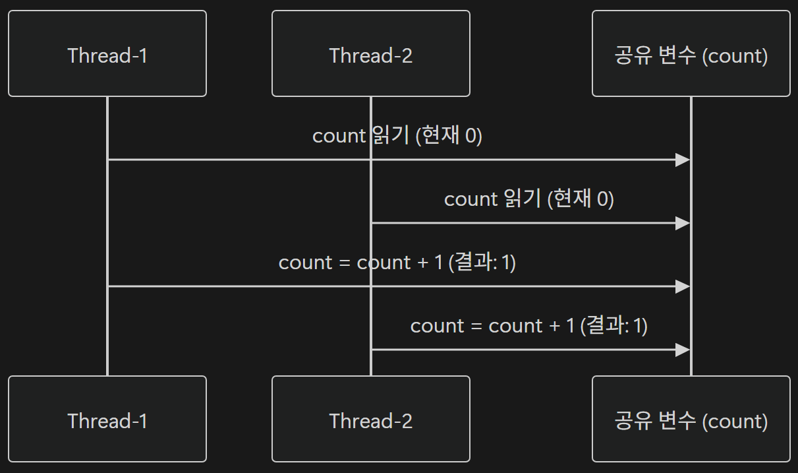

# <span style="background-color: #FFF9C4">3. 스레드 안정성과 동기화 기초</span>

## 3-01. 멀티스레드 프로그래밍의 위험성

멀티스레드는 **공유 자원을 동시에 접근할 때** 심각한 문제가 발생함

이러한 문제는 대부분 **Race Condition (경쟁 상태)**에서 비롯된다.

## 1) **Race Condition(경쟁 상태)란?**

CPU 스케줄링 타이밍에 따라 여러 스레드의 실행 순서가 달라지고, 그 결과 프로그램의 실행 결과도 달라지는 문제를 말함

### 예시 상황

- 두 스레드가 동시에 접근하면 “1 증가” 연산이 겹치게 되고, 결과가 2가 아닌 1이 된다.



<br>

### 2) Race Condition 발생 원리

Race Condition은 여러 스레드가 같은 공유 자원에 동시에 접근할 때, 발생할 수 있음

특히, **읽기(Read), 조건 확인(Check), 쓰기(Write)가 분리되어 수행되는 비원자적 연산**에서 자주 발생

```java
if (balance >= amount) { // 조건 확인
    balance -= amount;   // 읽기 + 계산 + 쓰기
}
```

<br>

## 3-02. 스레드 동기화 기법

Race Condition이 발생하여 데이터가 손상될 수 있는 문제를 **동기화(Synchronization)**를 적용하여 방지할 수 있다.

- **동기화(Synchronization)**
  - 여러 스레드가 하나의 공유 자원에 동시에 접근하지 못하도록 임계 구역(Critical Secrion)을 설정하는 방법

<br>

### 1) 임계 구역(Critical Section)과 락(Lock)

- **임계 영역**은 **오로지 하나의 스레드만 코드를 실행할 수 있는 코드 영역**
- **락**은 **임계 영역을 포함하고 있는 객체에 접근할 수 있는 권한**

특정 코드 구간을 임계 영역으로 설정할 때는 `synchronized`라는 키워드를 사용

<br>

### 2) `synchronized` 키워드

Java에서 동기화를 구현하기 위한 핵심 키워드

- Java의 모든 객체는 내부적으로 **모니터 락(Monitor Lock)**을 가지고 있음
- `synchronized` 키워드는 이 락을 기반으로 작동

➡️ **하나의 스레드가 락을 점유하면, 다른스레드는 락이 해제될 때까지 대기**

#### 메서드 동기화

- `synchronized` 키워드를 메서드 선언부에 붙이면, **메서드 전체가 임계 구역**으로 설정됨

#### 블록 동기화

- 필요한 부분만 `synchronized` 블록으로 감쌀 수 있음

**장점**

- **동기화 범위를 최소화하여 성능을 향상**
  - 동기화되는 코드 영역을 최소화 ➡️ **불필요한 대기 시간 감소**
  - 공유 자원을 사용하는 부분만 보호 ➡️ **성능 최적화 가능**

**단점**

- 코드 구조 복잡해질 수 있음
- 여러 락을 다룰 경우 데드락 가능성이 증가

---

# <span style="background-color: #FFF9C4">4. Executor와 스레드 풀</span>

## 4-01. 스레드 풀 (Thread Pool)

스레드 풀은 미리 생성해둔 여러 스레드를 관리하는 구조

- 매번 새로운 스레드를 만들지 않고 **이미 만들어진 스레드를 재사용**함으로써 성능을 향상 시킨다.

<br>

### 1) 스레드 풀의 필요성

#### (1) 스레드 생성/소멸 비용 절감

스레드는 생성할 때마다 **메모리 스택 공간**과 **운영체제의 문맥(context) 등록**이 필요한데, 이 작업은 가볍지 않기 때문에, 매 요청마다 새로운 스레드를 생성하면 성능이 급격히 저하된다.

**스레드 풀**은 이 문제를 해결하기 위해 **스레드를 미리 만들어 재사용**한다

#### (2) 스레드 개수 제한을 통한 자원 관리

시스템은 한정된 CPU 코어와 메모리를 가지고 있기 때문에, 스레드가 많을 수록 **문맥 전환(Context Switching)** 비용이 커짐

**스레드 풀**은 **최대 스레드 개수를 제한**하여 시스템 자원 보호한다. 이로 인해 CPU가 처리 가능한 양을 초과하는 스레드가 생기지 않아 **안정적인 실행**이 가능하다.

<br>

### 2) 작업(Work) Queue의 역할

작업 요청은 먼저 **작업 Queue**에 저장되고, 작업 Queue에 들어온 작업을 스레드 풀에 있는 스레드가 가져와 실행한다.

<br>

### 3) 스레드 풀의 이점

- 스레드 재사용으로 생성/소멸 비용 절감되어 **성능 향상**
- 최대 스레드 개수 제한으로 과부하 방지가 되어 **자원 관리** 가능
- 요청이 많을 때도 작업 Queue를 통한 순차 처리가 가능하여 **안정성** 향상
- 직접 스레드 관리가 불필요하여 **코드 단순화** 가능
- 다양한 `Executor` 구현체와 함께 사용 가능하여 **확장성**이 높음

<br>

## 4-02. Executor 구조

멀티스레드 프로그래밍에서 가장 큰 문제 중 하나는 **스레드를 직접 생성하고 관리하는 것**이다.

➡️ 몇 개의 스레드를 만들지, 언제 종료할지, 예외가 발생하면 어떻게 처리할지 등 많은 책임이 개발자에게 있다.

이러한 복잡성을 줄이기 위해 Java는 **스레드 실행을 추상화한 인터페이스** `Executor`를 제공

즉, `Executor`는 **작업을 실행할 수 있는 객체**를 표현한 인터페이스

```java
public interface Executor {
    void executor(Runnable command);
}
```

- 스레드를 직접 생성하는 대신, **Executor에서 실행을 위임**하면 내부적으로 스레드 풀을 사용하거나 단일 스레드로 실행할 수 있음
- 다만, `Executor`를 직접 구현하지 않고, `ExecutorService` 같은 구현체를 사용해 구현한다.

<br>

### 1) `Executor`를 직접 구현하지 않는 이유

#### (1) 스레드 생성 비용 문제

매번 새로운 스레드를 만들면 스택 메모리 할당, 커널 리소스 요청 등으로 인해 생성 비용이 매우 큼

#### (2) 자원 관리 어려움

스레드를 직접 생성하기 때문에, 스레드 실행 중 종료/예외 처리의 직접 관리가 필요하다.

#### (3) 비동기 결과 및 예외 처리 부족

`Executor`는 `Runnable`만 받을 수 있어 결과를 반환할 수 없음

<br>

### 2) `ExecutorService`

`Executor`의 하위 인터페이스로, **스레드의 생명주기 관리** 기능이 추가된 구조

```java
public interface ExecutorService extends Executor {
    void shutdown();
    <T> Future<T> submit(Callable<T> task);
}
```

- 실행은 물론
- **스레드를 종료**(`shutdown`)할 수 있고,
- **결과 반환**(`Callable` / `Future` ) 가능하며
- 여러 작업을 동시에 제출/관리할 수 있다.

#### 기능

- `execute(Runnable)` : 반환값 없는 단순 실행
- `submit(Callable)` : 결과를 반환하는 작업 실행
  - 이때 반환값을 비동기적으로 받을 수 있는 객체가 `Future`
- `shutdown()` : 더 이상 새로운 작업을 받지 않음
- `awaitTermination()` : 모든 스레드가 종료될 때까지 대기
- `isShutdown()` / `isTerminated()` : 상태 확인

<br>

## 4-03. 자주 사용되는 스레드 풀 유형

Java의 `Executor` 유틸리티 클래스를 통해 다양한 형태의 스레드 풀을 쉽게 생성할 수 있다.

<br>

### 1) 고정 크기 스레드 풀 (Fixed Thread Pool)

`ExecutorService executor = Executors.newFixedThreadPool(3);` ➡️ 스레드 3개 유지

- **특징**
  - 스레드 개수를 고정해놓고 재사용
  - 스레드가 모두 사용 중이라면, 남은 작업들을 **작업 Queue에 대기** 시킴
  - **CPU 바운드 작업**(CPU 연산 위주)에 적합

<br>

### 2) 캐싱 스레드 풀 (Cached Thread Pool)

`ExecutorService executor = Executors.newCachedThreadPool();` ➡️ 유동적 스레드 풀

- **특징**
  - 필요한 만큼 스레드를 생성하고, 일정 시간동안 사용하지 않으면 자동 종료
  - 요청이 몰리면 빠르게 스레드를 늘리고, 부하가 줄면 줄어든다.
  - **I/O 바운드 작업**(네트워크, 파일 입출력)에 적합

<br>

### 3) 단일 스레드 실행자 (Single Thread Executor)

`ExecutorService executor = Executors.newSingleThreadExecutor();`

- **특징**
  - 하나의 스레드만 사용해 작업을 **순차적으로 실행**
  - 여러 작업이 있을 경우, **작업 제출 순서대로 처리**
  - 로그 기록, 파일 쓰기 등 **순서가 중요한 작업**에 적합

<br>

### 4) 예약 스레드 풀 (Scheduled Thread Pool)

`ScheduledExecutorService scheduler = Executors.newScheduledThreadPool(2);`

`cheduledExecutorService`는 `ExecutorService`를 상속한 인터페이스로, **작업을 일정 주기로 예약(scheduling)** 가능

- **특징**
  - 주기적 또는 일정 시간 후 실행 가능
  - 타이머, 스케줄링 시스템, 정기적 백업 등 **주기적 실행 작업**에 적합

<br>

## 4-04. 스레드 풀 구성 및 관리

### 1) 적정 스레드 풀 크기 결정

스레드 풀의 크기는 시스템 성능과 직결됨

너무 작으면 작업이 밀리고, 너무 크면 CPU 자원 경쟁으로 성능이 떨어짐

- CPU 코어 수보다 많은 스레드는 문맥 전환(Context Switching) 비용 유발
- 스레드 풀 크기를 경험적으로 조정하면서 모니터링하는 것이 가장 현실적인 접근

<br>

### 2) 스레드 풀 셧다운 (Shutdown)

#### (1) 셧다운의 필요성

스레드 풀을 종료하지 않으면 프로그램이 끝나도 백그라운드에서 계속 실행되어 자원이 낭비됨

따라서 모든 작업이 끝나면 명시적으로 종료해야 함

#### (2) 종료 메서드

- `shutdown()` : 새 작업 접수 중단하고, 이미 제출된 작업은 완료될 때까지 실행
- `shutdownNow()` : 실행 대기 중인 작업들을 취소하고, 실행 중인 스레드에 interrupt를 보내 중단 시도
- `awaitTermination(timeout, unit)` : `shutdown()` 또는 `shutdownNow()` 호출 후, `ExecutorService`가 지정된 시간 안에 종료 완료를 기다림

<br>

### 3) 예외 처리 전략

#### (1) 실행 중 예외 발생

스레드 풀 내부에서 예외 발생 시, 해당 스레드만 영향을 받고 프로그램 전체는 멈추지 않음

하지만 **메인 스레드로** 예외 로그가 \***\*전파되지 않아 출력되지 않거나 무시될 수 있으므로 **명시적으로 예외를 처리해야 한다.\*\*

#### (2) `Future`를 통한 예외 처리

스레드 풀 내부에서 예외 발생 시 `future.get()`으로 예외가 `ExecutionException`으로 감싸져 전달된다.

- `ExecutionException`은 Checked Exception

---
