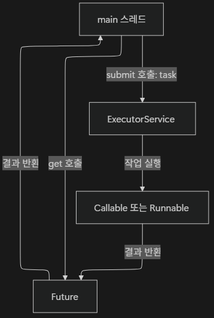
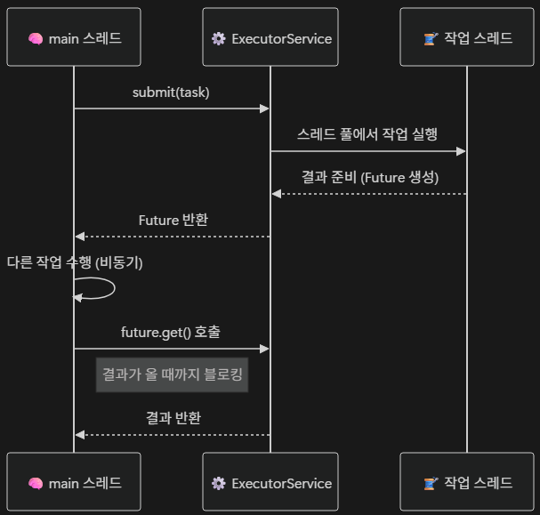

# <span style="background-color: #FFF9C4">5. `Future`와 `Callable`</span>

## 5-01. `Runnable`의 한계와 `Callable`의 등장

### 1) `Runnable`

Java에서 가장 기본적인 작업 단위 인터페이스로, 스레드에서 실행할 코드를 정의할 때 사용

- `Runnable` 인터페이스 내의 `run()` 메서드를 통해 작업함

```java
...
Runnable task = () -> {
    System.out.println("작업 실행 중...(" + Thread.currentThread().getName() + ")");
};

Thread thread = new Thread(task);
thread.start();
...
```

#### `Runnable`의 한계

- **반환값 없음**
  - 단순히 작업을 실행하는 역할만 할 뿐, **계산 결과를 호출자에게 전달(반환)할 수 없음**
- 예외 처리 불가
  - 스레드 내부에서 예외가 발생해도 상위로 전파되지 않음
- 비동기 제어 어려움
  - 작업 완료 시점을 알 수 없음

<br>

### 2) `Callable`

`Runnable`의 한계를 보완하기 위해 Java 5부터 도입된 인터페이스

- **반환 값을 가지며, 예외를 던질 수 있다.**
- `Callable` 인터페이스 내의 `call()` 메서드를 통해 결과를 반환하며, 예외를 명시적으로 던질 수 있음

```java
Callable<String> task = () -> {
    System.out.println("작업 실행 중...(" + Thread.currentThread().getName() + ")");
    return "작업 결과";
}
```

- 단독으로 실행되지 않으며, `ExecutorService`를 통해 실행된다.

```java
// 위 task 이용
ExecutorService executor = Executors.newSingleThreadExecutor();

Future<Spring> feture = executor.submit(task); // 작업 제출(submit) 후 Future 객체 반환
System.out.println("결과: " + future.get()); // 결과 조회

executor.shutdown();
```

#### `Callable`을 사용하는 상황

- 비동기 작업의 결과를 받아야 할 때
- 다양한 타입의 결과를 반환해야 할 때
- 예외 발생을 감지하고 처리해야 할 때
- 작업이 완료될 때까지 대기할 필요가 있을 때
- `ExecutorService`와 함께 `Future`를 통해 결과를 제어할 때

<br>

## 5-02. `Future` 인터페이스

`Callable`이나 `Runnable`의 비동기(Asynchronous) 작업의 결과를 **나중에** 조회하거나 제어할 수 있게 해주는 인터페이스

- 즉시 결과를 반환하지 않고,
  - 결과가 준비될 때까지 기다리거나,
  - 필요할 때 `get()` 메서드로 가져올 수 있음

<br>

### 1) `Future` 인터페이스의 주요 메서드

`Future`은 단순히 결과뿐만 아니라, 작업의 상태(진행, 완료, 취소)를 함께 관리함

- `get()`
  - 작업이 완료될 때까지 **블로킹**하여 결과 반환
  - 만약 작업이 오래 걸리면 그동안 메인 스레드는 멈춘 상태가 됨
  - 취소된 작업에 호출되면 `CancellationException` 발생
- `get(long timeout, TimeUnit unit)`
  - **지정된 시간 동안만 기다린 후** 결과가 없으면 `TimeoutException` 발생
  - 네트워크 호출이나 외부 API 작업처럼 응답 시간이 불확실한 작업에 유용
- `cancel(boolean mayInterruptIfRunning)`
  - 작업을 취소(중단) 시도
  - `mayInterruptIfRunning`이 `true`면 실행 중인 작업에 interrupt를 보냄
- `isDone()`
  - 작업이 완료되었는지 여부 반환
- `isCancelled()`
  - 작업이 취소되었는지 여부 반환

<br>

## 5-03. `ExecutorService`와 `Future`

`ExecutorService`는 스레드 풀을 관리하고, `Future`은 비동기 작업의 결과를 저장

두 객체는 함께 사용되어 **비동기 실행 ➡️ 결과 조회 ➡️ 자원 관리**의 전체 흐름을 완성



- `ExecutorService`는 스레드를 직접 생성하지 않고, 내부 스레드 풀에서 관리하기 때문에 자원 낭비를 방지하고, 여러 작업을 효율적으로 처리할 수 있다.

<br>

### 1) `submit()` 메서드

비동기 작업을 스레드 풀에 제출하고, 즉시 `Future` 객체를 반환

- 작업이 끝나는 것을 기다리지 않고 바로 `Future` 객체 반환

```java
ExecutorService executor = Executors.newFixedThreadPool(2);

Callable<Integer> task = () -> {
    System.out.println("작업 실행 중... (" + Thread.currentThread().getName() + ")");
    Thread.sleep(1000);
    return 100;
};

Future<Integer> future = executor.submit(task);

System.out.println("결과 대기 중...");
Integer result = future.get(); // 블로킹 대기
System.out.println("결과: " + result);

executor.shutdown();
```

<br>

### 2) `invokeAll()`과 `invokeAny()`

#### `invokeAll()`

여러 `Callable`을 한 번에 제출하고, **모든 작업이 끝날 때까지 기다림**

- 전체 작업을 병렬로 실행
- 모든 작업이 끝나야 반환되기 때문에 일괄 처리(batch processing)에 유용

#### `invokeAny()`

여러 작업 중 **가장 빨리 끝난 하나의 결과만 반환**하고 나머지 작업은 자동으로 취소됨

- 빠른 응답이 필요한 서비스에 적합

<br>

## 5-04. `Future`의 한계

### 1) `get()` 블로킹 문제

`Future`의 `get()` 메서드는 **결과가 준비될 때까지 현재 스레드를 멈추게(블로킹)** 한다.

이로 인해 **비동기 실행의 장점이 반감**되는 문제 발생



#### 블로킹의 실질적 문제점

- **CPU 낭비**
  - 대기 중인 스레드는 아무 일도 하지 않음
- **응답 지연**
  - 네트워크, I/O 작업이 지연되면 전체 프로그램 속도 저하
- **확장성 저하**
  - 여러 `Future`를 동시에 처리할 때, 각 스레드가 차례로 대기

<br>

### 2) Callback 메커니즘의 부재

`Future`는 단순 결과를 보관하는 객체로, 작업 완료 시 자동으로 **후속 동작(Callback)**을 실행할 수 없음

이로 인해 `Future`가 비동기임에도 결과적으로 동기적 처리 구조가 되어버림

- **예시** : 대용량 파일 다운로드 후, 자동으로 압축 해제하고, 로그 기록
  ```java
  String file = future.get(); // 완료될 때까지 대기
  unzip(file);
  writeLog(file);
  ```

<br>

### 3) 연쇄 작업(Chaining)의 어려움

`Future`는 반환값을 직접 받아 다음 작업에 넘기는 방식 외에는 **연쇄 작업(Chaining)** 불가능

- 아래 같은 구조로 동작한다면 훨씬 효율적일 것
  - 비동기 다운로드 ➡️ 비동기 압축 해제 ➡️ 비동기 로그 저장 ➡️ 최종 완료 알림
  - 하지만 `Future`로는 이런 자동 연결 구조 구현 불가능

---
