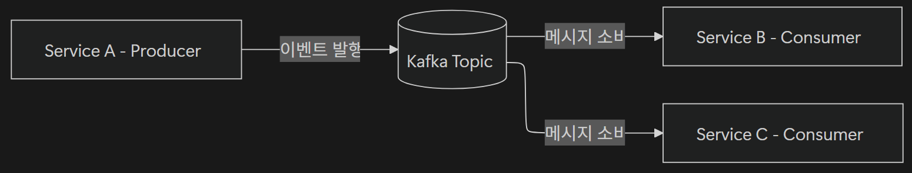

# <span style="background-color: #FFF9C4">3. Spring Event 기반 비동기 처리</span>

## 3-01. Spring Event 시스템

Spring의 이벤트 시스템은 **애플리케이션 내부에서 비동기적으로 로직을 분리하고 결합고를 낮추기 위한 구조**를 제공

이벤트를 발행하면, 등록된 Listener들이 이를 수신하여 후속 작업을 처리한다.

<br>

### 1) 이벤트 시스템의 기본 구조

Spring Event 시스템은 **발행-구독(Publish-Subscribe) 패턴**을 기반으로 처리

- 어떤 사건 발생 시 그 사실을 알리는 이벤트를 발행(Publish)하고, 해당 이벤트를 구독(Subscribe, Listen)하는 Listener가 이것을 처리

```
비즈니스 로직에서 `ApplicationEventPublisher`를 통해 이벤트 발행
➡️ `ApplicationEventPublisher`는 이벤트를 Spring 이벤트 시스템에 전달
➡️ 전달된 이벤트는 내부적으로 `ApplicationEventMulticaster`가
    해당 이벤트를 구독하고 있는 모든 `ApplicationListener`에게 전파
```

<br>

- `ApplicationEvent`
  - **역할**: 이벤트 객체
  - 발생한 사건(이벤트)의 정보를 담는 객체
- `ApplicationEventPublisher`
  - **역할**: 이벤트 발행자
  - 특정 시점에 이벤트를 발생하는 컴포넌트
  - Spring 컨텍스트에 기본적으로 내장되어 있음
  - `publishEvent()` 메서드가 호출되면, Spring 내부의 `ApplicationEventMulticaster`가 감지하여 등록된 Listener에게 이벤트를 전달
- `ApplicationListener`
  - **역할**: 이벤트 수신자
  - 발행된 이벤트를 감지하고, 후속 동작을 수행하는 컴포넌트
  - **관심사의 분리(Separation of Concerns)** 가능
    - 예를 들어, 회원가입 시 이메일을 발생시키는 로직을 구현했다면, 회원가입 로직이 있는 `UserService`는 이메일 발송 로직을 전혀 알 필요가 없어진다.

<br>

### 2) Spring Event 시스템 사용 상황

- 서비스 간 후속 작업을 느슨하게 연결하고 싶을 때
  - 예시: 회원가입 후 알림 발송/포인트 적립
- 트랜잭션 내 부수 작업을 분리하고 싶을 때
  - 예시
    - 영수증 발행
    - MSA 또는 이벤트 기반 아키텍처에서 결제 완료 후 재고 차감
- 이벤트 흐름을 중앙집중형 구조에서 벗어나게 하고 싶을 때
  - 예시: 모놀리식 구조의 서비스 로직 분리
    - 모놀리식 구조(Monolithic Architecture)는 하나의 애플리케이션 안에 여러 기능이 함께 들어있는 구조
      - 예시: 하나의 Spring Boot 프로젝트 안에 주문/결제/재고/배송 기능 등이 있는 구조

<br>

### 3) Spring Event 시스템의 동기/비동기 처리

- Spring Event 시스템은 기본적으로 **동기(Synchronous)** 방식으로 동작
  - 즉, 이벤트를 발행하면 리스너가 모두 처리될 때까지 다음 코드가 실행되지 않음
- 그러나 메일 전송, 로그 기록, 외부 API 호출 등 시간이 오래 걸리는 작업은 **비동기(Asynchronous)** 로 처리하는 것이 효율적

<br>

### 4) 이벤트 기반 아키텍처 장점

코드 분리 이상의 장점을 제공

#### (1) 결합도 감소와 유지보수성 향상

**비즈니스 로직**이 구현된 Service는 Listener에 대한 **의존성이 전혀 없다.**

그래서 Listener의 추가나 수정이 독립적으로 가능해 시스템 확장성이 크게 향상됨

#### (2) 확장성과 유연성

새로운 기능을 추가해야 하는 경우, 기존 로직 수정 없이 **새로운 Listener만 등록**하면 됨

이로 인해, **확장에 열려 있고 수정에 닫힌 개방 폐쇄 원칙(Open-Closed Principle)**을 가진 구조가 될 수 있음

#### (3) 비동기 확장 기반

이벤트 시스템은 `@Async`와 결합하여 비동기 처리 구현 가능하다.

이벤트가 발행되면 Listener가 별도의 스레드에서 동작하여 **서비스의 응답 속도를 높이고, 부하를 분산**시킬 수 있다.

<br>

## 3-02. `@EventListener` 애너테이션 활용

`@EventListener`를 활용하면

- 기존처럼 **이벤트 클래스, Publisher, Listener**를 분리하지 않고,
- **메서드 단위로 이벤트를 처리** 가능

`@EventListener`는 기존의 `ApplicationListener` 인터페이스를 대체해, **더 간결하고 가독성 높은 방식**으로 이벤트 Listener를 작성할 수 있다.

```java
// UserRegisteredEvent 타입의 이벤트가 발생할 때 자동으로 실행됨
@EventListener
public void handleUserRegistered(UserRegisteredEvent event) {
    System.out.println("회원가입 완료: " + event.getEmail());
    System.out.println("📧 환영 이메일 전송 완료!");
}
```

- 하나의 클래스에서 여러 이벤트를 처리할 수 있다.

<br>

### 1) 조건부 이벤트 처리(`Condition` 속성)

`@EventListner`는 `condition` 속성을 사용해 특정 조건일 때만 이벤트를 처리할 수 있다.

즉, 이벤트의 필드 값을 검사해 **필터링된 이벤트 처리**가 가능

```java
// UserRegisteredEvent의 premium 필드가 true 일 때만 실행
@EventListener(condition = "#event.premium == true")
public void handlePremiumUser(UserRegisteredEvent event) {
    System.out.println("✨ 프리미엄 회원 가입 처리: " + event.getEmail());
}
```

<br>

### 2) SpEL 활용

SpEL(Spring Expression Language)은 런타임에 객체의 값을 표현식으로 평가할 수 있는 기능을 제공

`@EventListener(condition = "...")` 내부에서 SpEL을 활용하면 이벤트 속성을 기반으로 한 정교한 조건식을 만들 수 있다.

```java
// UserRegisteredEvent의 premium 필드가 true 일 때만 실행
@EventListener(condition = "#event.premium == true")

// 이메일이 특정 도메인(@vip.com)일 때만 실행
@EventListener(condition = "#event.email matches '.*@vip.com'")
```

<br>

## 3-03. 분산 환경으로의 확장 가능성

Spring Event는 단일 애플리케이션 내에서 비동기 처리를 구현하기 용이하지만, **분산 시스템** 또는 **MSA**에서는 한계가 존재한다.

- **분산 시스템 확장성**이 떨어짐

<br>

### 1) Spring Event 동작 범위

Spring Event는 **ApplicationContext 내부**에서만 동작한다.

즉, 이벤트를 발행한 인스턴스(JVM) 안에서만 수신할 수 있다.

<br>

### 2) 메시지 브로커(Message Broker)

여러 애플리케이션 간에 메시지(이벤트)를 중간에서 안전하게 전달해주는 시스템

- 예시
  - **Apache Kafka** (고성능, 대규모 로그 스트리밍)
  - **RabbitMQ** (메시지 Queue 기반 비동기 처리)
  - **Amazon SQS, Goolge Pub/Sub** 등

#### 메시지 브로커 역할

- **Producer**
  - 메시지를 발행하는 주체
  - Publisher 역할
- **Broker**
  - 메시지를 임시 저장 및 관리하는 서버
  - Kafka Cluster 등
- **Topic/Queue**
  - 메시지를 구분하기 위한 논리적 공간
  - 메일함과 유사
- **Consumer**
  - 메시지를 구독하여 처리하는 주체

```
Producer (메시지 전송) ➡️ Message Broker (메시지 전달) ➡️ Consumer
```

<br>

### 3) Kafka 기본 구조

Kafka는 고성능 메시지 스트리밍 플랫폼으로, 이벤트를 중앙 Topic에 저장하고 **다수의 소비자(Consumer)**가 이를 병렬로 처리할 수 있도록 한다.



<br>

### 4) 도메인 이벤트 (Domain Event)

**하나의 서비스 내부**에서 발생하는 비즈니스 상태 변화를 표현

- 이벤트를 통해 내부 모듈 간 결합도를 낮춤
- 예시: 회원가입 완료 시 이메일 발송을 위한 이벤트
- `@EventListener` 기반으로 비동기 처리가 가능하다.

<br>

### 5) 통합 이벤트 (Integration Event)

**서비스 간 데이터 교환**을 위한 이벤트로, 다른 애플리케이션이 구독할 수 있도록 외부 브로커에서 발행됨

- 예시: 주문 서비스에서 외부 결제 서비스로 전달되는 이벤트
- 외부 브로커로 Kafka, RabbitMQ 등을 이용

---

# <span style="background-color: #FFF9C4">4. 비동기 예외 처리와 `AsyncUncaughtExceptionHandler`</span>

## 4-01. 비동기 처리의 예외 처리

비동기(`@Asycn`) 처리는 프로그램의 응답성을 높이지만, 예외 처리 면에서 **매우 다른 동작 방식**을 보인다.

<br>

### 1) 비동기 처리의 작동 구조

비동기 메서드는 **새로운 스레드(Thread)**에서 실행되므로, 메인 스레드에서 발생하는 예외 전파 규칙이 그대로 적용되지 않음

새로운 스레드에서 발생한 예외가 메인 스레드로 **예외 전파가 불가능**하다. 즉, 비동기 스레드에서 발생했기 때문에 발생한 예외를 `try-catch`로 잡을 수가 없다.

또한, 비동기 메서드는 호출 후 작업 완료를 기다리지 않고 바로 제어권을 반환하기 때문에, **작업의 성공 여부나 실패 여부를 즉시 확인할 수 없다.**

<br>

### 2) 예외 전파가 되지 않는 이유

#### (1) 스택 프레임(stack frame)의 분리

각 스레드는 독립적인 **호출 스택(Call Stack)**을 가지고 있으며, 비동기(`@Async`)로 실행되는 메서드는 완전히 **다른 스레드의 스택 공간**에서 동작한다. 따라서 한쪽 스레드의 예외는 다른 쪽으로 **전파되지 않는다.**

- 메인 스레드에서 새로운 A 스레드를 비동기 호출 시, A 스레드에서 예외가 발생하면 메인 스레드로 예외 전파가 불가능하다.
- `try-catch`는 같은 호출 스택, 즉 동일 스레드에서만 유효하므로, 다른 스레드에서 발생한 예외는 잡히지 않는다.

#### (2) `Future` 또는 `CompletableFuture`와의 관계

`@Asycn`는 내부적으로 `ExecutorService`를 사용해 새로운 스레드를 생성하고, 그 결과를 `Future` 객체로 래핑(wrapping)하여 관리한다.

이 구조 덕분에 비동기 처리가 가능하지만, 반환 타입이 `void`인 경우 `Future`가 생성되지 않기 때문에 결과나 예외를 추적할 방법이 없다.

**비동기 결과 추적이 필요한 경우 반드시** `Future`**나** `CompleteFuture`**를 반환해야 한다.**

<br>

## 4-02. `@Async` 반환 타입별 예외 처리

비동기(`@Async`) 메서드는 **호출 즉시 반환되고,** 실제 로직은 별도의 스레드에서 수행된다.

이때 예외가 발생하면, 반환 타입에 따라 예외 전파 방식이 완전히 달라진다.

<br>

### 1) `void`

- 예외 전파 여부: ❌ - `@Async` 메서드가 `void`를 반환하면 **호출자에게 전파되지 않음**
  - 즉, 메인 스레드가 예외를 감지할 방법이 없
- 예외 확인 여부: `AsyncUncaughtExceptionHandler` 필요

<br>

### 2) `Future<T>`

`Future<T>`는 비동기 결과를 감시할 수 있는 객체

- 예외 전파 여부: ⭕ - 스레드가 완료되면 `get()` 호출 시 예외 확인 가능
- 예외 확인 여부: 예외 존재 시 `ExecutionException`으로 래핑되어 전달됨

<br>

### 3) `CompletableFuture<T>`

Java 8부터 등장한 **비동기 흐름 제어 API**로, Callback 체이닝과 복구 메서드 제공하며, 명시적 `get()` 호출 없이 예외 제어 가능

- 예외 전파 여부: ⭕ - 체이닝 내부에서 직접 처리 가능
- 예외 확인 여부: `exceptionally()`, `handle()` 메서드 사용

```java
@Async
public CompletableFuture<String> sendEmail(String address) {
    if (address == null) {
        throw new IllegalArgumentException("이메일 주소가 null입니다.");
    }
    return CompletableFuture.completedFuture("전송 완료: " + address);
}
```

```java
mailService.sendEmail(null)
        // 예외
        .exceptionally(ex -> {
            System.err.println("비동기 예외 감지: " + ex.getMessage());
            return "전송 실패";
        })
        // 정
        .thenAccept(result -> System.out.println("결과: " + result));
```

<br>

## 4-03. `AsyncUncaughtExceptionHandler`

### 1) `AsyncUncaughtExceptionHandler`

`AsyncUncaughtExceptionHandler`는 `@Async`로 실행된 `void` 메서드의 예외를 처리하기 위한 전용 인터페이스이다.

비동기 메서드(`@Async`)는 호출 스레드와 별개로 실행되기 때문에, 예외가 발생해도 **호출자에게 전파되지 않는다.**

이 때 `AsyncUncaughtExceptionHandler` 를 사용하면 비동기 스레드 내부에서 발생한 예외를 감지하고, 로깅이나 후속 처리를 할 수 있다.

```java
public interface AsyncUncaughtExceptionHandler {
    void handleUncaughtException(Throwable ex, Method method, Object... params);
}
```

- 비동기 스레드에서 예외가 발생하면, Spring이 `handleUncaughtException()`을 자동으로 호출
- **파라미터**
  - `Throwable ex` : 발생한 예외 객체
  - `Method method` : 예외가 발생한 비동기 메서드 객체
  - `Object... params` : 해당 메서드에 전달된 인자들

<br>

### 2) 예외 정보 활용

이렇게 획득한 비동기 예외를 단순 로깅뿐 다양한 후속 처리에 활용할 수 있다.

#### 로그 중앙화

예외 로그를 Logstash, ELK, Sentry 등 외부 시스템으로 전송

#### 슬랙/이메일 알림

예외 발생 시 운영팀에게 실시간 전송

#### DB 기록

예외 발생 내역을 table에 저장해 통계에 활용

#### 자동 재시고

동일 작업을 다시 시도하거나 Backoff 적용

<br>

## 4-04. 글로벌 예외 처리 설정

### 1) `AsyncConfigurer`를 이용한 글로벌 예외 처리

`AsyncConfigurer`는 Spring의 비동기 기능(`@Async`)을 전역적으로 구성할 수 있는 인터페이스

이 인터페이스를 구현하면

- **스레드 풀 설정, 예외 처리 핸들러 등록, 비동기 실행 정책**을 한 번에 정의 가능
- **모든** `@Async` **메서드가 동일한 설정 공유**

```java
public interface AsyncConfigurer {
    Executor getAsyncExecutor();
    AsyncUncaughtExceptionHandler getAsyncUncaughtExceptionHandler();
}
```

- `getAsyncExecutor()` : 비동기 작업을 처리할 `Executor`(스레드 풀)를 커스터마이징 후 반환
- `getAsyncUncaughtExceptionHandler()` : 비동기 예외를 처리할 글로벌 예외 핸들러 등록

```
@Async 메서드 실행
➡️ 비동기 스레드에서 예외 발생
➡️ AsyncConfigurer에 등록된 핸들러 호출됨
➡️ CustomAsyncExceptionHandler
➡️ 로깅/알림/후속 처리
```

<br>

### 2) 다중 예외 타입별 핸들러 구현

- 모든 비동기 예외가 여기서 한 번에 처리됨
- 예외 타입별로 로깅 수준을 다르게 해서, 운영 환경에서 알림 노이즈 최소화 가능

```java
@Slf4j
@Component
public class GlobalAsyncExceptionHandler implements AsyncUncaughtExceptionHandler {

    @Override
    public void handleUncaughtException(Throwable ex, Method method, Object... params) {
        log.error("[Global Async 예외 감지]");
        log.error("발생 메서드: {}", method.getName());
        log.error("파라미터: {}", Arrays.toString(params));

        if (ex instanceof IllegalArgumentException) {
            log.warn("잘못된 인자 전달: {}", ex.getMessage());
        } else if (ex instanceof NullPointerException) {
            log.error("널 포인터 예외 발생: {}", ex.getMessage());
        } else {
            log.error("기타 예외 발생: {}", ex.getClass().getSimpleName(), ex);
        }

        // 알림 시스템 연동 예시 (Slack, Email 등)
        // notifyAdmin(method.getName(), ex);
    }
}

```

<br>

## 4-05. 비동기 예외 처리 모범 사례

단순 로깅만으로 장애 상황에 충분히 대응하기 어려우므로, 예외 발생 시 필요에 따라 서비스 전체의 안정성을 해치지 않으면서, 재시도/대체 로직/차단 메커니즘을 조합해 복원력을 확보해야 한다.

<br>

### 1) 재시도 메커니즘

**재시도(Retry)**는 일시적인 네트워크 오류나 타임아웃 등의 문제로 작업이 실패했을 때, 동일한 작업을 일정 횟수 다시 시도하는 전략

- **목적**
  - **일시적인 장애(Transient Fault)**를 복구
- **권장 방식**
  - 최대 시도 횟수 + 대기 간격(Backoff)을 함께 설정
- **장점**
  - 간단하고 효과적
- **단점**
  - 영구 장애 시 무의미한 반복
    - 너무 많은 재시도는 리소스 낭비와 서버 부하 발생

<br>

### 2) Fallback 전략

**Fallback**은 특정 작업이 실패했을 때 **대체 동작**을 수행해 시스템의 가용성을 유지하는 방법

- **목적**
  - Fail-Safe 설계로 서비스 연속성을 보장
- **적용 상황**
  - 외부 시스템 장애, API 응답 지연, 네트워크 불안정
- **예시**
  - 외부 이메일 서버 오류로 이메일 전송 실패 ➡️ **임시 메시지 Queue에 저장** ➡️ 나중에 재전송
- **장점**
  - 장애 격리, 사용자 영향 최소화
- **단점**
  - 구현 복잡도 증가

<br>

### 3) 회로 차단기 패턴

**회로 차단기(Circuit Breaker)**는 외부 시스템에 지속적으로 실패 요청이 발생할 경우, 일정 시간 동안 호출을 중단하여 시스템을 보호하는 패턴

- **상태 종류**
  - **Closed** : 정상 상태, 모든 요청 허용
  - **Open** : 오류율이 일정 임계치 초과 ➡️ 호출 차단
  - **Half-Open**
    - 특정 시간 후 일부 요청만 허용해 **Half-Open** 상태로 복구를 시도함
    - 성공 시 복구, 실패 시 다시 차단
- **목적**
  - 시스템 보호
- **장점**
  - 장애 전파 차단
- **단점**
  - 임계값 조정 어려움

<br>

## 4-06. Spring Retry와 Recovery Annotation 활용

`for` 반복문과 `try-catch`로 **직접 구현**하는 것보다,

Spring Retry의 `@Retryable`과 `@Recover`를 활용하면 재시도와 복구 흐름을 **애너테이션 기반** 선언적 처리 가능

<br>

### 1) 기존 직접 구현 방식의 한계

Retry의 동작 원리를 이해하는데 좋지만, 실무에서 그대로 적용하면 아래의 문제 발생

- 비즈니스 로직과 재시도 로직이 섞임
- 예외별 재시도 제어가 복잡
- Backoff 정책 관리 어려움
- 코드 중복 발생 가능
- 테스트와 유지보수가 어려움

따라서 직접 반복문을 작성하는 것보다 **Spring Retry** 같은 라이브러리를 사용해 재시도 정책을 분리하는게 좋다.

<br>

### 2) Spring Retry

실패 가능성이 있는 작업을 일정 조건에 따라 자동으로 실행해주는 Spring 기반 라이브러리

메서드에 `@Retryable`을 붙여 재시도 조건을 선언할 수 있다.

```java
@Retryable(
    retryFor = TemporaryPaymentException.class, // 이 예외일 때
    maxAttempts = 3, // 최대 3번까지 메서드 재실행
    backoff = @Backoff(delay = 1000, multiplier = 2)
)
public PaymentResult requestPayment(PaymentCommand command) {
    // 외부 API 호출
}
```

#### Spring Retry가 적합한 상황

“다시 실행하면 성공할 가능성이 있는가?”

재시도해도 성공 가능성이 없는 비즈니스 오류는 Retry 대상에서 제외

- 네트워크 타임아웃
- 외부 API 503 오류
- DB Deadlock (상황에 따라 적합)

#### Spring Retry 설정

Spring Retry를 사용하려면 `spring-retry`와 AOP 의존성이 필요하다

- Spring Retry는 내부적으로 AOP 프록시를 사용한다.

```groovy
dependencies {
    implementation 'org.springframework.retry:spring-retry'
    implementation 'org.springframework.boot:spring-boot-starter-aop'
}
```

#### Retry 기능 활성화

설정 클래스에 `@EnableRetry`를 추가해야 `@Retryable` 사용 가능

<br>

### 3) `@Retryable` 속성

- `retryFor`
  - 어떤 예외가 발생했을 때 재시도할 지 지정
  - 예시 : `retryFor = TemporaryPaymentException.class`
- `noRetryFor`
  - 어떤 예외는 재시도하지 않을지 지정
  - 예시 : `noRetryFor = InvalidPaymentException.class`
- `maxAttempts`
  - 최초 호출을 포함한 최대 재시도 횟수
  - 예시 : `maxAttempts = 3`
- `backoff`
  - 재시도 사이의 대기 시간 정책
  - 외부 시스템 부담을 줄이기 위해 사용
    - 외부 서버가 이미 과부화인 상태에서 모든 요청에 즉시 재시도된다면, 장애가 더 커질 수 있다.
  - 예시 : `backoff = @Backoff(delay = 1000, multiplier = 2)`
    - `delay` : 첫 번째 재시도 전 대기 시간
    - `multiplier` : 재시도할 때마다 대기 시간을 몇 배로 늘릴지 지정

<br>

### 4) `@Recover`를 활용한 최종 실패 복구 처리

`@Recover`는 `@Retryable` 메서드가 지정된 횟수만큼 모두 실패했을 때 실행되는 복구 메서드

Spring Retry를 사용하면 최종 실패 후 Fallback 로직을 `@Recover` 메서드로 분리 가능

<br>

### 5) 비동기 실행과 재시도 책임 분리

비동기 환경에서는 `@Async`와 `@Retryable`을 같은 메서드에 무작정 함께 붙이기보다, 역할을 분리하는 구조가 더 이해하기 쉽다.

- `PaymentAsyncService` : 비동기 실행만 담당
- `PaymentRetryService` : 실제 외부 API 호출, 재시도, 복구 담당

---
