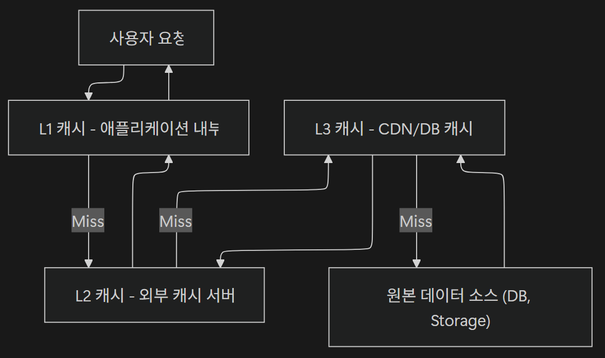
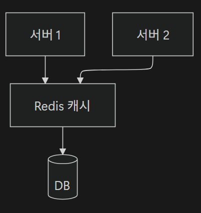

# <span style="background-color: #FFF9C4">1. 캐시의 기본 개념과 필요성</span>

## 1-01. 캐시의 정의와 목적

캐시(Cache)란 **자주 접근하는 데이터를 빠르게 가져오기 위해 임시로 저장해두는 저장소**

<br>

### 1) 캐시의 필요성 - 대용량 트래픽 환경에서의 역할

대용량 트래픽 환경이란 **짧은 시간에 수많은 사용자가 동시에 요청을 보내는 상황**을 말한다. 이 경우 모든 요청이 DB로 향하면 시스템은 과부하에 걸린다.

이 문제를 해결하기 위해 **중간 계층(Cache Layer)**을 두면

- **DB로 향하는 요청량을 크게 줄여 DB의 부하를 줄이고,**
- 응답 속도를 높이며,
- 트래픽이 폭주하더라도 시스템이 안정적으로 동작할 수 있게 한다.

<br>

### 2) 캐시의 목적

#### (1) 자주 접근하는 데이터의 빠른 검색

사용자가 자주 요청하는 데이터를 미리 저장해두어, 재요청 시 빠르게 제공

- **장점**
  - 데이터베이스를 거치지 않기 때문에 **네트워크 왕복 시간과 쿼리 실행 시간을 절약**
- **요청 Workflow**
  ```
  사용자 요청 ➡️ 캐시 확인 ➡️ 캐시에 데이터 존재 ➡️ 즉시 응답
  ```

#### (2) 원본 데이터 소스의 부하 감소

캐시가 없다면, 모든 요청이 DB로 전달되어 CPU, I/O 자원을 빠르게 소모

캐시를 사용하면, **동일한 데이터를 여러 번 요청하더라도 DB는 한 번만 조회**하여, **DB 연결 수 가 급격히 증가하는 것을 방지**

이로 인해, DB는 더 중요한 연산에 집중 가능

#### (3) 네트워크 지연 시간 최소화

캐시는 **사용자와 가까운 위치**(예: CDN, 브라우저, 서버 메모리)에 데이터를 저장하여 **지연(Latency)**을 최소화한다.

- DB 직접 조회 ➡️ 원격 서버에 데이터 위치
- 캐시 조회 ➡️ 근처 서버 메모리에 데이터 위치

<br>

## 1-02. 캐시의 핵심 원리

캐시가 왜 이렇게 빠른 속도를 낼 수 있는지, **내부 원리**를 알아보자.

<br>

### 1) 시간적 지역성

시간적 지역성(Temporal Locality)이란, **최근에 사용한 데이터는 가까운 미래에도 다시 사용될 가능성이 높다**는 원리

**최근에 접근한 데이터를 캐시에 보관하면 다시 요청할 때 즉시 응답 가능**

시간적 지역성은 대부분의 캐시 시스템이 **TTL(Time To Live, 유효 시간)** 개념을 사용하는 이유로, 최근 접근된 데이터는 일정 시간 동안 유지되어, 반복 요청에 빠르게 대응할 수 있다.

<br>

### 2) 공간적 지역성

공간적 지역성(Spatial Locality)란, **어떤 데이터가 사용되면 그 주변 인접 데이터도 곧 사용될 가능성이 높다**는 원리

**캐시가 하나의 데이터뿐만 아니라 인접한 데이터까지 함께 저장**하여 이후 요청 시 빠르게 제공할 수 있다.

<br>

### 3) 캐시 히트와 캐시 미스

#### 캐시 히트 (Cache Hit)

요청한 데이터가 캐시에 존재하여 즉시 응답이 가능한 경우

#### 캐시 미스 (Cache Miss)

요청한 데이터가 캐시에 없어 원본 데이터 소스(DB 등)를 다시 조회해야 하는 경우

<br>

### 4) 캐시 적중률

캐시 적중률(Cache Hit Ratio)은 전체 요청 중에서 캐시 히트가 발생한 비율

Cache Hit Ratio = (Cache Hit 횟수 / 전체 요청 횟수) x 100%

캐시 적중률이 높을수록 시스템은 더 빠르고 효율적으로 작동한다.

<br>

## 1-03. 대용량 트래픽에서 캐시의 역할

대용량 트래픽 환경에서 모든 요청이 DB로 직접 향한다면 아래의 문제가 발생한다.

- **DB 부하 증가**
  - 동일한 데이터를 여러 번 조회하면서 CPU, 메모리, 디스크 I/O가 과부하
- **응답 지연**
  - 요청이 몰리면서 쿼리 처리 속도가 느려짐
- **서비스 중단 위험**
  - DB 연결 수 초과, 장애, 서버 다운 등의 문제 발생

이러한 상황에서 **캐시**는 **데이터 요청을 분산 처리하고, 자주 사용되는 데이터를 메모리에서 즉시 제공**함으로써 시스템을 보호

<br>

### 1) DB 부하감소

캐시는 **데이터베이스로 향하는 요청 수를 줄일 수** 있다.

자주 요청되는 데이터를 캐시에 저장하면, DB는 동일한 쿼리를 여러 번 처리하지 않아도 된다.

즉, **DB 접근 빈도를 줄여 부하를 분산**시켜, 전체 시스템의 안정성을 높임

<br>

### 2) 응답 시간 개선

캐시를 사용하면 **데이터를 메모리에서 바로 가져오기 때문에 응답 속도가 획기적으로 빨라진다.**

- DB 쿼리 실행, 네트워크 왕복, 디스크 I/O 같은 단계를 모두 생략하기 때문

#### 캐시 미사용 시

요청이 들어오면 Controller ➡️ Service ➡️ Repository ➡️ DB 순으로 내려가며, DB에서 데이터를 읽고, 다시 같은 경로로 응답을 반환한다.

이 구조에서 **모든 요청마다 DB를 직접 조회**해야 하기 때문에, DB 부하가 커지고 **응답 지연(Latency)**이 발생

#### 캐시 사용 시

캐시를 도입하면 Service 계층에서 데이터를 미리 확인하고, 캐시에 데이터가 존재하면 Repository를 거치지 않는다.

- **요청 경로를 단축 시키고 전체 응답 속도를 수십 배 향상시킬 수 있다.**

<br>

### 3) 시스템 확장성 향상

확장성이란, **시스템이 사용자 수 증가에도 성능 저하 없이 대응할 수 있는 능력**

캐시를 도입하면 요청이 DB에 집중되지 않고 분산되어, 더 많은 사용자를 처리할 수 있다.

- 캐시는 **수평 확장(Scale-out)** 구조에서 필수적인 구성요소

<br>

### 4) 비용 효율성 향상

서버는 처리량이 늘어날수록 CPU, 메모리, 네트워크 비용이 증가한다.

하지만 캐시를 사용하면 **비용을 획기적으로 절감**할 수 있다.

- 캐시를 통해 **DB 서버 수를 줄일 수 있음**
- **네트워크 전송 비용 감소**
  - 데이터를 가까운 곳에서 꺼내오기 때문
- **클라우드 과금 절감 효과**
  - I/O, 트래픽, CPU 사용량 감소 때

<br>

## 1-04. 캐시 적용 고려사항

실제 캐시 적용 시 고려해야 할 사항에 대해 알아보자

<br>

### 1) 캐시 적합 데이터 식별

캐시할 데이터의 특성과 중요성 구분

모든 데이터를 캐시에 저장하면 비효율적이다.

캐시는 **자주 조회되지만 자주 변경되지 않는 데이터**에 가장 큰 효과

#### 선정 기준

- **조회 빈도 (Frequence)**
  - 자주 호출되는가?
- **변경 빈도 (Volatility)**
  - 자주 바뀌지 않는가?
- **최신성 중요도 (Freshness)**
  - 최신 데이터가 꼭 필요한가?

<br>

### 2) 데이터 크기와 수명 주기 (TTL)

캐시의 용량 관리 및 TTL(Time To Live) 설정

캐시는 메모리 기반 저장소로, 저장 공간이 제한적

너무 큰 데이터를 저장하면 다른 캐시가 삭제(Eviction)되어 성능이 오히려 떨어짐

#### TTL 설정

TTL은 **캐시 데이터의 유효 시간**을 의미

일정 시간이 지나면 자동으로 삭제되어, **데이터의 최신성을 유지**

<br>

### 3) 일관성과 최신성의 균형

원본 데이터 변경 시 캐시 동기화 방식 결정

캐시의 데이터와 실제 DB 데이터가 달라지는 문제를 **캐시 불일치 (Cache Inconsistency)**라고 하는데, 이 문제를 방치하면 사용자는 오래된 데이터를 보거나, 잘못된 정보가 전파될 수 있다.

따라서 캐시 시스템은 **DB 변경 시점과 캐시 갱신 시점의 일관성**을 유지하는 전략이 매우 중요

#### 해결 전략

- **Cache Invalidation**
  - DB 변경 시 캐시 삭제
  - **장점**
    - 단순하고 안전
  - **단점**
    - 다음 요청은 DB를 조회해야 하기에 캐시 삭제 후 첫 요청이 느림
- **Write-through**
  - DB 갱신과 동시에 캐시 갱신
  - **장점**
    - 일관성을 유지
  - **단점**
    - DB 쓰기와 캐시 쓰기를 동시에 수행해야 하므로 쓰기 성능 저하
- **Background Refresh**
  - 주기적으로 캐시 재생성
  - **장점**
    - 자동 동기화
  - **단점**
    - 정기적으로 캐시를 자동 업데이트하기 때문에 실시간성 부족

<br>

### 4) 캐시 전략 선택

데이터 읽기/쓰기 방식에 따른 정책 설계

#### Cache-aside (Lozy Loading)

요청 시 캐시가 없으면 DB 조회 후 캐시에 저장

- **장점**
  - 단순하고 널리 사용
  - 구현이 간단하고 유지 보수가 쉬움
- **단점**
  - 첫 요청이 느림

#### Write-through

DB에 쓰기 시 캐시도 즉시 갱신

- **장점**
  - 일관성 유지
- **단점**
  - 쓰기 요청이 많을 경우 쓰기 부하 증가

#### Write-behind (Write-back)

캐시에 먼저 쓰고, 나중에 DB에 반영

대량의 비동기 쓰기에 적합

- **장점**
  - 빠른 응답
- **단점**
  - 장애 시 데이터 유실 위험

#### Read-through

캐시가 DB를 직접 조회

- 장점
  - 구조 단순
- **단점**
  - 캐시 시스템 복잡

---

# <span style="background-color: #FFF9C4">2. 캐시 아키텍처와 종류</span>

## 2-01. 캐시 계층 구조

캐시는 시스템의 여러 위치에서 동작할 수 있는데, 배치되는 위치에 따라 **L1/L2/L3 캐시**로 구분된다.

각 계층은 접근 속도, 저장 용량, 유지 비용이 다르며 **가까운 곳일수록 빠르고, 비쌀수록 용량이 작다**는 특성이 있다.

아래 사진은 **캐시의 계층적 접근 흐름**을 보여준다.



요청이 들어오면 L1 ➡️ L2 ➡️ L3 순으로 탐색하며, 상위 캐시에서 찾지 못하면 하위 계층에서 데이터를 가져와 상위에 저장한다.

<br>

### 1) L1 캐시

**가장 가까운 계층**으로, 애플리케이션 내부 메모리에 존재

CPU의 L1 캐시처럼, 프로그램이 실행 중인 프로세스에서 즉시 접근할 수 있어 **지연(Latency)**이 거의 없다.

**속도가 매우 빨라** 단일 서버나 스레드 기반의 **빠른 캐시 조회**가 필요할 때 사용하며,

요청이 많고 동일한 데이터를 반복 조회하는 경우 유용

단, 서버가 여러 대일 경우 각 인스턴스의 캐시가 **서로 다른 데이터를 가질 수 있어 일관성이 깨질 수 있다.**

- **예시**: `HashMap`, `ConcurrentHashMap`, `Caffeine`, `Guava Cache` 등
- **속도**: 매우 빠름
- **용량**: 작음

<br>

### 2) L2 캐시 (외부 캐시 서버)

**서버 간 공유 가능한 캐시 계층**으로, 외부 캐시 서버가 이에 해당

모든 서버가 동일한 캐시 서버에 접근하기 때문에,

여러 애플리케이션 인스턴스가 같은 L2 캐시를 공유하므로,

- **일관성을 유지**하면서
- **분산 환경에서도 효율적인 캐싱**이 가능
- L1 캐시에서 캐시 미스 발생 시, L2 캐시에서 데이터를 가져옴



- **예시**: Redis Memcached 같은 외부 캐시 서버
- **속도**: 빠름
- **용량**: 중간

<br>

### 3) L3 캐시

**글로벌 트래픽 분산 및 네트워크 지연 최소화**를 위한 캐시 계층으로, CDN, DB 캐시, 프록시 서버 등에 위치한다.

- **예시**: Cloudflare, MySQL Query Cache
- **속도**: 상대적으로 느림
- **용량**: 큼

#### DB 캐시

반복되는 SQL 쿼리 결과를 캐싱

- **예시**
  - MySQL Query Cache
  - PostgreSQL Plan Cache

#### CDN 캐시

데이터를 사용자 근처 엣지 서버에 저장하여 **지연 시간(Latency)**을 획기적으로 단축

- 이미지, 동영상, 정적 HTML 등 변경이 적은 정적 자산에 이상적

<br>

## 2-02. 캐시 토폴로지

### 1) 로컬 캐시

로컬 캐시(In-Memory Cache)는 **애플리케이션 내부(RAM)**에 저장하는 캐시 구조로, 서버 자체에 존재하므로 외부 네트워크 요청 없이 **가장 빠르게 데이터에 접근 가능**

#### 장점

- 네트워크 호출이 없고 메모리 직접 접근으로 **응답 속도가 가장 빠름**
- **단순 구현** 가능 (`HashMap`, `Caffeine` 등)
- 외부 장애(네트워크, Redis 다운 등)에 영향을 받지 않음
- 별도 서버가 없어 운영 난이도가 낮음

#### 단점

- 서버 프로세스 내부에서만 사용 가능
- 서버 간 공유가 불가능하여 **데이터 불일치** 발생 가능
- 서버 재시작 시 캐시가 모두 초기화됨
- 확장성(Scalability)이 낮음

#### 주요 솔루션

- **Caffeine**
  - Spring Boot `@Cacheable` 기본 캐시 엔진으로 자주 사용
  - 최신 Java In-Memory 캐시 라이브러리
  - **장점**
    - 빠른 성능, 다양한 Eviction 정책 제공(LRU, LFU, Window TinyLFU)
  - **단점**
    - 분산 환경 미지원
- **Guava Cache**
  - 단순한 캐시 구조 구현
  - Google의 범용 유틸리티 라이브러리 내 포함
  - **장점**
    - TTL, 크기 제한, 동시 접근 제어
  - **단점**
    - 최근 업데이트 적음, 기능 제한
- **EhCache**
  - 캐시 용량이 큰 엔터프라이즈 시스템
  - JVM 기반 캐시 라이브러리로, Spring 통합 쉬움
  - **장점**
    - 디스크 스왑 지원, 영속성 가능
  - **단점**
    - 구성 복잡도 높음

<br>

### 2) 분산 캐시

분산 캐시(Distributed Cache)는 **여러 서버 인스턴스가 동일한 캐시 서버를 공유**하는 구조

일반적으로 Redis, Memcached 같은 In-Memory 서버 사용

- 여러 서버가 **하나의 중앙 캐시 저장소**를 공유


#### 장점

- 여러 서버 간 데이터 공유 가능
- 모든 서버가 동일한 캐시를 사용하여 데이터 일관성 유지에 용이
- 캐시 서버 장애 시에도 **Persistence(데이터 영속화)** 설정 가능
- **수평 확장(Scale-Out)**에 유리

#### 단점

- 네트워크 지연이 존재
- Redis/Memcached 장애 시 모든 요청이 DB로 몰릴 수 있음
- 운용/모니터링 복잡도 증가

#### 주요 솔루션

- **Redis**
  - Key-Value 기반 In-Memory DB
  - 세션 관리, 실시간 데이터, 랭킹 시스템 등에 주로 사용
  - **장점**
    - TTL, 영속성 지원, Pub/Sub, SortedSet 등 강력한 기능
  - **단점**
    - 메모리 의존성, 운영 복잡
- **Memcached**
  - 단순 Key-Value 캐시 서버
  - 구조가 단순해 **읽기 중심 트래픽 처리**에 유리
  - 단순 데이터 캐싱, 트래픽 완화 등에 주로 사용
  - **장점**
    - 빠름, 경량
  - **단점**
    - TTL만 지원, 데이터 영속화 불가

<br>

### 3) 다중 레벨 캐시

다중 레벨 캐시(Multi-Level Caching)는 **L1(로컬) + L2(분산)** 구조를 결합한 형태로, 서버 내부의 빠른 접근성과 서버 간 일관성을 모두 확보하는 방식

```
L1 캐시에서 데이터 검색    ➡️   L2 캐시로 이동
                       없으면

L2에서도 없으면 ➡️ DB에서 조회 후 ➡️ L1, L2 모두에 저장
```

#### 장점

- L1 접근 속도 + L2 일관성 확보

#### 단점

- 캐시 동기화(Invalidation) 설계 복잡

#### 사용하기 적합한 환경

- 대규모 트래픽 + 서버 다중 인스턴스 운영 환경

---
