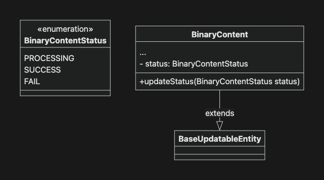
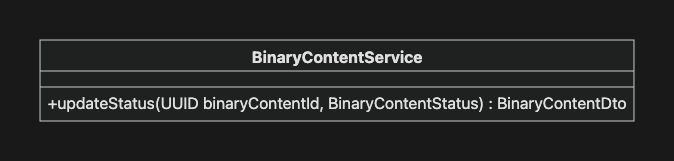
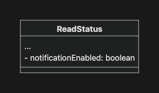
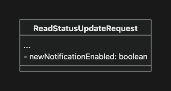
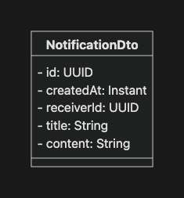
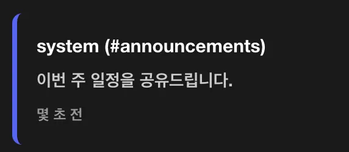
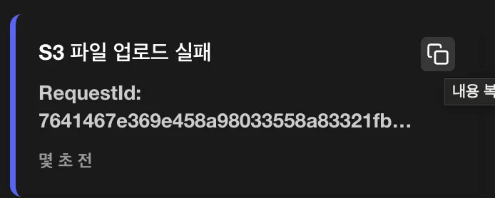

# 프로젝트 요구 사항

## 3. 기본 요구사항

### 3-01. Spring Event - 파일 업로드 로직 분리하기

- 디스코드잇은 BinaryContent의 메타 데이터(DB)와 바이너리 데이터(FileSystem/S3)를 분리해 저장합니다.
- 만약 지금처럼 두 로직이 하나의 트랜잭션으로 묶인 경우 트랜잭션을 과도하게 오래 점유할 수 있는 문제가 있습니다.
  - 바이너리 데이터 저장 연산은 오래 걸릴 수 있는 연산이며, 해당 연산이 끝날 때까지 트랜잭션이 대기해야합니다.
- 따라서 Spring Event를 활용해 메타 데이터 저장 트랜잭션으로부터 바이너리 데이터 저장 로직을 분리하여, 메타데이터 저장 트랜잭션이 종료되면 바이너리 데이터를 저장하도록 변경합니다.
- [x] `BinaryContentStorage.put`을 직접 호출하는 대신 `BinaryContentCreatedEvent`를 발행하세요.
  - `BinaryContentCreatedEvent`를 정의하세요.
    - `BinaryContent` 메타 정보가 DB에 잘 저장되었다는 사실을 의미하는 이벤트입니다.
  - 다음의 메소드에서 `BinaryContentStorage`를 호출하는 대신 `BinaryContentCreatedEvent`를 발행하세요.
    - `UserService.create`/`update`
    - `MessageService.create`
    - `BinaryContentService.create`
  - `ApplicationEventPublisher`를 활용하세요.
- [x] 이벤트를 받아 실제 바이너리 데이터를 저장하는 리스너를 구현하세요.
  - 이벤트를 발행한 **메인 서비스의 트랜잭션이 커밋**되었을 때 리스너가 실행되도록 설정하세요.
  - `BinaryContentStorage`를 통해 바이너리 데이터를 저장하세요.
- [x] 바이너리 데이터 저장 성공 여부를 알 수 있도록 메타 데이터를 리팩토링하세요.

    
    
  - `BinaryContent`에 바이너리 데이터 업로드 상태 속성(`status`)을 추가하세요.
    - `PROCESSING`: 업로드 중
      - 기본값입니다.
    - `SUCCESS`: 업로드 완료
    - `FAIL`: 업로드 실패

    

      ```sql
      -- schema.sql
      CREATE TABLE binary_contents
      (
          id           uuid PRIMARY KEY,
          created_at   timestamp with time zone NOT NULL,
          updated_at timestamp with time zone,
          file_name    varchar(255)             NOT NULL,
          size         bigint                   NOT NULL,
          content_type varchar(100)             NOT NULL,
          status       varchar(20)              NOT NULL
      );

      -- ALTER TABLE binary_contents
      --      ADD COLUMN updated_at timestamp with time zone;
      -- ALTER TABLE binary_contents
      --      ADD COLUMN status varchar(20) NOT NULL;
      ```

  - `BinaryContent`의 상태를 업데이트하는 메소드를 정의하세요.
    - 트랜잭션 전파 범위에 유의하세요.

    

- [x] 바이너리 데이터 저장 성공 여부를 메타 데이터에 반영하세요.
  - 성공 시 `BinaryContent`의 `status`를 `SUCCESS`로 업데이트하세요.
  - 실패 시 `BinaryContent`의 `status`를 `FAIL`로 업데이트하세요.

### 3-02. Spring Event - 알림 기능 추가하기

- `1)채널에 새로운 메시지가 등록`되거나 `2)권한이 변경된 경우` 이벤트를 발행해 알림을 받을 수 있도록 구현합니다.
- [x] 채널에 새로운 메시지가 등록된 경우 알림을 받을 수 있도록 리팩토링하세요.
  - `MessageCreatedEvent`를 정의하고 새로운 메시지가 등록되면 이벤트를 발행하세요.
  - 사용자 별로 관심있는 채널의 알림만 받을 수 있도록 **ReadStatus** 엔티티에 채널 알림 여부 속성(`notificationEnabled`)을 추가하세요.
    - **PRIVATE** 채널은 알림 여부를 `true`로 초기화합니다.
    - **PUBLIC** 채널은 알림 여부를 `false`로 초기화합니다.

    

    ```sql
    -- schema.sql
    CREATE TABLE read_statuses
    (
        id           uuid PRIMARY KEY,
        created_at   timestamp with time zone NOT NULL,
        updated_at   timestamp with time zone,
        user_id      uuid                     NOT NULL,
        channel_id   uuid                     NOT NULL,
        last_read_at timestamp with time zone NOT NULL,
        notification_enabled boolean NOT NULL,
        UNIQUE (user_id, channel_id)
    );

    -- ALTER TABLE read_statuses
    --      ADD COLUMN notification_enabled boolean NOT NULL;
    ```

  - 알림 여부를 수정할 수 있게 `ReadStatusUpdateRequest`를 수정하세요.
    - 알림이 활성화 되어 있는 경우

      

    - 알림이 활성화 되어 있지 않은 경우

      

    

- [x] 사용자의 권한(Role)이 변경된 경우 알림을 받을 수 있도록 리팩토링하세요.
  - `RoleUpdatedEvent`를 정의하고 권한이 변경되면 이벤트를 발행하세요.
- [x] 알림 API를 구현하세요.
  - `NotificationDto`를 정의하세요.
    - `receiverId`: 알림을 수신할 User의 `id`입니다.

      

  - 알림 조회
    - 엔드포인트: `GET /api/notifications`
    - 요청
      - 헤더: 엑세스 토큰
    - 응답
      - `200 List<NotifcationDto>`
      - `401 ErrorResponse`
  - 알림 확인
    - 엔드포인트: `DELETE /api/notifications/{notificationId}`
    - 요청
      - 헤더: 엑세스 토큰
    - 응답
      - `204 Void`
      - 인증되지 않은 요청: `401 ErrorResponse`
      - 인가되지 않은 요청: `403 ErrorResponse`
        - 요청자 본인의 알림에 대해서만 수행할 수 있습니다.
      - 알림이 없는 경우: `404 ErrorResponse`

- [x] 알림이 필요한 이벤트가 발행되었을 때 알림을 생성하세요.
  - 이벤트를 처리할 리스너를 구현하세요.

    ```java
    public class NotificationRequiredEventListener {

      @TransactionalEventListener
      public void on(MessageCreatedEvent event) {...}

      @TransactionalEventListener
      public void on(RoleUpdatedEvent event) {...}
    }
    ```

    - `on(MessageCreatedEvent)`
      - 해당 채널의 알림 여부를 활성화한 `ReadStatus`를 조회합니다.
      - 해당 `ReadStatus`의 사용자들에게 알림을 생성합니다.

        ```
        # 알림 예시
        title: "보낸 사람 (#채널명)"
        content: "메시지 내용"
        ```

        

      - 단, 해당 메시지를 보낸 사람은 알림 대상에서 제외합니다.

    - `on(RoleUpdatedEvent)`
      - 권한이 변경된 당사자에게 알림을 생성합니다.

        ```
        # 알림 예시
        title: "권한이 변경되었습니다."
        content: "USER -> CHANNEL_MANAGER"
        ```

        

### 3-03. 비동기 적용하기

- [x] 비동기를 적용하기 위한 설정(`AsyncConfig`) 클래스를 구현하세요.
  - `@EnableAsync` 어노테이션을 활용하세요.
  - `TaskExecutor`를 Bean으로 등록하세요.
  - `TaskDecorator`를 활용해 MDC의 Request ID, SecurityContext의 인정 정보가 비동기 스레드에서도 유지되도록 구현하세요.
- [x] 앞서 구현한 Event Listener를 비동기적으로 처리하세요.
  - `@Async` 어노테이션을 활용하세요.
- [x] 동기 처리와 비동기 처리 간 성능 차이를 비교해보세요.
  - 파일 업로드 로직에 의도적인 지연(`Thread.sleep(…)`)을 발생시키세요.

    ```java

    // LocalBinaryContentStorage
    public UUID put(UUID binaryContentId, byte[] bytes) {
        try {
          Thread.sleep(3000);
        } catch (InterruptedException e) {
          Thread.currentThread().interrupt();
          throw new RuntimeException("Thread interrupted while simulating delay", e);
        }
        ...
    }
    ```

  - 메시지 생성 API의 실행 시간을 측정해보세요.
    - `@Timed` 어노테이션을 메소드에 추가합니다.

      ```java

      // MessageController
        @Timed("message.create.async")
        @PostMapping(consumes = MediaType.MULTIPART_FORM_DATA_VALUE)
        public ResponseEntity<MessageDto> create(...) {...}
      ```

    - Actuator 설정을 추가합니다.

      ```yaml

      # application.yaml
      management:
          ...
        observations:
          annotations:
            enabled: true
      ```

    - `/actuator/metrics/message.create.async` 에서 측정된 시간을 확인할 수 있습니다.

  - `@EnableAsync`를 활성화 / 비활성화 해보면서 동기 / 비동기 처리 간 응답 속도의 차이를 확인해보세요.

### 3-04. 비동기 실패 처리하기

- 비동기로 처리하는 로직이 실패하는 경우 사용자에게 즉각적인 에러 전파가 되지 않을 가능성이 높습니다.
- 따라서 비동기로 처리하는 로직은 자동 재시도 전략을 통해 더 견고하게 구현해야 합니다.
- 또, 실패하더라도 그 사실을 명확하게 기록해두어야 에러에 대응할 수 있습니다.
- [x] S3를 활용해 바이너리 데이터 저장 시 자동 재시도 매커니즘을 구축하세요.
  - Spring Retry를 위한 환경을 구성하세요.
    - `org.springframework.retry:spring-retry` 의존성을 추가하세요.
    - `@EnableRetry` 어노테이션을 활용해 Spring Retry를 활성화 하세요.
  - 바이너리 데이터를 저장하는 메소드에 `@Retryable` 어노테이션을 사용해 재시도 정책(횟수, 대기 시간 등)을 설정하세요.
- [x] 재시도가 모두 실패했을 때 대응 전략을 구축하세요.
  - `@Recover` 어노테이션을 활용하세요.
  - 실패 정보를 관리자에게 통지하세요.

    

    ```

    # 알림 내용 예시
    RequestId: 7641467e369e458a98033558a83321fb
    BinaryContentId: b0549c2a-014c-4761-8b21-4b77d3bd011c
    Error: The AWS Access Key Id you provided does not exist in our records. (Service: S3, Status Code: 403, Request ID: B7KCVSRCGPYJZREX, Extended Request ID: AWRVuJJJ3upwwOkCnd+yhHkgSajUxdg7L4195lbMVTIka6WnBpjZLLRTReoHbgIMf9zzH/QQM0Y5ZOVJCHF2F+l2mSyPG/+8Ee2XBS8hcqk=) (SDK Attempt Count: 1)
    ```

    - 실패 정보에는 추후 디버깅을 위해 필요한 정보를 포함하세요.
      - 실패한 작업 이름
      - MDC의 Request ID
      - 실패 이유 (예외 메시지)

`//...`

---

# GitHub Repository 주소

[https://github.com/JungH200000/10-sprint-mission/tree/sprint11](https://github.com/JungH200000/10-sprint-mission/tree/sprint11)

---
