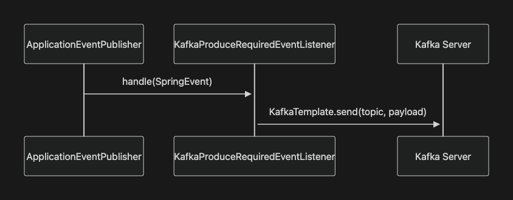

# 오늘의 성취

## 1. 개발 진행 상황

- Spring Kafka 도입하기
  - Spring Event를 Kafka topic을 발행하는 `KafkaProduceRequiredEventListener` 구현
  - Kafka Console을 통해 Kafka 이벤트가 잘 발행되는지 확인
    - `broker` 컨테이너 shell 접속
      - `docker exec -it -w /opt/kafka/bin broker sh`
    - topic 리스트 확인 (실행위치: `/opt/kafka/bin`)
      - `./kafka-topics.sh --list --bootstrap-server broker:29092`
    - 특정 topic 이벤트 구독 및 대시 (실행위치: `/opt/kafka/bin`)
      - `./kafka-console-consumer.sh --topic discodeit.MessageCreatedEvent --from-beginning --bootstrap-server broker:29092`
  - Kafka topic을 구독해 알림을 생성하는 `NotificationRequiredTopicListener` 구현

---

# 프로젝트 요구 사항

`//...`

## 4. 심화 요구사항

### 4-00. 유의사항

- 이번 실습은 분산 환경을 대비한 기술 도입을 목표로 합니다. 특히, 여러 서버나 인스턴스로 구성되는 시스템에서 발생할 수 있는 문제를 해결하는 데 필요한 기술을 학습합니다.
  - Kafka를 통한 이벤트 발행/구독
  - Redis를 활용한 전역 캐시 저장소 구성
- 이번 미션에서는 Kafka, Redis의 세부 설정이나 고급 기능보다는, 기술을 간단하게 적용하고, **분산 환경의 필요성과 기존 시스템의 한계**를 이해하는 데 집중해주세요.

### 4-01. Spring Kafka 도입하기

- 회원이 늘어나면서 알림 연산량이 급증해 알림 기능만 별도의 마이크로 서비스로 분리하기로 결정했다고 가정해봅시다.
- 이제 알림 서비스와 메인 서비스는 완전히 분리된 서버이므로 Spring Event만을 통해서 이벤트를 발행/소비할 수 없습니다.
- 따라서 메인 서비스에서 Kafka를 통해 서버 외부로 이벤트를 발행하고, 알림 서비스에서는 서버 외부의 이벤트를 소비할 수 있도록 해야합니다.

`//...`

- [x] Spring Event를 Kafka로 발행하는 리스너를 구현하세요.
  - `NotificationRequiredEventListener`는 비활성화하세요.
  - `KafkaProduceRequiredEventListener`를 구현하세요.

    ```java

    package com.sprint.mission.discodeit.event.kafka;

    @Slf4j
    @RequiredArgsConstructor
    @Component
    public class KafkaProduceRequiredEventListener {

        private final KafkaTemplate<String, String> kafkaTemplate;
        private final ObjectMapper objectMapper;

      @Async("eventTaskExecutor")
      @TransactionalEventListener
      public void on(MessageCreatedEvent event) {
        ...
        String payload = objectMapper.writeValueAsString(event);
        kafkaTemplate.send("discodeit.MessageCreatedEvent", payload);
        ...
      }

      @Async("eventTaskExecutor")
      @TransactionalEventListener
      public void on(RoleUpdatedEvent event) {...}

      @Async("eventTaskExecutor")
      @EventListener
      public void on(S3UploadFailedEvent event) {...}
    }
    ```

    - Spring Event를 Kafka 메시지로 변환해 전송하는 중계 구조입니다.

      

- [x] Kafka Console을 통해 Kafka 이벤트가 잘 발행되는지 확인해보세요.
  1. `broker` 컨테이너 쉘 접속

     ```bash

     docker exec -it -w /opt/kafka/bin broker sh
     ```

  2. 토픽 리스트 확인 (실행위치: `/opt/kafka/bin`)

     ```java

     ./kafka-topics.sh --list --bootstrap-server broker:29092

     __consumer_offsets
     discodeit.MessageCreatedEvent
     ...
     ```

  3. 특정 토픽 이벤트 구독 및 대기 (실행위치: `/opt/kafka/bin`)

     ```java

     ./kafka-console-consumer.sh --topic discodeit.MessageCreatedEvent --from-beginning --bootstrap-server broker:29092

     ...
     ```

- [x] Kafka 토픽을 구독해 알림을 생성하는 리스너를 구현하세요.
  - 이 리스너는 메인 서비스와 별도의 서버로 구성된 알림 서비스라고 가정합니다.
  - `NotificationRequiredTopicListener`를 구현하세요.

    ```java

    package com.sprint.mission.discodeit.event.kafka;

    @Slf4j
    @RequiredArgsConstructor
    @Component
    public class NotificationRequiredTopicListener {
      ...
      private final ObjectMapper objectMapper;

      @KafkaListener(topics = "discodeit.MessageCreatedEvent")
      public void onMessageCreatedEvent(String kafkaEvent) {
        try {
          MessageCreatedEvent event = objectMapper.readValue(kafkaEvent,
              MessageCreatedEvent.class);
                ...
        } catch (JsonProcessingException e) {
          throw new RuntimeException(e);
        }
      }

      @KafkaListener(topics = "discodeit.RoleUpdatedEvent")
      public void onRoleUpdatedEvent(String kafkaEvent) {...}

      @KafkaListener(topics = "discodeit.S3UploadFailedEvent")
      public void onS3UploadFailedEvent(String kafkaEvent) {...}
    }
    ```

  - 기존 `@EventListener` 기반 로직을 제거하고 `@KafkaListener`로 대체하세요.

---

# GitHub Repository 주소

[https://github.com/JungH200000/10-sprint-mission/tree/sprint11](https://github.com/JungH200000/10-sprint-mission/tree/sprint11)
