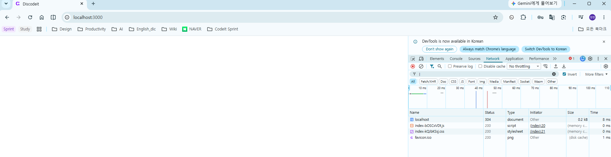
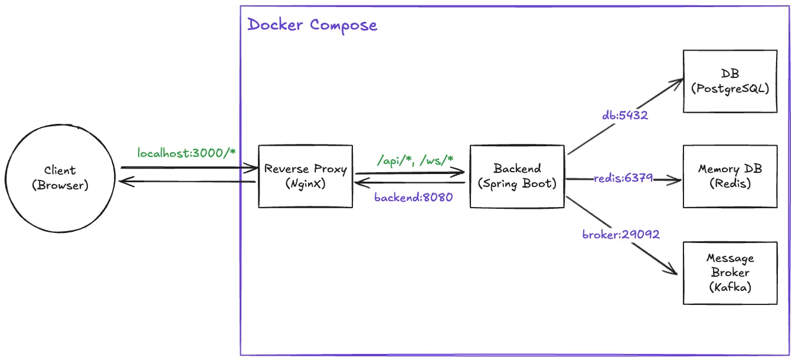

# 오늘의 성취

## 1. 개발 진행 상황

- 배포 아키텍처 구성하기
  - Nginx 기반 리버스 프록시 컨테이너 구성
  - 애플리케이션 서버, DB, Redis, Kafka가 외부 네트워크와 단절되도록 설정

## 2. 문제



브라우저에서 `http://localhost:3000` 접속 시 `index.html`은 내려오지만 화면이 흰색으로 표시됨

Chrome 개발자 도구의 Console에서는 아래와 같은 오류가 발생

```shell
Failed to load module script:
Expected a JavaScript-or-Wasm module script but the server responded with a MIME type of "text/plain".
Strict MIME type checking is enforced for module scripts per HTML spec.
```

이 오류는 브라우저가 JavaScript 파일을 받기 했지만, 그 파일을 JavaScript로 인정하지 않았다는 뜻이다.

현재 `index.html`은 JavaScript 파일을 아래처럼 불러온다.

```html
<script type="module" crossorigin src="/assets/index-bOSCxVDt.js"></script>
```

여기서 `type="module"`로 불러오는 JavaScript 파일은 MIME 타입 검사가 엄격하게 적용된다. 따라서 서버는 JavaScript 파일을 내려줄 때 아래와 같은 응답 헤더를 보내야 한다.

```http
Content-Type: application/javascript
```

하지만 문제가 발생했을 때 Nginx는 아래처럼 JavaScript 파일을 내려왔다.

```http
Content-Type: text/plain
```

브라우저 입장에서는 "이 파일은 JavaScript가 아니라 일반 텍스트 파일인데, module script로 실행하려고 한다"고 판단한다. 그래서 보안 정책에 따라 JavaScript 실행을 차단한다. 이로 인해 `index.html`은 정상적으로 로드되어 탭 제목이 `Discodeit`으로 보였지만, 앱을 렌더링하는 JavaScript가 실행되지 않아 화면이 비어있던 것이다.

이 문제가 발생한 직접적인 **원인**은 `nginx.conf`를 직접 작성해 `/etc/nginx/nginx.conf`에 마운트하면서, Nginx 기본 설정에 MIME 타입 매핑 설정이 빠졌기 때문이다.

Nginx는 정적 파일을 내려줄 떄 확장자에 따라 적절한 `Content-Type`을 붙여야 한다. 예를 들어 `.html`은 `text/html`, `.css`는 `text/css`, `.js`는 `application/javascript`로 내려줘야 한다. 그런데 MIME 타입 매핑이 빠져 있으면 Nginx가 `.js` 파일을 JavaScript로 인식하지 못하고 기본 타입으로 내려줄 수 있다.

그래서 `nginx.conf`의 `http {...}` 블록 안에 아래 설정을 추가해야 한다.

```nginx
http {
    include /etc/nginx/mime.types;
    default_type application/octet-stream;
# ...
}
```

- `include /etc/nginx/mime.types;`
  - Nginx에 확장자별 MIME 타입 목록을 불러오게 한다.
  - `.js` 파일은 `application/javascript`, `.css` 파일은 `text/css`, `./html`은 `text/html`로 응답한다.
- `default_type application/octet-stream;`
  - MIME 타입 목록에 없는 파일을 만났을 때 사용할 기본 타입을 지정
  - `application/octet-stream`
    - 정확한 형식은 알 수 없는 일반 바이너리 파일이라는 의미
  - 알 수 없는 파일을 임의로 텍스트나 HTML처럼 해석하지 않게 만드는 안전한 기본값

---

# 프로젝트 요구 사항

## 3. 기본 요구사항

`//...`

### 3-03. 배포 아키텍처 구성하기



- [x] 다음의 다이어그램에 부합하는 배포 아키텍처를 Docker Compose를 통해 구현하세요.
  - `Reverse Proxy`
    - Nginx 기반의 리버스 프록시 컨테이너를 구성하세요.
    - 역할 및 설정은 다음과 같습니다:
      - `/api/*`, `/ws/*` 요청은 **Backend 컨테이너**로 프록시 처리합니다.
      - 이 외의 모든 요청은 **정적 리소스(프론트엔드 빌드 결과)**를 서빙합니다.
        - 프론트엔드 정적 리소스는 Nginx 컨테이너 내부의 적절한 경로(`/usr/share/nginx/html` 등)에 복사하세요.
    - 외부에서 접근 가능한 유일한 컨테이너이며, `3000`번 포트를 통해 접근할 수 있어야 합니다.
  - `Backend`
    - Spring Boot 기반의 백엔드 서버를 Docker 컨테이너로 구성하세요.
    - `Reverse Proxy`를 통해 `/api/*`, `/ws/*` 요청이 이 서버로 전달됩니다.
  - `DB`, `Memory DB`, `Message Broker`
    - `Backend` 컨테이너가 접근 가능한 다음의 인프라 컨테이너들을 구성하세요
      - **DB**: PostgreSQL
      - **Memory DB**: Redis
      - **Message Broker**: Kafka
    - 각 컨테이너는 Docker Compose 네트워크를 통해 백엔드에서 통신할 수 있어야 합니다.
    - 외부 네트워크와 단절되어야 합니다.

`//...`

---

# GitHub Repository 주소

[https://github.com/JungH200000/10-sprint-mission/tree/sprint12](https://github.com/JungH200000/10-sprint-mission/tree/sprint12)

---
