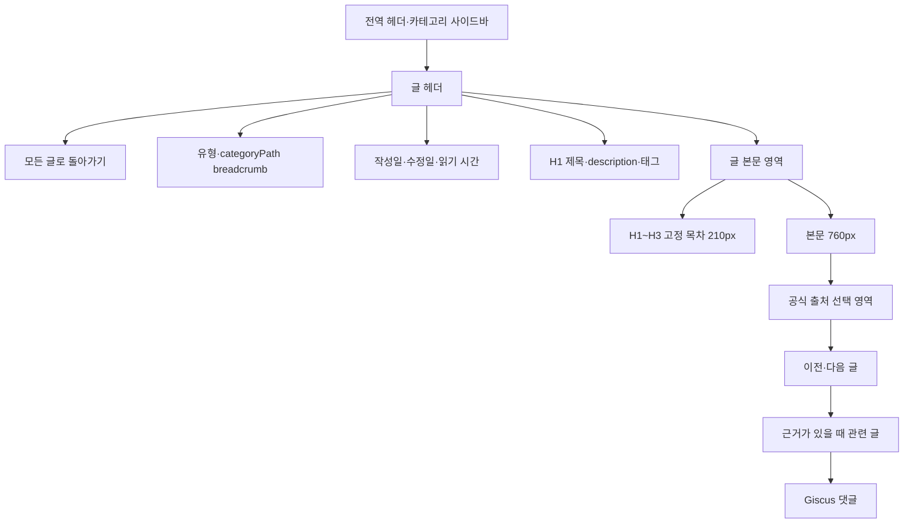

# 글 상세 페이지 편집형 리디자인 계획

- 작성일: 2026-08-07
- 대상: 현재 Jekyll 블로그 저장소
- 참고 구현: `website_blog`
- 상태: **1~4단계 최종 완료** — 공개 전환 글 158개 자동 검사와 전체 이미지 164개 참조 검증 통과
- 선행 문서: [블로그 사이트 디자인 비교](../overview/blog-design-comparison.md), [블로그 글 스타일·형식 비교](../overview/blog-content-style-comparison.md)
- 구현 결과: [1단계](stages/stage1/implementation.md), [2단계](stages/stage2/implementation.md), [3단계](stages/stage3/implementation.md), [4단계](stages/stage4/implementation.md)

## 1. 결론

현재 Jekyll·Minimal Mistakes를 유지하면서 `website_blog`의 글 상세 스타일과 구조를 적용할 수 있다. 프레임워크를 Astro로 교체할 필요는 없다. 이번 우선 작업에서는 홈·아카이브·상단 메뉴·카테고리 페이지를 변경하지 않는다.

다만 Astro 컴포넌트를 그대로 복사할 수는 없다. 다음과 같이 번역해야 한다.

- Astro 레이아웃과 컴포넌트 → Jekyll Liquid layout·include
- CSS custom properties → Sass 변수 또는 `:root` custom properties
- Content Collection 필드 → 현재 Jekyll front matter와 fallback 규칙
- Shiki·Mermaid·코드 복사 → Rouge를 유지하고 필요한 JavaScript를 별도 추가

가장 안전한 방식은 기존 `_layouts/single.html`을 즉시 전면 교체하지 않고 `single-editorial.html`을 새로 만들어 대표 글 3개에 먼저 적용하는 것이다. 2단계에서는 실제 표 검증을 위해 네 번째 대표 글을 추가했다.

### 1.1 현재 작업 범위

이번에 먼저 적용할 범위는 다음과 같다.

- 별도 `single-editorial` 레이아웃
- 글 상단의 카테고리·날짜·제목·설명·태그
- 최대 720~760px 본문 폭과 타이포그래피
- H1~H3 전체 목차와 내부 스크롤을 지원하는 모바일 목차 카드
- 기존 이전·다음 글, 관련 글, Utterances 댓글 재연결
- 코드·표·이미지의 모바일 가로 넘침 방지
- 1단계 대표 글 3종과 2단계 표 대표 글 1개를 이용한 단계적 검증

### 1.2 이번 작업에서 제외할 범위

- 홈 카드와 통계 영역
- `/archive/` 페이지와 Archive 메뉴
- 카테고리 페이지 재설계
- 전체 사이트의 파란색 테마 전환
- Pagefind 도입
- 전체 글 166개의 일괄 헤딩 변환
- Mermaid·다크 모드·코드 복사 버튼

제외 항목은 글 상세의 기본 읽기 경험이 안정된 후 필요성을 다시 판단한다.

## 2. 프레임워크와 테마 비교

### 2.1 실행 구조

| 항목 | 현재 프로젝트 | `website_blog` | 이식 판단 |
| --- | --- | --- | --- |
| 정적 사이트 생성기 | Jekyll + Liquid | Astro + TypeScript/Astro 컴포넌트 | 둘 다 정적 HTML을 만들므로 화면 구조 이식 가능 |
| 테마 | Minimal Mistakes 4.22.0 원격 테마 + 로컬 override | 전용 컴포넌트와 `global.css` | 로컬 layout·Sass가 이미 있어 override 가능 |
| Markdown | Kramdown GFM | Astro Markdown Remark GFM | 일반 Markdown은 호환 가능 |
| 코드 강조 | Rouge | Shiki의 light/dark 테마 | 외형은 조정 가능, 엔진 자체는 다름 |
| 목차 | Liquid가 렌더된 H1~H3를 분석 | Astro가 H2/H3 heading 데이터를 전달 | 현재 include의 `h_min`, `h_max` 변경 가능 |
| 검색 | Lunr | Pagefind | 글 상세 레이아웃과는 독립적이므로 유지 가능 |
| 콘텐츠 검증 | 별도 스키마 없음 | Zod Content Collection | 화면 이식과 별개이며 Jekyll에는 자동으로 생기지 않음 |
| 다이어그램 | 기본 지원 없음 | Mermaid 동적 로딩 | 별도 스크립트와 스타일이 필요 |
| 다크 모드 | 없음 | CSS 토큰 + 저장된 테마 | 가능하지만 글 상세만 바꾸는 범위보다 큼 |
| 배포 | GitHub Pages/Jekyll 플러그인 | Astro static output/GitHub Pages | 현재 배포 구조를 유지할 수 있음 |

`website_blog/package.json`은 Astro 관련 패키지를 `latest`로 지정한다. 따라서 문서에서는 특정 Astro 메이저 버전을 전제로 하지 않고 현재 소스 구조만 비교한다.

### 2.2 디자인 레퍼런스와의 관계

`DESIGN-Hashnode.md`와 `DESIGN-notion.md`는 실행 가능한 테마나 프레임워크가 아니라 디자인 명세다.

| 기준 | Hashnode 레퍼런스 | Notion 레퍼런스 | `website_blog` | 현재 프로젝트 |
| --- | --- | --- | --- | --- |
| 구조색 | `#1d52de` 파랑 | `#0075de` 파랑 | `#1d52de` | `#FF6C02` 주황 |
| 배경 | `#f9fafb` | `#f6f5f4` | `#f7f7f5` | `#ffffff` |
| 본문 잉크 | `#16191c` | 검정 계열 | `#16191c` | `rgb(7,7,7)` |
| 구분 | 1px hairline, 그림자 최소화 | 여백, hairline, 미세한 그림자 | hairline 중심 | Minimal Mistakes 기본 구분과 일부 그림자 |
| 서체 | Suisse Intl, Inter 대체 가능 | NotionInter, Inter 대체 가능 | Inter·Pretendard | Montserrat·Pretendard 등 혼합 |
| 글 본문 | 편집형·카드형 시스템의 일부 | 문서형 가독성 | 760px, 17px/1.88 | 가변 폭, 0.9em 본문 |

색과 폰트는 독립적인 CSS 값이므로 Jekyll에서도 수정 가능하다. 프레임워크 차이 때문에 불가능한 부분은 없지만, 다크 모드와 콘텐츠 검증은 별도 기능 작업이다.

## 3. `website_blog` 글 상세 구조

현재 `PostLayout.astro`는 다음 순서로 화면을 만든다.



### 3.1 핵심 스타일 값

| 영역 | `website_blog` 값 | 역할 |
| --- | --- | --- |
| 글 헤더 | 표면색 배경, 하단 1px 테두리 | 목록과 본문의 전환을 분명하게 함 |
| 제목 | 36~48px, line-height 1.1, 음수 자간 | 긴 제목도 첫 위계로 보이게 함 |
| 설명 | 최대 750px, 17px/1.65 | 글을 열기 전에 범위를 설명 |
| 글 본문 | 최대 760px, 17px/1.88 | 긴 한국어 기술 글의 가독성 확보 |
| 목차 | 210px, 본문과 72px 간격, sticky | 본문 폭을 침범하지 않고 이동 지원 |
| H2 | 31px, 위 여백 2.6em, 하단 hairline | 긴 글의 큰 구간을 명확히 분리 |
| H3 | 23px, 위 여백 2.2em | 하위 논점을 구분 |
| 코드 | 14px/1.65, 24px padding, 가로 스크롤 | 긴 코드의 밀도와 복사 편의 확보 |
| blockquote | 파란 왼쪽 4px + 약한 배경 | 팁·주의·인용의 의미 구분 |
| 이미지 | 중앙 정렬, hairline, 12px 모서리 | 스크린샷 경계와 본문 분리 |
| 모바일 | 16px/1.85, 목차를 본문 앞 카드로 전환 | 작은 화면에서도 목차를 숨기지 않음 |

## 4. 현재 글 상세와의 차이

### 현재 구조

```text
상단 masthead
└─ #main (최대 1280px)
   ├─ 좌측 작성자·카테고리 sidebar (240~280px)
   └─ article.page
      ├─ 제목 + 작성일
      ├─ 중앙 본문
      ├─ 우측 sticky TOC (240~280px)
      ├─ 카테고리·수정일
      ├─ 이전·다음
      ├─ 관련 글
      └─ 댓글
```

현재 `.page__content`의 기본 크기는 `0.9em`이고, 좌측 사이드바와 우측 목차가 동시에 폭을 차지한다. 기능은 충분하지만 본문이 제목·목차·보조 정보보다 상대적으로 약해 보일 수 있다.

### 목표 구조

현재 프로젝트에는 `website_blog`의 색과 컴포넌트를 그대로 복사하기보다 다음 구조가 적절하다.

```text
상단 masthead
├─ 글 헤더 grid
│  ├─ 좌측 200~210px: 뒤로가기
│  └─ 본문보다 왼쪽으로 보정한 열: 카테고리 / 날짜 / 제목 / 설명 / 태그
├─ 글 본문 grid
│  ├─ 좌측 TOC 200~210px: Markdown 본문까지만 sticky
│  └─ 본문 720~760px: Markdown 내용
└─ 본문 이후 grid
   └─ 본문 열 720~760px: 이전·다음 / 같은 카테고리의 최신 글 / 댓글
```

`website_blog`는 데스크톱에서 전역 카테고리 사이드바도 유지한다. 하지만 현재 Jekyll은 이미 좌측 280px와 우측 280px을 사용하므로 이를 그대로 유지한 채 목차까지 왼쪽으로 옮기면 다시 본문이 좁아질 수 있다.

**권장안은 새 글 상세 레이아웃에서 작성자·카테고리 사이드바를 숨기거나 축소하는 것**이다. 현재 홈과 카테고리 페이지는 이미 작성자 정보와 카테고리 탐색을 제공하므로 별도 개편 없이 유지할 수 있다. 글 상세에서는 상단 카테고리 breadcrumb와 기존 masthead 메뉴가 탐색 역할을 대신한다.

## 5. 권장 화면 배치

### 5.1 데스크톱

```text
┌──────────────────────────────────────────────────────────────────────────────┐
│ Jung's DevLog                         Home  Archive  About  GitHub  Search   │
├──────────────────────────────────────────────────────────────────────────────┤
│ ← 전체 기록          고급 프로젝트 / MOPL                                  │
│                       작성 2026.07.27 · 수정 2026.07.28                     │
│                          │                                                   │
│                          │  MOPL 프로젝트 회고록                            │
│                          │  Playlist·Notification·SSE 구현 선택과 결과      │
│                          │  [Kafka] [Redis] [SSE] [Spring Batch]             │
├──────────────────────────────────────────────────────────────────────────────┤
│                                                                              │
│  ON THIS PAGE            │  모두의 플리는 영화·드라마·스포츠…              │
│  플레이리스트 API        │                                                  │
│  삭제 Batch              │  플레이리스트 API 구현                           │
│  알림 전달               │  ─────────────────────────────                  │
│  아쉬움                  │  본문…                                           │
│  (sticky, 210px)         │  (최대 760px, 17px/1.88)                         │
│                          │                                                  │
├──────────────────────────┼───────────────────────────────────────────────────┤
│                          │  [← 이전 글]             [다음 글 →]            │
│                          │  같은 카테고리의 최신 글                          │
│                          │  댓글                                             │
└──────────────────────────────────────────────────────────────────────────────┘
```

### 5.2 모바일

```text
┌──────────────────────────────┐
│ Jung's DevLog     🔍   ☰     │
├──────────────────────────────┤
│ ← 전체 기록                  │
│ 고급 프로젝트 / MOPL        │
│ 작성 2026.07.27              │
│                              │
│ MOPL 프로젝트 회고록        │
│ 글의 범위를 설명하는 문장…  │
│ [Kafka] [Redis] [SSE]        │
├──────────────────────────────┤
│ ▾ 이 글의 목차               │
│   플레이리스트 API           │
│   삭제 Batch                 │
│   알림 전달                  │
├──────────────────────────────┤
│ 본문 16px / line-height 1.85 │
│                              │
│ ## 플레이리스트 API         │
│ 본문…                        │
│                              │
│ [← 이전 글]                 │
│ [다음 글 →]                 │
│ [관련 글]                    │
└──────────────────────────────┘
```

목차 항목이 많은 TIL은 모바일 화면을 지나치게 차지할 수 있다. 모바일에서는 `<details>`로 접을 수 있게 하고 기본 상태는 글 길이와 항목 수에 따라 결정하는 편이 좋다.

## 6. 데이터 필드 매핑

| `website_blog` | 현재 Jekyll | 즉시 사용 | 주의점 |
| --- | --- | --- | --- |
| `title` | `page.title` | 가능 | 146개 제목에 카테고리 접두어가 포함됨 |
| `description` | `page.excerpt` | 부분 가능 | 현재 분석 기준 166개 중 72개가 비어 있음 |
| `publishedAt` | `page.date` | 가능 | 기존 날짜 유지 |
| `updatedAt` | `page.last_modified_at` | 부분 가능 | 모든 글에 있고 작성일과 같은 경우가 많음 |
| `type` | `page.categories | first` | 가능 | 현재는 한 단계 카테고리 |
| `categoryPath` | 없음 | 불가 | 별도 필드를 추가하거나 현재 카테고리만 표시 |
| `tags` | `page.tags` | 가능 | 기존 중첩 YAML 표현도 렌더링 확인 필요 |
| `draft` | `published: false` | 대체 가능 | 기존 글에는 상태 필드 없음 |
| 읽기 시간 | `content`, `words_per_minute` 기반 계산 가능 | 미적용 | 예상값의 효용보다 상단 정보 복잡도가 커 글 상세에서는 제거 |

### 설명 작성 원칙

빈 `excerpt`에 본문 첫 문장을 자동으로 잘라 넣으면 코드·질문·요구 사항이 설명처럼 노출될 수 있다. 실제 Pages 화면에서 이 문제가 확인되어 본문 fallback은 사용하지 않는다.

```liquid

```

`description`이나 `excerpt`가 없으면 설명 영역을 렌더링하지 않는다. 대표 글과 자주 공유하는 글에는 문서의 범위를 설명하는 한 문장을 직접 작성한다.

### 수정일 표시

작성일과 수정일이 같으면 수정일을 숨기는 것이 적절하다.

```liquid
{% assign published = page.date | date: "%Y-%m-%d" %}
{% assign updated = page.last_modified_at | date: "%Y-%m-%d" %}


  <time datetime="{{ page.last_modified_at | date_to_xmlschema }}">
    수정 {{ page.last_modified_at | date: "%Y.%m.%d" }}
  </time>

```

## 7. 콘텐츠 구조에서 해결할 문제

화면만 바꿔도 가독성은 좋아지지만, `website_blog`와 같은 목차 계층을 얻으려면 글 원문 정리가 필요하다.

| 현재 상태 | 영향 | 권장 처리 |
| --- | --- | --- |
| 144개 글이 본문 H1 사용 | 페이지 제목 H1과 의미 구조 중복 | 기존 글은 유지하고 새 글 작성 규칙에서 개선 여부 결정 |
| 118개 글이 H1을 여러 번 사용 | H1~H3 목차가 길고 평평해짐 | 모든 H1~H3을 표시하되 목차 영역 내부 스크롤 적용 |
| 모든 글에 `toc: true` | 짧거나 빈 글에도 목차 자리 발생 | 헤딩 수가 충분한 글만 활성화 |
| 75개 `excerpt`가 비어 있음 | 글 헤더 설명이 비거나 자동 문장 품질 저하 | 대표 글·최근 글부터 작성 |
| inline HTML을 쓰는 글 120개 | 새 본문 CSS와 간격 충돌 가능 | `<br>`, `<div>`, 인라인 스타일을 점진 정리 |
| 이미지가 있는 글 56개 | 큰 이미지가 본문 폭을 넘을 수 있음 | `max-width: 100%`, 캡션·가로 스크롤 확인 |
| 표가 있는 글 26개 | 모바일 가로 넘침 위험 | 표 wrapper 또는 `display: block; overflow-x: auto` |

166개를 한 번에 수정하지 않는다. 새 글에 새 규칙을 적용하고, 이력서에서 연결할 대표 글부터 순서대로 정리한다.

## 8. 이식 난이도

| 항목 | 난이도 | 이유 |
| --- | --- | --- |
| 종이색·잉크·hairline 토큰 | 낮음 | Sass/CSS 값만 추가하면 됨 |
| 36~48px 글 헤더 | 낮음 | Liquid가 기존 필드를 출력 가능 |
| 720~760px 본문과 행간 | 낮음 | `.page__content` 또는 새 `.editorial-prose`로 제한 가능 |
| 태그 chip | 낮음 | 기존 `page.tags` 재사용 |
| 작성일·조건부 수정일 | 낮음 | Liquid 날짜 비교로 처리 가능 |
| 이전·다음·관련 글 | 낮음 | 현재 기능을 새 스타일로 재사용 |
| 좌측 sticky H1~H3 목차 | 중간 | 현재 우측 absolute 구조를 새 grid로 옮겨야 함 |
| 모바일 목차 카드 | 중간 | breakpoint와 접기 동작 추가 필요 |
| 빈 설명 fallback | 중간 | 자동 생성보다 콘텐츠 보완이 중요 |
| 코드 복사 버튼 | 중간 | 기존 Rouge HTML에 JavaScript를 추가해야 함 |
| 제목 anchor 접근성 | 중간 | Kramdown 생성 ID와 포커스 스타일 확인 필요 |
| Mermaid | 중간~높음 | 렌더러 로딩, 보안 설정, 다크 모드까지 고려해야 함 |
| 다크 모드 | 높음 | 전체 테마·검색·댓글·코드 색상을 함께 조정해야 함 |
| H1/H2 일괄 정리 | 높음 | 166개 글의 의미 계층을 자동 치환만으로 판단할 수 없음 |

## 9. 권장 Liquid 골격

완성 코드가 아니라 필요한 구조를 한눈에 보기 위한 예시다.

```liquid
---
layout: default
---

<main id="main" class="editorial-post" tabindex="-1" itemscope itemtype="https://schema.org/BlogPosting">
  <header class="editorial-post__hero">
    <div class="editorial-post__hero-inner">
      <a class="editorial-post__back" href="{{ '/' | relative_url }}">← 글 목록</a>

      <div class="editorial-post__hero-content">
        
        

        <h1>{{ page.title }}</h1>
        
        
      </div>
    </div>
  </header>

  <div class="editorial-post__shell">
    
      <aside class="editorial-post__toc">
        
      </aside>
    

    <div class="editorial-post__content">
      <section class="editorial-prose" itemprop="articleBody">
        {{ content }}
      </section>
    </div>
  </div>

  <div class="editorial-post__after-shell">
    <div class="editorial-post__after">
      
      
      
    </div>
  </div>
</main>
```

기존 `post_pagination.html`, `comments.html`, 관련 글 로직을 버리지 않고 새 컨테이너 안에서 재사용하는 것이 중요하다.

## 10. 권장 CSS 골격

`website_blog` 값을 시작점으로 삼되 현재 사이트 전체를 한 번에 파란색으로 바꾸지는 않는다. 레이아웃 검증 단계에서는 현재 주황 포인트를 유지해 구조 변경과 테마 변경을 분리할 수 있다.

```scss
:root {
  --editorial-canvas: #f7f7f5;
  --editorial-surface: #fbfbfa;
  --editorial-ink: #16191c;
  --editorial-muted: #6d737a;
  --editorial-hairline: #d8dadf;
  --editorial-accent: #ff6c02; // 1차 적용에서는 기존 plum 색 유지
  --editorial-reading: 760px;
}

.editorial-post__hero {
  border-bottom: 1px solid var(--editorial-hairline);
  background: var(--editorial-surface);
}

.editorial-post__hero-inner,
.editorial-post__shell,
.editorial-post__after-shell {
  display: grid;
  grid-template-columns: 210px minmax(0, var(--editorial-reading));
  justify-content: center;
  gap: 72px;
}

.editorial-post__hero-content {
  width: calc(100% + 48px);
  margin-left: -80px;
}

.editorial-post__hero h1 {
  max-width: 900px;
  font-size: clamp(2.25rem, 4.2vw, 3rem);
  line-height: 1.1;
  letter-spacing: -0.04em;
  word-break: keep-all;
}

.editorial-post__shell,
.editorial-post__after-shell {
  max-width: 1100px;
  margin: 0 auto;
  padding-inline: 20px;
}

.editorial-prose {
  color: #3d4248;
  font-size: 17px;
  line-height: 1.88;
  overflow-wrap: break-word;
}

@media (max-width: 1100px) and (min-width: 961px) {
  .editorial-post__hero-content {
    width: calc(100% + 12px);
    margin-left: -12px;
  }
}

@media (max-width: 960px) {
  .editorial-post__hero-inner,
  .editorial-post__shell,
  .editorial-post__after-shell {
    display: block;
    width: min(var(--editorial-reading), calc(100% - 48px));
  }

  .editorial-post__hero-content {
    width: auto;
    margin-left: 0;
  }
}

@media (max-width: 680px) {
  .editorial-post__shell {
    width: calc(100% - 32px);
    padding-top: 48px;
  }

  .editorial-prose {
    font-size: 16px;
    line-height: 1.85;
  }
}
```

## 11. 수정 대상 파일

| 파일 | 변경 목적 |
| --- | --- |
| `_layouts/single-editorial.html` | 새 글 상세 구조를 격리해 시험 |
| `_includes/post/editorial-meta.html` | 작성일·조건부 수정일, 읽기 시간 계산·출력 제거 |
| `_includes/post/editorial-description.html` | 직접 작성한 `description` 또는 `excerpt` 처리 |
| `_includes/post/editorial-breadcrumb.html` | 카테고리 경로 |
| `_includes/post/editorial-related.html` | 기존 관련 글 UI 재구성 |
| `_includes/toc.html` | 그대로 재사용하되 `h_min=1`, `h_max=3` 인자 사용 |
| `_sass/minimal-mistakes/_page.scss` 또는 새 partial | editorial 전용 hero·grid·prose 스타일 |
| `assets/js/_main.js` | 선택적으로 코드 복사·목차 활성 상태 추가 |
| `_config.yml` | 검증 후 기본 layout 또는 `read_time` 설정 변경 |
| 대표 글 Markdown | `layout`, `excerpt` 보완 |

기존 `_layouts/single.html`은 시험이 끝날 때까지 유지한다.

홈·아카이브 관련 파일인 `index.html`, `_layouts/home.html`, `_layouts/posts.html`, `_data/navigation.yml`은 이번 변경 대상에 포함하지 않는다.

## 12. 단계별 적용 순서

### 1단계: 별도 레이아웃으로 구조 검증

> 구현 상태(2026-08-09): 실제 GitHub Pages 감사를 바탕으로 크기·설명·목차·댓글·하단 탐색을 보정했고, 목차 sticky 범위를 Markdown 본문까지로 제한했다. 최신 MOPL 배포 화면에서 상단을 본문보다 80px 왼쪽으로 이동한 결과와 읽기 시간 제거를 확인했으므로 1단계 구현은 완료로 처리한다. 2단계에서 표 대표 글을 추가했으므로 현재 대표 글 4종의 전체 breakpoint 회귀 확인은 전체 posts 기본값 전환 전에 수행한다.

1. `single-editorial.html` 추가
2. 현재 주황색 테마를 유지한 채 글 헤더·본문 폭·목차 위치만 변경
3. 다음 세 종류의 글에만 `layout: single-editorial` 적용
   - 긴 프로젝트 회고
   - 코드와 이미지가 많은 TIL 또는 트러블슈팅
   - 표와 목록이 많은 Weekly Paper
4. 1440px, 1024px, 390px 화면 확인

### 2단계: 대표 글 콘텐츠 정리

> 구현 상태(2026-08-10): 대표 글의 excerpt·H1~H3·수정일 조건·코드 fence·이미지 파일을 점검했다. TIL의 언어 없는 코드 fence를 보완하고, 실제 표가 있는 `MOPL 개인 개발 리포트`를 네 번째 대표 글로 추가해 빈 excerpt와 코드 fence를 정리했다. 정적 검증과 GitHub Pages 배포 검증을 통과했다. 390px 화면에서 MOPL 표와 TIL 코드가 각 요소 내부에서만 가로 스크롤되고, 이미지·긴 목차·상단 정보도 정상 동작함을 확인해 2단계를 최종 완료했다.

- 대표 글의 H1~H3 목차 누락 여부와 긴 목차의 내부 스크롤 확인
- 대표 글에 직접 작성한 `excerpt`가 노출되는지 확인
- 작성일과 같은 `last_modified_at`은 화면에서 숨김
- 코드 fence 언어, 표, 이미지 가로 넘침 확인

### 3단계: 공통 기능 재연결

> 구현 상태(2026-08-10): 대표 글 4종의 이전·다음 글, 같은 카테고리의 최신 글, 카테고리 링크, Utterances 댓글, Lunr 검색과 기존 permalink를 GitHub Pages에서 확인했다. 모든 기능이 이미 정상 연결돼 있어 기능을 다시 구현하지 않았고, 카테고리 목록 링크에 잘못 지정된 `aria-current="page"`만 제거했다. 수정 사항이 배포된 뒤 대표 글 4종에서 해당 속성이 제거됐고 세 카테고리 링크와 기존 공통 기능이 그대로 동작하며 콘솔 오류가 없는 것까지 재검증했다. 390px 화면에서도 하단 카드와 댓글이 한 열로 배치되고 페이지 전체 가로 넘침이 없어 3단계를 최종 완료했다.

- 이전·다음 글
- 같은 카테고리의 최신 글
- 카테고리·태그
- Utterances 댓글
- 검색 결과에서 기존 permalink 유지

### 4단계: 전체 기본값 전환 여부 결정

> 진행 상태(2026-08-11): 166개 전체 글을 분석하고 공개 전환 글 158개와 제외 글 8개의 처리 상태를 확정했다. 🟢 일괄 적용, 🟡 유형별 검증, heading·비표준 태그·permalink 교정과 전체 이미지 점검 과정은 [4단계 통합 구현 결과](stages/stage4/implementation.md)에 정리했다. 글별 결과는 [CSV](stages/stage4/data/post-inventory.csv)에 기록했다.

heading 글 9개, 비표준 이미지 태그 글 2개와 공개 permalink 충돌 글 2개는 수정·배포·화면 검증을 마쳤다. 비공개 초안 2개, Template 5개와 TIL 089을 합한 8개는 전환 대상에서 제외했다. 166개 모두 `single-editorial`을 명시하며 공개 전환 글 158개 자동 검사와 본문 이미지 164회 참조 검사가 실패 없이 통과해 4단계를 최종 완료했다.

### 5단계: 글 상세 선택 기능

- 코드 복사
- 현재 읽는 목차 항목 강조
- Mermaid
- 다크 모드

이 기능들은 가독성 레이아웃이 안정된 후 별도 변경으로 진행한다.

## 13. 완료 기준

- 페이지 제목과 기존 본문 H1을 유지하며, 본문의 H1~H3이 목차에서 빠짐없이 표시된다.
- 글 설명, 작성일, 조건부 수정일, 태그가 상단에서 구분되고 읽기 시간은 표시되지 않는다.
- 상단 카테고리·메타·제목·설명·태그는 데스크톱에서 본문보다 80px 왼쪽으로 보정되고, 961~1100px에서는 12px, 960px 이하에서는 본문과 같은 한 열 여백을 사용한다.
- 데스크톱 본문 폭이 720~760px 범위이고 기본 글자가 16~17px다.
- 데스크톱 목차가 본문을 가리지 않으며 H1~H3 전체를 표시한다.
- 데스크톱 목차는 Markdown 본문이 끝난 뒤의 최신 글·댓글 옆까지 따라오지 않는다.
- 모바일 목차가 본문 앞에서 접을 수 있는 카드로 표시된다.
- 모바일 목차의 키보드 포커스가 주황색 테두리로 명확히 표시된다.
- 코드와 표는 390px에서 페이지 전체를 가로로 밀지 않고 자체 스크롤된다.
- 큰 이미지가 본문 폭을 넘지 않는다.
- 이전·다음, 관련 글, 댓글, 검색이 기존과 동일하게 연결된다.
- 기존 permalink가 바뀌지 않는다.
- 대표 글 4종 검증, 166개 전체 분석과 🟢 132개의 배포·제외 상태 결정을 마치고, 모든 글의 적용·유지·제외 상태가 정해진 뒤에만 전체 글 기본값을 변경한다.

## 14. 최종 권장안

현재 프로젝트에서 `website_blog`를 참고할 때 가장 먼저 가져올 것은 파란색이나 카드 모양이 아니라 **본문의 760px 읽기 폭, 글 헤더의 시각적 균형, 17px/1.88 본문, H1~H3 전체 목차, 넓은 문단 간격**이다. 헤더를 본문선에 기계적으로 맞추기보다 808px 폭을 유지한 채 본문보다 80px 왼쪽으로 이동하는 편이 현재 배포 화면에서는 더 균형 잡혀 보인다.

현재 홈과 카테고리 페이지가 작성자의 활동량과 분류를 이미 보여 주므로, 이번에는 그 화면을 유지하고 글 상세의 본문 집중도만 먼저 개선한다. 글 상세는 보조 탐색을 줄이고 본문을 중심에 두는 편이 이력서에서 유입된 독자에게 더 적합하다.

프레임워크 변경 없이 충분히 구현 가능하지만, 화면 리디자인과 166개 글의 헤딩·요약 정리는 분리해야 한다. 🟢 단계는 TIL 089를 제외하고 마무리했으며, 이제 **🟡을 위험 유형별 배치로 적용·검증한 뒤 🔴을 별도로 판단하는 방식**으로 진행한다.
